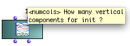
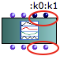
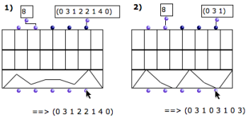
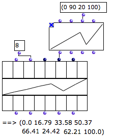

Navigation : [Previous](ClassArray "page précédente\(Array\)") |
[Next](ArrayEditor "Next\(Class-Array Editor\)")

# Class-Array Object

Contents

  1. Properties
  2. Rows and Columns
  3. Instantiation
  4. Creating Arrays with Objects

The  class-array box is accessed via the `Classes / Basic Tools / Array` menu.

## Properties

Columns and Lines

The  ** class-array ** box has a number of **columns** , called "
**components** " and a variable number of **rows** or **lines** , called "
**fields** ".

Default Inputs and Outputs

|

The  class-array box has two default inputs and outputs

  * "self" : an object or a list of objects 
  * "numcols" : a number of components or columns.

  
  
---|---  
  
Keyword Inputs

The  class-array  can be added a number of [ keyword arguments
](AdditionalInputs) , which represent  ** **
the **fields** of the matrix.

Each keyword input has a corresponding output.

|

  
  
---|---  
  
## Rows and Columns

Use and Definition

An empty class-array with 2 fields - rows - and 7 components - columns.

|

Each **column** represents a **component** .

Each **line** **or row** in the matrix display represents a **field** , which
corresponds to one of the **keyword inputs  ** of the box.

  * Each line contains field values. Values are entered in the corresponding keyword input. 
  * Field values are assigned successively to each component of the matrix. This means each cell has a specific value.

  * Fields can be added by the user with the `k` keys, just like **keyword arguments** in OM function boxes. 

To delete a field, press `SHIFT` \+ `k` .

  * Fields can be defined as **slots** of the class-array subclasses. 

They can then be hidden or shown with the `>` or `<` keys.

  
  
---|---  
  
Slots / Subclasses

The  class-array  is designed to be used as a  superclass for array classes
with default fields.

Subclasses[1] can be created either with Lisp code, or visually in OMExamples
of  class-array subclasses are the classes from the [OMChroma system]() for
the control of sound synthesis.

Creating Subclasses

  * [Object Oriented Programming](OOP)

Keyword Inputs Name and Value

By default, keyword inputs - additional fields - are called ":k1", ":k2",
etc...

To modify these names :

1\. click on the input

2\. enter a name starting with ":"

The value of keyword inputs must come from a connected box.

Keyword Inputs

  * [Additional Inputs : Optional, Keyword and Rest Arguments](AdditionalInputs)

## Instantiation

The  class-array has an original and powerful instantiation system that
interprets the input data connected to its different filed inputs
automatically. If needed, input data is converted to generate and fill all the
components values internally, depending on the given number of columns.

Applying a List of Values

If necessary, values are repeated.

  1. The list fits the number of components. The items contained in each list are assigned to the successive components.

  2. If the number of items is superior to the number of components, the list is repeated.

Applying a Single Value

A single value is repeated for every component of the array.

|

The constant value is repeated for all the components.  
  
---|---  
  
Resampling BPFs

Eight values are sampled periodically in the curve.

|

A BPF can be resampled according to the number of components of the  class-
array . Hence, each **component** can be assigned a **value** , no matter how
many points the BPF has.

This class-array contains eight components, or columns.

  * The BPF is the second field of the  class-array .
  * Eight points are sampled in the BPF and assigned to the second line of the  class-array .

Note that using the "x-points" or "y-points" instead of the "self" output of
the BPF amounts to feeding the array with a list of value.  
  
---|---  
  
Applying Functions

If a function or a box on [ "lambda" mode ](LambdaMode) is connected to a
field of the array, it is applied to the components of the field at the
evaluation.

Here, arrays # 1 and 3 are instantiated with two functions :

  1. the sinus function is evaluated for n = 1 to 30, that is, for each component's index.

  2. The om-random box in "lambda" mode defines a function that returns a random number between 0 and n, where n = the component's index.

|

Instantiating arrays with the sinus and om-random functions.  
  
---|---  
  
## Creating Arrays with Objects

Objects Lists

Objects, such as  notes ,  chords , or any object in OM, can also be used for
filling the matrix fields. These objects must be connected as a list to the
class-array inputs.

This procedure also allows, for instance, to create **arrays of arrays** , as
in example 2 above.

Advanced Issue : Row Types

In  class-array subclasses , the **type** of a subclass field may change the
way input data is interpreted.

References :

  1. Subclass

A subclass is derived from a preexisting class, by inheritance. In object-
oriented programming, objects are defined by classes. New objects can be
created from existing objects. As objects are defined by classes, classes can
inherit other classes. Sub-classes inherit attributes and behavior of the pre-
existing classes, or super-classes. Code is compartmentalized and reused by
creating collections of attributes and behaviors called objects which can be
based on previously created objects.

Contents :

  * [OpenMusic Documentation](OM-Documentation)
  * [OM User Manual](OM-User-Manual)
    * [Introduction](00-Contents)
    * [System Configuration and Installation](Installation)
    * [Going Through an OM Session](Goingthrough)
    * [The OM Environment](Environment)
    * [Visual Programming I](BasicVisualProgramming)
    * [Visual Programming II](AdvancedVisualProgramming)
    * [Basic Tools](BasicObjects)
      * [Curves and Functions](CurvesAndFunctions)
      * [Array](ClassArray)
        * Class-Array Object
        * [Class-Array Editor](ArrayEditor)
        * [Class-Array Tools](ArrayTools)
      * [TextFile](textfile)
      * [Picture](Picture)
    * [Score Objects](ScoreObjects)
    * [Maquettes](Maquettes)
    * [Sheet](Sheet)
    * [MIDI](MIDI)
    * [Audio](Audio)
    * [SDIF](SDIF)
    * [Reactive mode](Reactive)
    * [Lisp Programming](Lisp)
    * [Errors and Problems](errors)
  * [OpenMusic QuickStart](QuickStart-Chapters)

Navigation : [Previous](ClassArray "page précédente\(Array\)") |
[Next](ArrayEditor "Next\(Class-Array Editor\)")

