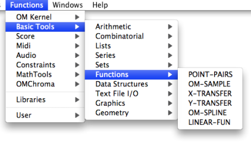
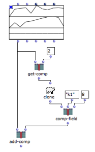

# Class-Array Tools Overview

The values of array components can be accessed and modified via specific
tools. These are especially designed for advanced applications, in particular
in the [ OMChroma ]() project, where synthesis parameters are specified using
subclasses of  class-array . These applications allow the access and extension
of specified parameters at synthesis time.

To access these tools, select the the `Functions/Basic Tools/Array` menu.

These functions mostly operate on array **components** - or columns -, since
they are transverse to the different fields - or lines - that were specified
via the inputs of the  array box.

Instances of the internal class component are returned and manipulated by
these functions.

More information on these functions and their arguments is available in the
online function reference - type `d`.

## Accessing Array Data

Functions

|

**get-comp** returns the  nth component of an array.  
  
---|---  
  

|

**comp-list** returns a list of values in a component, corresponding to the
different array fields.  
  

|

** comp-field ** returns the value of a specific field in a given component.
This field can be specified by an index (number) or by a name (string).  
  
More information on these functions and their arguments is available in the
online function reference - type `d` .

Example : Getting the Value of a Chord from a Class-Array

Here,

  * get-comp returns the value of the **second component** , or column, of the  class-array
  * comp-list returns the list of values belonging to the **second column** of the  class- array : a chord and two ordinates
  * comp-field returns the value of the **first field** , or line, corresponding to the second column : a chord.

Remember that numbering starts at 0, consequently, 0 = 1st element, 1 = 2nd
element...

## Modifying Array Data

Functions

|

**comp-list** can also set the list of values of a given components via an
optional second input.  
  
---|---  
  

|

** comp-field ** can also set the value of a given field of the components via
an optional third input. This field can be specified by an index (number) or
by a name (string).  
  

|

****** new-comp ** ** ** function allows to create a new component with a
given list of values.  
  

|

**add-comp** adds a component at a given position in the array.  
  

|

**remove-comp** removes a component from the array.  
  
Example : Modifying and Re-injecting a Component in an Array

|

Here,

  * get-comp returns the 3rd component in the array
  * clone creates a copy of this component
  * comp-field modifies a field of the new component
  * add-comp adds it to the array

  
  
---|---  
  
Permanent Modification of the Object

These functions are destructive : the input parameters, that is, the array or
its internal components are modified at each evaluation. In the previous
example, the array on the top of the figure gets one new component each time
add-comp is evaluated.

References :

Plan :

  * [OpenMusic Documentation](OM-Documentation)
  * [OM 6.6 User Manual](OM-User-Manual)
    * [Introduction](00-Sommaire)
    * [System Configuration and Installation](Installation)
    * [Going Through an OM Session](Goingthrough)
    * [The OM Environment](Environment)
    * [Visual Programming I](BasicVisualProgramming)
    * [Visual Programming II](AdvancedVisualProgramming)
    * [Basic Tools](BasicObjects)
      * [Curves and Functions](CurvesAndFunctions)
      * [Array](ClassArray)
        * [Class-Array Object](ArrayObject)
        * [Class-Array Editor](ArrayEditor)
        * Class-Array Tools
      * [TextFile](textfile)
      * [Picture](Picture)
    * [Score Objects](ScoreObjects)
    * [Maquettes](Maquettes)
    * [Sheet](Sheet)
    * [MIDI](MIDI)
    * [Audio](Audio)
    * [SDIF](SDIF)
    * [Lisp Programming](Lisp)
    * [Errors and Problems](errors)
  * [OpenMusic QuickStart](QuickStart-Chapters)

Navigation : [page precedente](ArrayEditor "page précédente\(Class-Array
Editor\)") | [page suivante](textfile "page suivante\(TextFile\)")

