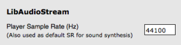
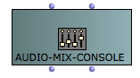
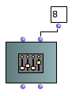
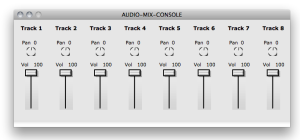
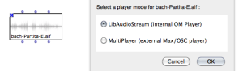
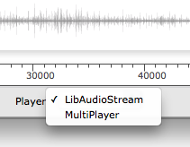
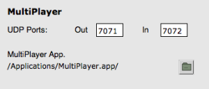

Navigation : [Previous](SoundEditor "page précédente\(Sound
Editor\)") | [Next](SoundTools "Next\(Sound Tools\)")

OM currently relies on the  LibAudioStream libray for playback and rendering
of audio files. The LibAudioStream player offers a multitrack architecture,
sounds can be assigned to different tracks with particular volume and panning
values.

Multi-channel Support

OM sound objects support arbitrary number of channels for audio files, but the
default OM player will only read mono and stereo files. In order to read
multi-channel audio files, please refer to the " **Alternative Players** "
section of this page.

## The LibAudioStream Player

LibAudioStream

(c) [GRAME ](http://www.grame.fr/ "http://www.grame.fr/ \(nouvelle
fenêtre\)"): see
[http://libaudiostream.sourceforge.net/](http://libaudiostream.sourceforge.net/
"http://libaudiostream.sourceforge.net/ \(nouvelle fenêtre\)")

Tracks

Every  sound object can be assigned a particular audio track.

Setting Tracks to the Sound Objects

  * [The Sound Object](Sound)
  * [The Sound Editor](SoundEditor)

Sound rendering can then be controlled for the different track using the
AUDIO-MIX-CONSOLE objects.

Sample Rate

The audio player has a single sample-rate (by default, 44100Hz).

If you want to play files with a different sample rate, you need to change the
default player sample rate. To do so, go to the OM preferences, `Audio` tab,
and set the player sample rate accordingly.

Consequently, it is not possible to play several files at the same time with
different sample rates.

|

  
  
---|---  
  
Bad Sample-Rate

If you experiment audible slowdowns or accelerations at playing sounds, this
may be because the sample rate of the player is not the same as the sample
rate of your audio file.

The Audio-Mix-Console

**AUDIO-MIX-CONSOLE** is another OM object allowing to set and send control
values for the OM audio player.

It can be instanciated as a standard OM object as a box.

By default, the Audio-Mix-Console has only one track. Set a different number
to the second ( nbtracks ) input in order to instanciate it with another
number of tracks.

|

  
  
---|---  
  
Double click on the bo to open the AUDIO-MIX-CONSOLE editor. This editor
actually corresponds to a real console for the control of the OM audio player.

|

  
  
---|---  
  
Every time a parameter (volume, panning) is changed on the AUDIO-MIX-CONSOLE
editor, it is immediately sent to the audio player and affects current or
future audio playbacks.

Playing Controls

The Audio-Mix-Console can also be considered a "stadard" musical object, and
played as such.

Press `space` to "play" the AUDIO-MIX-CONSOLE. All the control values for its
different tracks will immediately be sent to the audio player.

The AUDIO-MIX-CONSOLE can also be used in a Maquette. At a given time (when
the playing cursor reaches the Audio-Mix-Console box), this box will modify
the values of the different audio player parameters.

## Alternative Audio Players

Alternative audio players can be installed and registered in OM.

Currently this is the case for the **MultiPlayer** , a standalone application
which communicates with OM and can render multi-channel audio as well as
ambisonics-encoded files.

MultiPlayer

MultiPlayer by Marlon Scumacher, CIRMMT - McGill University

You can download the MultiPlayer (MacOSX only) at the following pages :

Ircam forum softwares : [OpenMusic download
pages](http://forumnet.ircam.fr/697 "http://forumnet.ircam.fr/697
\(nouvelle fenêtre\)").

OMPrisma pages at McGill/IDMIL :
[http://www.idmil.org/software/omprisma](http://www.idmil.org/software/omprisma
"http://www.idmil.org/software/omprisma \(nouvelle fenêtre\)")

Selecting the Player

There are two ways for changing the player.

  * Using the contextual menu on a sound box, selecting the `Player` menu item.

|

  
  
---|---  
  
Inside the sound editor, using the `Player` menu.

|

  
  
---|---  
  
Launching the MultiPlayer

When the MultiPlayer is selected, it should be launched automatically (if the
player application path has been set up correctly, see below). If not, it can
be necessary to launch the application manually.

If a sound box does not play, it maight be that it is assifgned to a player
which is not currently active...

MultiPlayer Setup

For optimal use, the MultiPlayer options might be set in the OM preferences,
`Audio` tab.

Set the correct path to the MultiPlayer application if needed.

Change the OSC communication ports if they have been changed in the
MultiPlayer side.

|

  
  
---|---  
  
Note that default preference values should work with the default values of the
MultiPlayer.

References :

Plan :

  * [OpenMusic Documentation](OM-Documentation)
  * [OM 6.6 User Manual](OM-User-Manual)
    * [Introduction](00-Sommaire)
    * [System Configuration and Installation](Installation)
    * [Going Through an OM Session](Goingthrough)
    * [The OM Environment](Environment)
    * [Visual Programming I](BasicVisualProgramming)
    * [Visual Programming II](AdvancedVisualProgramming)
    * [Basic Tools](BasicObjects)
    * [Score Objects](ScoreObjects)
    * [Maquettes](Maquettes)
    * [Sheet](Sheet)
    * [MIDI](MIDI)
    * [Audio](Audio)
      * [Sound Object](Sound)
      * [Sound Editor](SoundEditor)
      * Audio Player
      * [Sound Tools](SoundTools)
      * [Sound Processing](SoundProcessing)
      * [Recording](SoundRecording)
      * [External Libraries](Externals)
      * [Audio Preferences](SoundPreferences)
    * [SDIF](SDIF)
    * [Lisp Programming](Lisp)
    * [Errors and Problems](errors)
  * [OpenMusic QuickStart](QuickStart-Chapters)

Navigation : [Previous](SoundEditor "page précédente\(Sound
Editor\)") | [Next](SoundTools "Next\(Sound Tools\)")

