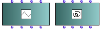
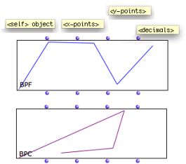
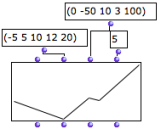
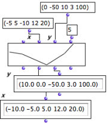
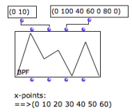

Navigation : [Previous](CurvesAndFunctions "page
précédente\(Curves and Functions\)") | [Next](MultiBPF "page
suivante\(BPF/BPC-Libs\)")

# 2D Objects : BPF / BPC

The BPF and BPC boxes

|

OM offers two types of objects for the manipulation of 2D curves :

the  BPF  and  BPC objects - Break Point Function[1] and  Break-Point Curve  .  
  
---|---  
  
## Properties

Definition

A BPF represents a function as a set of 2D points with increasing  x values.

In the mathematical sense, a BPF can be considered as a function y = f(x).

|

A break-point function defined by points (0 0), (14 46), (43 9), (89 19) and
(97 , -1).  
  
---|---  
  

A break-point curve defined by points (8,6) (90,41) (15,42) and (101,3).

|

A BPC is a free curve defined in a 2D plane.  
  
---|---  
  
Inputs and Outputs

|

BPF and BPC objects have four inputs and outputs :

  1. "self" : as in every object box, represents the object instance itself - BPF or BPC

  2. " x-points" : abscissa, a list of positive or negative numbers 

  3. " y -points" : ordinates, a list of positive or negative numbers

  4. "decimals" : a number of decimals representing the approximation or step value of the points.

  
  
---|---  
  
## Creating BPF or BPC in a Patch

The BPF or BPC points can be set by connecting lists of values to the
"x-points" and "y-points" inputs, or with the [BPF/BPC
editor](BPFEditors).

|

  
  
---|---  
  
X-Points Order in BPFs

|

In a BPF,  x-points must be in a strictly increasing order.

If the list is not ordered correctly, the points will be created from the
y-points values and sorted automatically before the actual BPF is created.  
  
---|---  
  
Incomplete Coordinates Lists

If the  x or  y list is shorter than the other,  the last interval in the
shorter list is repeated  until the right number of points is reached.

For instance, this allows to create a BPF with a list of y-points and a
periodic x interval.

|

  
  
---|---  
  
Decimals and BPF/BPC Precision

Rounding or increasing precision of the point coordinates with "decimals".

|

The " decimals" input determines the  number of decimals per coordinates ,
that is, the precision of the curve.

Coordinates are therefore rounded according to the number of decimals.

If "decimals"= 0, all coordinates are rounded to the closest integer.  
  
---|---  
  
References :

  1. Break Point Function

A "break-point" function is a function defined by a finite number of points
(x,y).

Contents :

  * [OpenMusic Documentation](OM-Documentation)
  * [OM User Manual](OM-User-Manual)
    * [Introduction](00-Contents)
    * [System Configuration and Installation](Installation)
    * [Going Through an OM Session](Goingthrough)
    * [The OM Environment](Environment)
    * [Visual Programming I](BasicVisualProgramming)
    * [Visual Programming II](AdvancedVisualProgramming)
    * [Basic Tools](BasicObjects)
      * [Curves and Functions](CurvesAndFunctions)
        * BPF / BPC
        * [BPF/BPC-Libs](MultiBPF)
        * [Editors](BPFEditors)
        * [BPF / BPC Tools](Tools)
        * [3D Objects](3D)
      * [Array](ClassArray)
      * [TextFile](textfile)
      * [Picture](Picture)
    * [Score Objects](ScoreObjects)
    * [Maquettes](Maquettes)
    * [Sheet](Sheet)
    * [MIDI](MIDI)
    * [Audio](Audio)
    * [SDIF](SDIF)
    * [Lisp Programming](Lisp)
    * [Errors and Problems](errors)
  * [OpenMusic QuickStart](QuickStart-Chapters)

Navigation : [Previous](CurvesAndFunctions "page
précédente\(Curves and Functions\)") | [Next](MultiBPF "page
suivante\(BPF/BPC-Libs\)")

