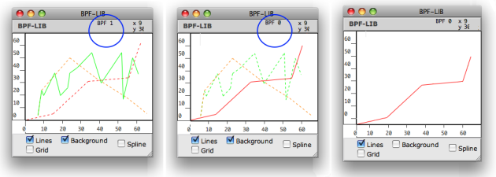
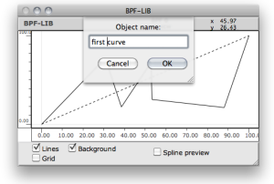
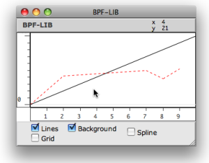
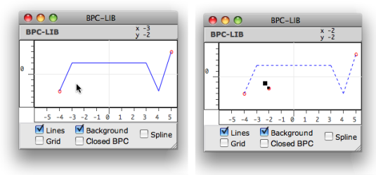

Navigation : [Previous](Display "page précédente\(Display\)") |
[Next](Tools "Next\(BPF / BPC Tools\)")

# BPF-Lib / BPC-Lib Editors

All the information provided in the [ BPF and BPC
Editor](BPFEditors) section also apply to BPF-lib and BPC-lib editors.

## Editing Curves

Items Selection

All editing operations can be performed upon one curve only. Edition
procedures are similar to those used in BPF or BPC editors.

To switch from a curve to another, press the `->❘` key.

  * The selected curve is displayed in the foreground. Its index and name - if any - appears at the top of the editor.
  * The other curves are displayed in the background with dotted lines.

To show or hide background curves, select or unselect the `Background` option.

Selecting a curve and hiding the background.[Zoom](../res/switchbpf_scr_1.png
"Zoom \(nouvelle fenêtre\)")

Name

Press `n` to change the name of the current selected curve.

|

  
  
---|---  
  
## Adding Curves in BPF-lib or BPC-lib Editors

Adding BPFs

|

To add a curve in a BPF-lib editor :

  1. select the pointer tool.

  2. `SHIFT` \+ `Cmd` click in the editor.

    * The existing curve(s) switch to the background and are displayed with dashes. 
    * The new curve is at the foreground. 
  3. To edit the new curve, `Cmd` click in the editor to add a first point in it.

  
  
---|---  
  
Hidden Curve

If previous curve hasn't been edited, the new curve **is superimposed to it**
at the foreground. To visualize the new curve, select the curve tool and move
the line.

Adding BPCs

Contrary to BPFs, which initially come with two default points, BPCs come
empty.

  * To add a first BPC : 

Select the pointer and `Cmd` click twice in the editor to create a curve. Two
points at least must be added in the editor to make a new BPC visible.

  * To add other BPCs :

    1. `SHIFT` \+ `Cmd` click outside the line to create a new empty curve. The previous ones go to the background.

    2. `Cmd` click twice in the editor to add points to the curve.

References :

Plan :

  * [OpenMusic Documentation](OM-Documentation)
  * [OM User Manual](OM-User-Manual)
    * [Introduction](00-Sommaire)
    * [System Configuration and Installation](Installation)
    * [Going Through an OM Session](Goingthrough)
    * [The OM Environment](Environment)
    * [Visual Programming I](BasicVisualProgramming)
    * [Visual Programming II](AdvancedVisualProgramming)
    * [Basic Tools](BasicObjects)
      * [Curves and Functions](CurvesAndFunctions)
        * [BPF / BPC](BPF-BPC)
        * [BPF/BPC-Libs](MultiBPF)
        * [Editors](BPFEditors)
          * [Edition Basics](Edition)
          * [Display](Display)
          * BPF-Lib / BPC-Lib Editors
        * [BPF / BPC Tools](Tools)
        * [3D Objects](3D)
      * [Array](ClassArray)
      * [TextFile](textfile)
      * [Picture](Picture)
    * [Score Objects](ScoreObjects)
    * [Maquettes](Maquettes)
    * [Sheet](Sheet)
    * [MIDI](MIDI)
    * [Audio](Audio)
    * [SDIF](SDIF)
    * [Lisp Programming](Lisp)
    * [Errors and Problems](errors)
  * [OpenMusic QuickStart](QuickStart-Chapters)

Navigation : [Previous](Display "page précédente\(Display\)") |
[Next](Tools "Next\(BPF / BPC Tools\)")

