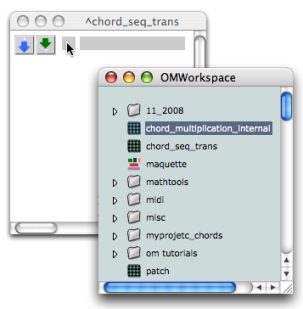
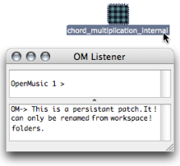
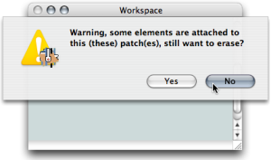

Navigation : [Previous](AbsBoxes "page précédente\(Abstraction
Boxes\)") | [Next](RedAbstraction "Next\(Internal
Abstractions\)")

# Standard Abstraction

This section deals with the integration of an existing patch
 in another patch.

## Adding a Patch From the Workspace to Another Patch

Procedure

To be used as an abstraction, a patch can be dragged from the  **workspace
window** to another  **patch editor** .

The abstraction ** refers ** to the patch located in the workspace.

Consequently :

  * the abstraction and the patch in the workspace have the same name and icon,

  * the representation of the patch remains visible in the workspace : it hasn't been moved to the patch editor,

  * both items will be affected by subsequent operations performed in the abstraction.

No matter where the patch is open from, the editor displayed is the same.

Preserving the Master of a Patch

  * [Saving / Reloading a Patch](SavingPatch)

Using Duplicates

Several patch boxes with the same reference can coexist in a patch editor.
Hence, the same function can be used at several steps of a program. When an
abstraction is duplicated, another box, which refers to the same master patch,
is created. Subsequent modifications to the reference patch will therefore
affect both items.

One representation of patch1 has been added inputs. The other representation
has been added outputs. Both items have been equally and simultaneously
modified.

## Managing Abstractions in the Workspace

Renaming an Abstraction

|

A blue patch can only be renamed in the workspace.  
  
---|---  
  
Deleting a Patch from the Workspace

**In a workspace** , nothing shows that a blue patch is used as an abstraction
: this must be taken into account when organizing it.

A warning pops up if one attempts to delete a patch used as an abstraction in
another patch. If it is deleted its reference in the other patch editor will
be replaced by a [dead box](SavingPatch) .

|

  
  
---|---  
  
References :

Contents :

  * [OpenMusic Documentation](OM-Documentation)
  * [OM User Manual](OM-User-Manual)
    * [Introduction](00-Contents)
    * [System Configuration and Installation](Installation)
    * [Going Through an OM Session](Goingthrough)
    * [The OM Environment](Environment)
    * [Visual Programming I](BasicVisualProgramming)
    * [Visual Programming II](AdvancedVisualProgramming)
      * [Abstraction](Abstraction)
        * [Abstraction Boxes](AbsBoxes)
          * Standard Abstraction
          * [Internal Abstractions](RedAbstraction)
          * [Conversions](AbsConversion)
        * [Application](AbsApplication)
        * [Recursive Patches](Recursion)
      * [Evaluation Modes](EvalModes)
      * [Higher-Order Functions](HighOrder)
      * [Control Structures](Control)
      * [Iterations: OMLoop](OMLoop)
      * [Instances](Instances)
      * [Interface Boxes](InterfaceBoxes)
      * [Files](Files)
    * [Basic Tools](BasicObjects)
    * [Score Objects](ScoreObjects)
    * [Maquettes](Maquettes)
    * [Sheet](Sheet)
    * [MIDI](MIDI)
    * [Audio](Audio)
    * [SDIF](SDIF)
    * [Lisp Programming](Lisp)
    * [Errors and Problems](errors)
  * [OpenMusic QuickStart](QuickStart-Chapters)

Navigation : [Previous](AbsBoxes "page précédente\(Abstraction
Boxes\)") | [Next](RedAbstraction "Next\(Internal
Abstractions\)")

