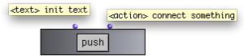
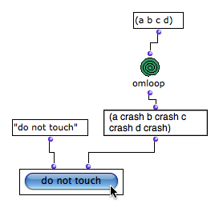

# Triggering Operations : The Button Box

Button boxes are used for triggering operations. They don't return anything.

When the  button is pressed, an action is executed.

## Features

|

The  button box has two inputs

  1. "text" : the button appellation

  2. "action" : is simply evaluated, and evaluates upstream connected boxes.

  
  
---|---  
  
When the button is pushed, the Listener displays the value returned by the box
connected to the second input.

Reminder

Displaying and Editing the Button Box Interface

  * [General Features](GeneralFeatures)

## A Basic Example

Any box or part of a patch to be evaluated by pushing the button can be
connected to the second input.

|

  
  
---|---  
  
## A Musical Application : an Extended Example

Building a Triad with an Item-List-Box, a Button-Box, and a Check Box

  * [Using the Interface Boxes : Example](InterfaceExample)

References :

Plan :

  * [OpenMusic Documentation](OM-Documentation)
  * [OM 6.6 User Manual](OM-User-Manual)
    * [Introduction](00-Sommaire)
    * [System Configuration and Installation](Installation)
    * [Going Through an OM Session](Goingthrough)
    * [The OM Environment](Environment)
    * [Visual Programming I](BasicVisualProgramming)
    * [Visual Programming II](AdvancedVisualProgramming)
      * [Abstraction](Abstraction)
      * [Evaluation Modes](EvalModes)
      * [Higher-Order Functions](HighOrder)
      * [Control Structures](Control)
      * [Iterations: OMLoop](OMLoop)
      * [Instances](Instances)
      * [Interface Boxes](InterfaceBoxes)
        * [General Features](GeneralFeatures)
        * [Text Boxes](TextBoxes)
        * [Check Box](CheckBox)
        * [List Boxes](ListBoxes)
        * Button
        * [Slider Box](Slider)
        * [Pop-Up Menu Box](MenuBoxes)
        * [Examples of Use](InterfaceExample)
      * [Files](Files)
    * [Basic Tools](BasicObjects)
    * [Score Objects](ScoreObjects)
    * [Maquettes](Maquettes)
    * [Sheet](Sheet)
    * [MIDI](MIDI)
    * [Audio](Audio)
    * [SDIF](SDIF)
    * [Lisp Programming](Lisp)
    * [Errors and Problems](errors)
  * [OpenMusic QuickStart](QuickStart-Chapters)

Navigation : [page precedente](ListBoxes "page précédente\(List Boxes\)")
| [page suivante](Slider "page suivante\(Slider Box\)")

