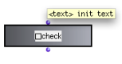
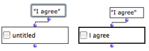

Navigation : [Previous](TextBoxes "page précédente\(Text Boxes\)")
| [Next](ListBoxes "Next\(List Boxes\)")

# Controlling Operations : the Check Box

The  **check-box** object resembles a [predicate](Predicates). If the box
is checked, it returns "true". If not, it returns "nil". Hence, it can be used
as a "switch on / off condition" for the execution of programs. It must be
associated with **conditional boxes** that will call the programs.

## Features

Inputs and Outputs

|

The  check-box object has one input and one output :

  * "text" : a statement

  * the output returns "t" or "nil" depending on **if the box is checked** or not.

  
  
---|---  
  
Editing the Statement

To change the box's statement :

  1. click or `SHIFT` click on the first input to edit it and validate,

  2. select the box again,

  3. evaluate the box.

|

  
  
---|---  
  
## Use

Wherever the box is clicked, it is successively checked or unchecked.
Depending on its state, the box output returns "t" or "nil".

|

In the first case, the OMIF box returns the second argument, because the
checkbox returns "nil". In the second case, it returns the first argument,
because the checkbox returns "t".  
  
---|---  
  
Using Conditions in a Program

  * [Conditional Operators](ConditionalOps)

For a More than Two Options

  * [Selection : List Boxes](ListBoxes)

## A Musical Application : an Extended Example

Building a Triad with an Item-List-Box, a Button-Box, and a Check Box

  * [Using the Interface Boxes : Example](InterfaceExample)

References :

Plan :

  * [OpenMusic Documentation](OM-Documentation)
  * [OM 6.6 User Manual](OM-User-Manual)
    * [Introduction](00-Sommaire)
    * [System Configuration and Installation](Installation)
    * [Going Through an OM Session](Goingthrough)
    * [The OM Environment](Environment)
    * [Visual Programming I](BasicVisualProgramming)
    * [Visual Programming II](AdvancedVisualProgramming)
      * [Abstraction](Abstraction)
      * [Evaluation Modes](EvalModes)
      * [Higher-Order Functions](HighOrder)
      * [Control Structures](Control)
      * [Iterations: OMLoop](OMLoop)
      * [Instances](Instances)
      * [Interface Boxes](InterfaceBoxes)
        * [General Features](GeneralFeatures)
        * [Text Boxes](TextBoxes)
        * Check Box
        * [List Boxes](ListBoxes)
        * [Button](Button)
        * [Slider Box](Slider)
        * [Pop-Up Menu Box](MenuBoxes)
        * [Examples of Use](InterfaceExample)
      * [Files](Files)
    * [Basic Tools](BasicObjects)
    * [Score Objects](ScoreObjects)
    * [Maquettes](Maquettes)
    * [Sheet](Sheet)
    * [MIDI](MIDI)
    * [Audio](Audio)
    * [SDIF](SDIF)
    * [Lisp Programming](Lisp)
    * [Errors and Problems](errors)
  * [OpenMusic QuickStart](QuickStart-Chapters)

Navigation : [Previous](TextBoxes "page précédente\(Text Boxes\)")
| [Next](ListBoxes "Next\(List Boxes\)")

