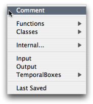
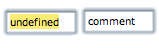
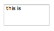
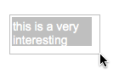
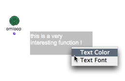
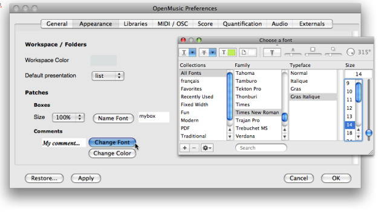
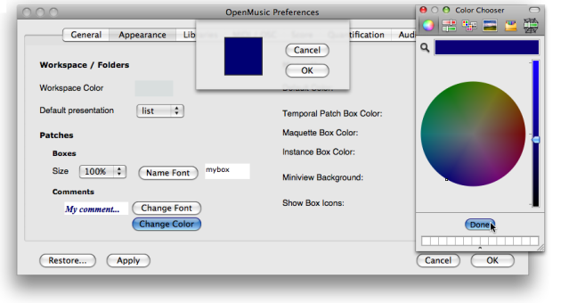
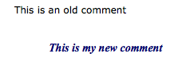

Navigation : [Previous](DocAndInfo "page précédente\(Documentation
and Info\)") | [Next](Pictures "Next\(Pictures\)")

# Comments

Contents

  1. Creating a comment
  2. Editing a comment
  3. Modifications
  4. Comments Font Style

A comment is a text box that doesn't affect the patch in which it is set. It
allows to add textual indications that can make a program more legible.

## Creating a comment

With the contextual menu

|

To add a comment in a patch :

  1. `Ctrl` / right click in the patch editor

  2. choose `Comment` .

  
  
---|---  
  
Directly in the patch editor

To add a comment box directly in a patch editor :

  1. `Cmd` click in the editor and type "comment"

  2. validate to create the comment box.

|

  
  
---|---  
  
## Editing a comment

|

  1. Double click in the comment box to type the text. 

  2. Click somewhere in the patch editor to validate and save your text.

  
  
---|---  
  
Note

Unlike data boxes, comment boxes accept breaks and line returns.

## Modifications

Manipulating Comment Boxes

|

Like any other box, a comment box can be moved, resized, copied, deleted.

To apply a modification, choose a menu item in the `Edit` menu, or use the
usual commands and shortcuts.  
  
---|---  
  
Manipulating Boxes :

  * [Elementary Manipulations](ElementaryManips)

Fitting

To fit a comment box to the text, select it and press `i` .

## Comments Font Style

Local Modifications

To modify the font type and colour of a comment within a patch :

  1. `Ctrl` / right click on the box,

  2. choose `Text color` or `Text Font`.

|

  
  
---|---  
  
Style Shortcuts

use the menu `Edit / Font / Bold` and `Edit / Fonts / Italics` or the
corresponding keyboard shortcuts `CMD` \+ `SHIFT` \+ `B` / `I` in order to
change all selected comments to bold or italics.

Default Style

The comments font style can be globally specified via the OM preferences.
Select the `OM 6.X.X. / Preferences menu`. Click on the `Appearance` tab and
go to the **Comments** section

To modify the comments font style :

  1. click on `Change Font` and define a font style in the font dialogue window

  2.     * choose `Apply` and/or `OK`

    * choose `Restore` to get back to the OM default values.

[Zoom](../res/commentfont_scr_1.png "Zoom \(nouvelle fenêtre\)")

To modify the comments colour

  1. click on `Change Colour`

  2. click on the coloured patch, and choose a colour in the colour chooser. 

  3.     * choose `Apply` and/or `OK`

    * choose `Restore` to get back to the OM default values.

[Zoom](../res/commentstyle_scr_1.png "Zoom \(nouvelle fenêtre\)")

Applying Changes

|

New preferences will apply to new comments only.  
  
---|---  
  
References :

Contents :

  * [OpenMusic Documentation](OM-Documentation)
  * [OM User Manual](OM-User-Manual)
    * [Introduction](00-Contents)
    * [System Configuration and Installation](Installation)
    * [Going Through an OM Session](Goingthrough)
    * [The OM Environment](Environment)
    * [Visual Programming I](BasicVisualProgramming)
      * [Patch Introduction](ProgrammingIntro)
      * [Adding Boxes Into a Patch](AddingBoxes)
      * [Elementary Manipulations](ElementaryManips)
      * [Boxes](Boxes)
      * [Box Inputs](BoxInputs)
      * [Connections](Connections)
      * [Evaluation](Evaluation)
      * [Documentation and Info](DocAndInfo)
      * Comments
      * [Pictures](Pictures)
      * [Saving / Reloading a Patch](SavingPatch)
      * [Dead Boxes](DeadBox)
    * [Visual Programming II](AdvancedVisualProgramming)
    * [Basic Tools](BasicObjects)
    * [Score Objects](ScoreObjects)
    * [Maquettes](Maquettes)
    * [Sheet](Sheet)
    * [MIDI](MIDI)
    * [Audio](Audio)
    * [SDIF](SDIF)
    * [Lisp Programming](Lisp)
    * [Errors and Problems](errors)
  * [OpenMusic QuickStart](QuickStart-Chapters)

Navigation : [Previous](DocAndInfo "page précédente\(Documentation
and Info\)") | [Next](Pictures "Next\(Pictures\)")

