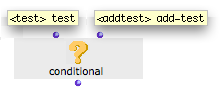
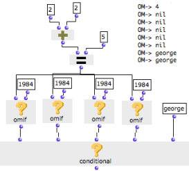
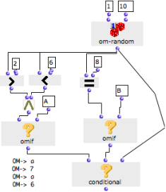

Navigation : [Previous](OMIF "page précédente\(OMif\)") | [page
suivante](Logical "Next\(Logical Operators\)")

# Conditional : Multiple Conditions

Conditional is very similar to omif : it tests if  **a set ** of conditions**
** is fulfilled, one by one. As soon as one condition is fulfilled,
conditional executes the corresponding operation.

Its behaviour can be summed up as :

"IF condition A is fulfilled, THEN return x, ELSE check if condition B is
fulfilled.

IF condition B is fulfilled, THEN return y, ELSE check if condition C is
fulfilled.

IF condition C is fulfilled..."

The conditional box can be accessed via the `Functions / Control /
CONDITIONAL` menu.

Inputs and Outputs

The conditional box takes a number of test arguments. It has one default input
and output and a free number of additional inputs.

  * "test" : a test argument
  * "add-test" : an additional test argument.
  * The user can add as additional test arguments as necessary. 

Its output returns the value of the last evaluated input.

All inputs are test inputs : predicates, or other types of boxes.

|

  
  
---|---  
  
Behaviour

Conditional behaves like an  [ or operator.](Logical)

  1. The box evaluates its inputs successively until an input returns a non nil value.

  2. This value is returned by conditional.

Conditional and Omif

Conditional can be used as a meta-omif box, with a virtually unlimited number
of "if" / "then" and "else" inputs, and a terminal "else" input.

Each input can take an omif box representing a condition and an action.
Because conditional stops the inputs evaluation as soon as it gets a non nil
value, these actions are linked with each other in a causal chain.

Examples

|

In this example, we will test successively if 4 = 5, and define a last
argument for conditional.

  1. Om+ returns 4. 

  2. Every time, om= tests if 4 = 5, and returns "nil" to the omif boxes. One by one, they return "nil", because the condition to return "1984" is not fulfilled.

  3. Finally, the last input of conditional is evaluated and returns "george". 

  4. Conditional returns "george".

  
  
---|---  
  
In this example, we want to filter values from 1 to 10 and pass 1, 7, 9 or 10.

  1. Om-random returns a number between 1 and 10. The box is on "[evaluate-once mode](EvOnceMode)" so that the  **same value** is returned to all the other boxes at the evaluation. 

  2. The value is tested by two predicates.

    * If it is comprised between 2 and 6, the first predicate returns true and omif returns "A".
    * If it is equal to 8, the second predicate returns true and omif returns "B". 
  3. Finally, if none of these conditions is fulfilled, the last input of conditional is evaluated and returns the random number yielded by om-random.

|

  
  
---|---  
  
References :

Contents :

  * [OpenMusic Documentation](OM-Documentation)
  * [OM User Manual](OM-User-Manual)
    * [Introduction](00-Contents)
    * [System Configuration and Installation](Installation)
    * [Going Through an OM Session](Goingthrough)
    * [The OM Environment](Environment)
    * [Visual Programming I](BasicVisualProgramming)
    * [Visual Programming II](AdvancedVisualProgramming)
      * [Abstraction](Abstraction)
      * [Evaluation Modes](EvalModes)
      * [Higher-Order Functions](HighOrder)
      * [Control Structures](Control)
        * [Predicates](Predicates)
        * [Conditional Operators](ConditionalOps)
          * [OMif](OMIF)
          * Conditional
        * [Logical Operators](Logical)
        * [Sequential Operators](Sequencial)
      * [Iterations: OMLoop](OMLoop)
      * [Instances](Instances)
      * [Interface Boxes](InterfaceBoxes)
      * [Files](Files)
    * [Basic Tools](BasicObjects)
    * [Score Objects](ScoreObjects)
    * [Maquettes](Maquettes)
    * [Sheet](Sheet)
    * [MIDI](MIDI)
    * [Audio](Audio)
    * [SDIF](SDIF)
    * [Lisp Programming](Lisp)
    * [Reactive mode](Reactive)
    * [Errors and Problems](errors)
  * [OpenMusic QuickStart](QuickStart-Chapters)

Navigation : [Previous](OMIF "page précédente\(OMif\)") | [page
suivante](Logical "Next\(Logical Operators\)")

