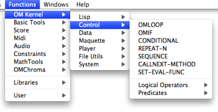

Navigation : [Previous](PredExample "page précédente\(In
Practice\)") | [Next](OMIF "Next\(OMif\)")

# Conditional Operators

Conditional Operators

Conditional operators execute an operation if one or more preconditions are
fulfilled. If these conditions are not fulfilled, they can possibly execute
another operation.

OM offers two conditional operators : ** omif ** and ** **conditional** **,
which operate according to the following paradigm : "IF A, THEN do B, ELSE do
C".

Note : "A" can be the result of another opration or a condition defined by a
predicate.

About Predicates :

  * [Predicates : Testing Relations and Properties](Predicates)

To access the omif and conditional operators, select a menu item in the
`Kernel / Control` menu.

References :

Contents :

  * [OpenMusic Documentation](OM-Documentation)
  * [OM User Manual](OM-User-Manual)
    * [Introduction](00-Contents)
    * [System Configuration and Installation](Installation)
    * [Going Through an OM Session](Goingthrough)
    * [The OM Environment](Environment)
    * [Visual Programming I](BasicVisualProgramming)
    * [Visual Programming II](AdvancedVisualProgramming)
      * [Abstraction](Abstraction)
      * [Evaluation Modes](EvalModes)
      * [Higher-Order Functions](HighOrder)
      * [Control Structures](Control)
        * [Predicates](Predicates)
        * Conditional Operators
          * [OMif](OMIF)
          * [Conditional](Conditional)
        * [Logical Operators](Logical)
        * [Sequential Operators](Sequencial)
      * [Iterations: OMLoop](OMLoop)
      * [Instances](Instances)
      * [Interface Boxes](InterfaceBoxes)
      * [Files](Files)
    * [Basic Tools](BasicObjects)
    * [Score Objects](ScoreObjects)
    * [Maquettes](Maquettes)
    * [Sheet](Sheet)
    * [MIDI](MIDI)
    * [Audio](Audio)
    * [SDIF](SDIF)
    * [Lisp Programming](Lisp)
    * [Errors and Problems](errors)
  * [OpenMusic QuickStart](QuickStart-Chapters)

Navigation : [Previous](PredExample "page précédente\(In
Practice\)") | [Next](OMIF "Next\(OMif\)")

