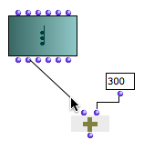
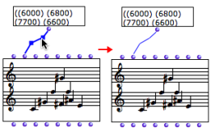
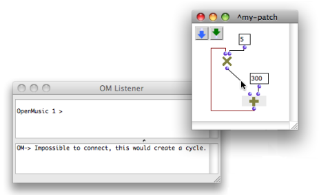

Navigation : [Previous](AdditionalInputs "page
précédente\(Additional Inputs\)") | [Next](Evaluation "page
suivante\(Evaluation\)")

# Connections

A connection is a link between the outlet of a box and the inlet of another
box. It means that the value of the downstream box inlet will be the result of
the upstream box computation.

The connections define the functional composition, that is the syntax of a
visual program.

## Creating and modifying connections

Creating a connection

|

A connection is created by clicking on a box output and drag the mouse cursor
to the input of another box.  
  
---|---  
  
Modifying a connection

Connections can be selected and modified as well :

  * to change the shape of a connection : click and drag its articulations
  * to change the colour of a connection : select its and press `c`

|

  
  
---|---  
  
Deleting a connection

To delete a connection

  * select it and press `Backspace`
  * `Cmd` click on the cotresponding input of the connection.

## Syntactic Relevance

When boxes are being connected to each other, OM applies syntactic rules, so
that the connection may be rejected. This includes :

  * **preventing cycles** : a box can not be connected to another one if this connection creates a cycle - see example below -
  * **deleting existing connections** when a new connection is made to an input. An input is necessarily assigned a single value and therefore cannot be connected to more than one box.

Preventing Cycles

One of the inputs of the om* box is connected to the om+ box. Om* will then
need to know the result returned by om+ to perform its computation. In this
case, OM "refuses" to connect the result of the multiplication to the inlet of
the addition, as shown in the Listener.

References :

Plan :

  * [OpenMusic Documentation](OM-Documentation)
  * [OM 6.6 User Manual](OM-User-Manual)
    * [Introduction](00-Sommaire)
    * [System Configuration and Installation](Installation)
    * [Going Through an OM Session](Goingthrough)
    * [The OM Environment](Environment)
    * [Visual Programming I](BasicVisualProgramming)
      * [Patch Introduction](ProgrammingIntro)
      * [Adding Boxes Into a Patch](AddingBoxes)
      * [Elementary Manipulations](ElementaryManips)
      * [Boxes](Boxes)
      * [Box Inputs](BoxInputs)
      * Connections
      * [Evaluation](Evaluation)
      * [Documentation and Info](DocAndInfo)
      * [Comments](Comments)
      * [Pictures](Pictures)
      * [Saving / Reloading a Patch](SavingPatch)
      * [Dead Boxes](DeadBox)
    * [Visual Programming II](AdvancedVisualProgramming)
    * [Basic Tools](BasicObjects)
    * [Score Objects](ScoreObjects)
    * [Maquettes](Maquettes)
    * [Sheet](Sheet)
    * [MIDI](MIDI)
    * [Audio](Audio)
    * [SDIF](SDIF)
    * [Lisp Programming](Lisp)
    * [Errors and Problems](errors)
  * [OpenMusic QuickStart](QuickStart-Chapters)

Navigation : [Previous](AdditionalInputs "page
précédente\(Additional Inputs\)") | [Next](Evaluation "page
suivante\(Evaluation\)")

