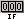
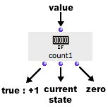
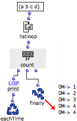
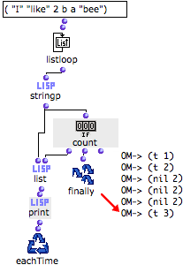

Navigation : [Previous](MinMax "page précédente\(Min / Max\)") |
[Next](Acum "Next\(Acum\)")

# Count : Counting Items

 ** Count ** is a counter. Its internal value
increases at each evaluation evaluated, if the input value is non nil.

## Inputs and Outputs

|

Count has one default input and three outputs :

  * "what" : a value.
  * first output : triggers the increment of the counter if the input is non nil, and returns its current value. 
  * second output : returns the current state of the counter.
  * third output : resets the value of the counter to zero.

  
  
---|---  
  
## Examples

Counting the Items of a List

  1. Listloop returns each element of the list successively to count. These elements are non nil values. 

  2. The first output of count adds 1 every time listloop returns an element. 

  3. Once the enumeration of listloop is over, the final state of count is returned by Finally.

|

  
  
---|---  
  
Counting Specific Items of a List

We will now apply count more specifically, to know how many  **strings** a
list contains among other types of items.

|

  1. Listloop enumerates the elements of a list. 

  2. The stringp predicate returns true every time it evaluates a string. 

  3. At each step of the loop, the first output of count is evaluated : 

    * if it gets a non nil value from stringp, it increments the value of the counter
    * if it gets "nil", the value doesn't change.
  4. The results returned by stringp and counter are gathered in a list and printed.

  5. The total number of strings, that is, the final state of counter is returned by Finally. 

  
  
---|---  
  
References :

Plan :

  * [OpenMusic Documentation](OM-Documentation)
  * [OM User Manual](OM-User-Manual)
    * [Introduction](00-Sommaire)
    * [System Configuration and Installation](Installation)
    * [Going Through an OM Session](Goingthrough)
    * [The OM Environment](Environment)
    * [Visual Programming I](BasicVisualProgramming)
    * [Visual Programming II](AdvancedVisualProgramming)
      * [Abstraction](Abstraction)
      * [Evaluation Modes](EvalModes)
      * [Higher-Order Functions](HighOrder)
      * [Control Structures](Control)
      * [Iterations: OMLoop](OMLoop)
        * [Iteration](LoopIntro)
        * [General Features](LoopGeneral)
        * [Evaluators](LoopEvaluators)
        * [Iterators](LoopIterators)
        * [Accumulators](LoopAccumulators)
          * [Collect](Collect)
          * [Sum](Sum)
          * [Min / Max](MinMax)
          * Count
          * [Acum](Acum)
        * [Example : A Random Series](LoopExample)
      * [Instances](Instances)
      * [Interface Boxes](InterfaceBoxes)
      * [Files](Files)
    * [Basic Tools](BasicObjects)
    * [Score Objects](ScoreObjects)
    * [Maquettes](Maquettes)
    * [Sheet](Sheet)
    * [MIDI](MIDI)
    * [Audio](Audio)
    * [SDIF](SDIF)
    * [Lisp Programming](Lisp)
    * [Errors and Problems](errors)
  * [OpenMusic QuickStart](QuickStart-Chapters)

Navigation : [Previous](MinMax "page précédente\(Min / Max\)") |
[Next](Acum "Next\(Acum\)")

