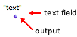
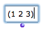
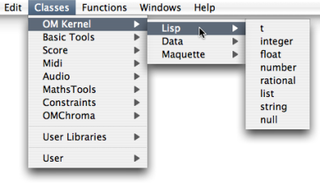
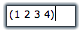
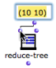

Navigation : [Previous](GraphicFeatures "page précédente\(Boxes
Features\)") | [Next](FunctionBoxes "Next\(Function
Boxes\)")

# Data Boxes

Sommaire

  1. Use
  2. Adding a Data Box
  3. Editing the Content of a Box
  4. Connection to Another Box

**Data boxes** are the simplest of all OM boxes. A data box represents a
constant value. This value belongs to one of the primitive Lisp types, which
are available in the OM Kernel / Lisp package.

## Use

|

A data box is designed to pass data to other boxes in a patch. It is made of a
text field that expresses a value or a text, and an output that allows to
connect this content to other boxes.  
  
---|---  
  
Primitive Lisp Types

There are several primitive Lisp types :

  * number :

|

any type of numeric data

|

  * list :

|

a list of any type of item between parenthesis  
  
---|---|---|---  
  
  * integer :

|

an integer number

|

  * string :

|

a text between double quotes - inverted commas -  
  
  * float :

|

decimal number

|

  * t :

|

the Lisp expression for "true"  
  
  * rational :

|

a/b

|

  * nil :

|

the Lisp expression of "false" or "nothing"  
  
## Adding a Data Box

Typing Directly In the Patch Editor

|

`Cmd` click in the patch editor and type a content - for instance 4, (2 3 4),
"hello", etc. - directly in the text prompt.  
  
---|---  
  
Menus Or Library Window

  *  Go to `Classes / Kernel / Lisp` and choose a menu item.
  * `Ctrl` / right click in the patch editor and choose a menu item in the contextual menu.
  * Pick the box in the relevant package from the [Library](Library) window and drop it in the editor. 

Note

A data box accepts any primitive type, no matter what its type was initially.

## Editing the Content of a Box

|

Double click on a box to edit its content.  
  
---|---  
  
  * Numbers should be entered as simple numbers.
  * Strings should be entered between double quotes - inverted commas.
  * Symbols should be entered as simple text.
  * Lists should be entered between parenthesis, just as in Lisp. Ill-formed lists are not accepted.

** **To confirm the input value, press `Enter` or click in the patch editor.
** **No line return is allowed in data boxes.** **

Resizing

To fit the box size to its content, select it and type `i`.

## Connection to Another Box

Click on the outlet to create a connection and drag it to the wanted inlet of
another box.

|

Connecting a simple value box to the pitch inlet of a "note" box.  
  
---|---  
  
Automatic Connection

|

To add a connected data box to a factory or function box, `SHIFT` click on an
input. This data box will have the default value of the input, which will then
be displayed permanently.  
  
---|---  
  
References :

Plan :

  * [OpenMusic Documentation](OM-Documentation)
  * [OM 6.6 User Manual](OM-User-Manual)
    * [Introduction](00-Sommaire)
    * [System Configuration and Installation](Installation)
    * [Going Through an OM Session](Goingthrough)
    * [The OM Environment](Environment)
    * [Visual Programming I](BasicVisualProgramming)
      * [Patch Introduction](ProgrammingIntro)
      * [Adding Boxes Into a Patch](AddingBoxes)
      * [Elementary Manipulations](ElementaryManips)
      * [Boxes](Boxes)
        * [Boxes Features](GraphicFeatures)
        * Data Boxes
        * [Function Boxes](FunctionBoxes)
        * [Objects - Factory Boxes](FactoryBoxes)
        * [Abstraction Boxes](AbsBoxesIntro)
        * [Other Boxes](OtherBoxes)
      * [Box Inputs](BoxInputs)
      * [Connections](Connections)
      * [Evaluation](Evaluation)
      * [Documentation and Info](DocAndInfo)
      * [Comments](Comments)
      * [Pictures](Pictures)
      * [Saving / Reloading a Patch](SavingPatch)
      * [Dead Boxes](DeadBox)
    * [Visual Programming II](AdvancedVisualProgramming)
    * [Basic Tools](BasicObjects)
    * [Score Objects](ScoreObjects)
    * [Maquettes](Maquettes)
    * [Sheet](Sheet)
    * [MIDI](MIDI)
    * [Audio](Audio)
    * [SDIF](SDIF)
    * [Lisp Programming](Lisp)
    * [Errors and Problems](errors)
  * [OpenMusic QuickStart](QuickStart-Chapters)

Navigation : [Previous](GraphicFeatures "page précédente\(Boxes
Features\)") | [Next](FunctionBoxes "Next\(Function
Boxes\)")

