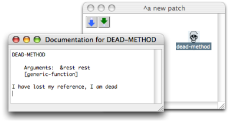
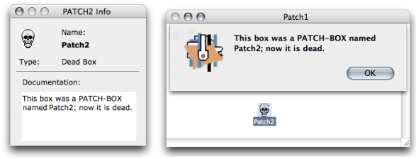
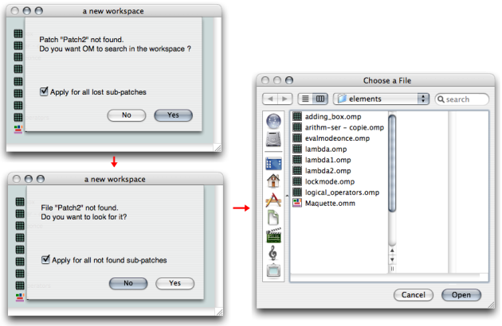

Navigation : [Previous](SavingPatch "page précédente\(Saving /
Reloading a Patch\)") | [Next](AdvancedVisualProgramming "page
suivante\(Visual Programming II\)")

# Missing References : Dead Boxes

An item used in a patch may sometimes be missing. ** Dead boxes **
 refer to saved items that OM cannot find anymore :

  * if an item belongs to a library that was loaded at a previous session, and that this library isn't reloaded,
  * if an OM function doesn't exist in a new OM version, 
  * If a sub patch that was used in another patch is missing in a workspace.

Dead boxes have been designed to keep as much information as possible about
their original reference, so that they can possibly be loaded again correctly.

## Dead Boxes

If the user tries to open a dead box or to get information or documentation,
the box doc will say "I have lost my reference, I am dead"...

... or a message of the same kind.

Note

When a dead box "knows" which reference - class or function for instance - it
was attached to, it can possibly be restored. Its reference must be loaded
again or re-created before the patch is reloaded. To reload a patch containing
dead boxes, use the "Last Saved" command.

Saving Procedures

  * [Saving / Reloading a Patch](SavingPatch)

## Finding Lost Patches

If a patch reference is missing in the workspace, OM will point it out and
offer to find it. If the item can't be found, the user will be offered to look
for it by himself.

Looking for the reference of a dead box.[Zoom](../res/deadpatches_scr_1.png
"Zoom \(nouvelle fenêtre\)")

What Is a Patch Reference ?

  * [Standard Abstraction](BlueAbstraction)

See also : Workspace / Adding Components in a Workspace at a Session : Import
and Export Functions

  * [Workspace](Workspace)

References :

Contents :

  * [OpenMusic Documentation](OM-Documentation)
  * [OM User Manual](OM-User-Manual)
    * [Introduction](00-Contents)
    * [System Configuration and Installation](Installation)
    * [Going Through an OM Session](Goingthrough)
    * [The OM Environment](Environment)
    * [Visual Programming I](BasicVisualProgramming)
      * [Patch Introduction](ProgrammingIntro)
      * [Adding Boxes Into a Patch](AddingBoxes)
      * [Elementary Manipulations](ElementaryManips)
      * [Boxes](Boxes)
      * [Box Inputs](BoxInputs)
      * [Connections](Connections)
      * [Evaluation](Evaluation)
      * [Documentation and Info](DocAndInfo)
      * [Comments](Comments)
      * [Pictures](Pictures)
      * [Saving / Reloading a Patch](SavingPatch)
      * Dead Boxes
    * [Visual Programming II](AdvancedVisualProgramming)
    * [Basic Tools](BasicObjects)
    * [Score Objects](ScoreObjects)
    * [Maquettes](Maquettes)
    * [Sheet](Sheet)
    * [MIDI](MIDI)
    * [Audio](Audio)
    * [SDIF](SDIF)
    * [Reactive mode](Reactive)
    * [Lisp Programming](Lisp)
    * [Errors and Problems](errors)
  * [OpenMusic QuickStart](QuickStart-Chapters)

Navigation : [Previous](SavingPatch "page précédente\(Saving /
Reloading a Patch\)") | [Next](AdvancedVisualProgramming "page
suivante\(Visual Programming II\)")

