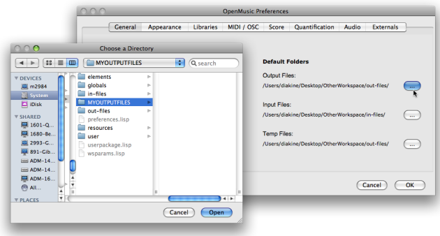
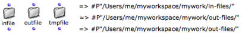
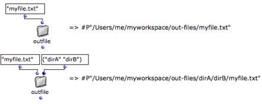

Navigation : [Previous](Pathnames "page précédente\(Pathnames\)")
| [Next](File-Box "Next\(File-Box\)")

# Default Directories

Default directories can be used for the storage of external input, output and
temporary files - MIDI, SDIF or sound files , sound analysis and synthesis
files, etc. These storage folders can also be used in programs with the text
tools presented in this section.

## OM Settings

The default locations are the in-files and out-files directories of the
current workspace directory.

Preferences

These directories are selected in the [OM Preferences](Preferences).

[Zoom](../res/selectout_scr_1.png "Zoom \(nouvelle fenêtre\)")

To define a location folder

  1. go to the `General` tab of the preferences pane

  2. click on the relevant button of the `Default Folders` section

  3. select a folder for the corresponding item.

Selection

Note that you can select any folder, including out of the workspace, and
possibly share these folders between different workspaces.

## Infile, Outfile and Tmpfile Boxes

The  **infile** , ** outfile ** and  **tmpfile** boxes allow to build
pathnames directly in the OM default folders.

Access

To access these boxes

  * select `Functions / Kernel / Files` and pick a menu item

  * `Cmd` click and type "infile", "outfile" or "tmpfile".

Inputs and Output

  * Each box has one default input where the name of the file can be specified. 

A keyword input allows to specify also a list of subdirectories, a specific
file extension, etc.

  * The output returns the a pathname.

Using the Pathname with File-Box

The output of the box can be connected to a  streamfile box in a [File-
Box](File-Box), where the pointed file can be manipulated.

References :

Contents :

  * [OpenMusic Documentation](OM-Documentation)
  * [OM User Manual](OM-User-Manual)
    * [Introduction](00-Contents)
    * [System Configuration and Installation](Installation)
    * [Going Through an OM Session](Goingthrough)
    * [The OM Environment](Environment)
    * [Visual Programming I](BasicVisualProgramming)
    * [Visual Programming II](AdvancedVisualProgramming)
      * [Abstraction](Abstraction)
      * [Evaluation Modes](EvalModes)
      * [Higher-Order Functions](HighOrder)
      * [Control Structures](Control)
      * [Iterations: OMLoop](OMLoop)
      * [Instances](Instances)
      * [Interface Boxes](InterfaceBoxes)
      * [Files](Files)
        * [Pathnames](Pathnames)
        * Default Directories
        * [File-Box](File-Box)
    * [Basic Tools](BasicObjects)
    * [Score Objects](ScoreObjects)
    * [Maquettes](Maquettes)
    * [Sheet](Sheet)
    * [MIDI](MIDI)
    * [Audio](Audio)
    * [SDIF](SDIF)
    * [Reactive mode](Reactive)
    * [Lisp Programming](Lisp)
    * [Errors and Problems](errors)
  * [OpenMusic QuickStart](QuickStart-Chapters)

Navigation : [Previous](Pathnames "page précédente\(Pathnames\)")
| [Next](File-Box "Next\(File-Box\)")

