Navigation : [Previous](Edition "page précédente\(Edition
Basics\)") | [Next](BPFLibEditors "Next\(BPF-Lib / BPC-
Lib Editors\)")

# Display Options

Contents

  1. Curve and Points
  2. View
  3. Background Picture
  4. Spline Display

## Curve and Points

Show / Hide Points

To display or hide the points of a curve, click on or outside it.

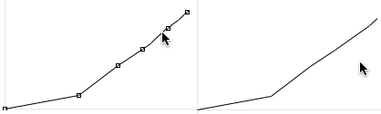

Show / Hide Line

The `line` option is selected by default.

To display points only, unselect this option.

|

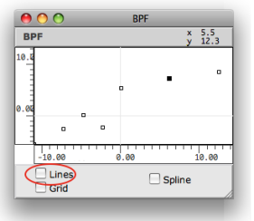  
  
---|---  
  
Grid

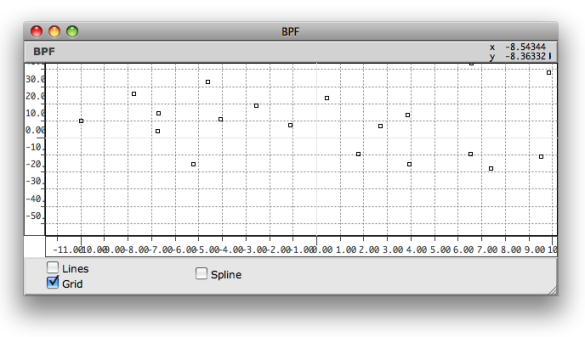

Displaying a grid in a BPF editor.

To display a grid in the editor, select the `grid` option.

The grid's step is adapted automatically to the window size and to the axis
scale.

Indexes

Press `p` to show or hide the indexes of the points. The indexes are not
ordered "chronologically", but follow the abscissa axis order.

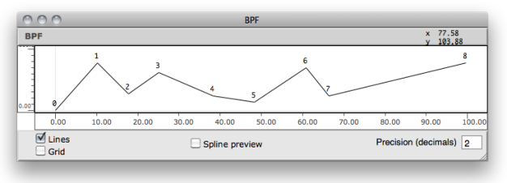

Closed BPC

BPC editors have an additional option : the `Closed BPC` option.

This option allows to connect the first and last point of the curve, in order
to get a polyhedron.

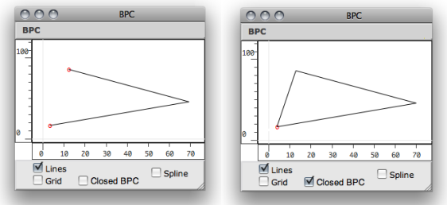

## View

Browsing the Editor

[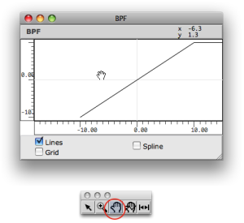](../res/moveineditor.png "Cliquez pour
agrandir")

|

To browse the editor's surface :

  1. select the hand tool ,

  2. click and drag the mouse in the editor.

  
  
---|---  
  
Rulers

To change the editor's scale, click and drag the abscissa or ordinates axis.

The adjustment limits of the abscissa ruler depends on the value of the
"decimals" input.

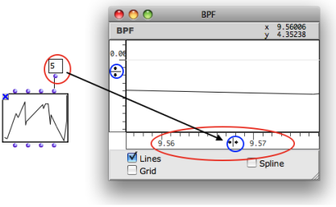

Zoom In / Out, Resize

[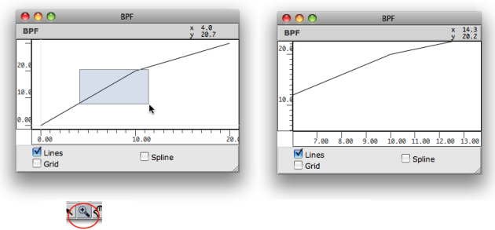](../res/zoom.png "Cliquez pour agrandir")

To zoom in a region of a curve :

  1. select the zoom tool  ,

  2. click and drag a region. 

To fit the editor's scale to the object size, click on the rezise tool
 .

## Background Picture

A picture can be associated with the BPF or BPC editors and displayed as
background. To select a background picture :

  1. `Ctrl` / right click and and select `Background Picture` in the contextual menu

  2. Click on the picyre icon

  3. Select a picture via the dialogue window

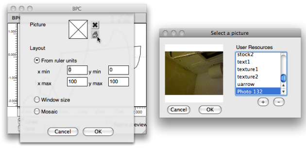

[Zoom](../res/choosepic_scr_1.png "Zoom \(nouvelle fenêtre\)")

Pictures Management

  * [Resources](resources)

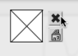

|

To delete the picture, click on the small cross icon.

  * Several options are available to set the picture coordinates and size relatively to the editor scale.

  * When a background picture is attached to the editor, the resize command  fits the editor's scales to the picture size.

  
  
---|---  
  
## Spline Display

Spline Curves

Spline are mathematical functions defined piecewise by polynomial
interpolation. They are used for generating  smoothed interpolated shapes ,
starting from a set of control points. Some functions in OM allow to generate
spline curves starting from the points of a BPF or BPC.

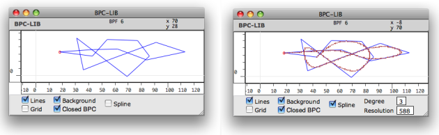

Displaying the spline of a curve.[Zoom](../res/spline1_scr_1.png "Zoom
\(nouvelle fenêtre\)")

To display the preview of a spline curve computed from the BPF/BPC, check the
`spline` display option.

Parameters

  * The spline's resolution represents the number of points in the spline preview. 
  * The spline's degree determines the number of adjacent control points used for computing the spline curve points. Higher values produce smoother curves.

To modify the spline resolution or degree :

  1. click on the **" Degree"** or " **Resolution "** frames

  2. scroll the mouse up or down to change the value.

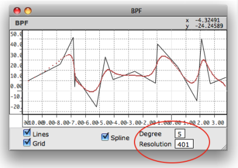

Spline Tools in OM

  * [BPF and BPC Tools](Tools)

References :

Contents :

  * [OpenMusic Documentation](OM-Documentation)
  * [OM User Manual](OM-User-Manual)
    * [Introduction](00-Contents)
    * [System Configuration and Installation](Installation)
    * [Going Through an OM Session](Goingthrough)
    * [The OM Environment](Environment)
    * [Visual Programming I](BasicVisualProgramming)
    * [Visual Programming II](AdvancedVisualProgramming)
    * [Basic Tools](BasicObjects)
      * [Curves and Functions](CurvesAndFunctions)
        * [BPF / BPC](BPF-BPC)
        * [BPF/BPC-Libs](MultiBPF)
        * [Editors](BPFEditors)
          * [Edition Basics](Edition)
          * Display
          * [BPF-Lib / BPC-Lib Editors](BPFLibEditors)
        * [BPF / BPC Tools](Tools)
        * [3D Objects](3D)
      * [Array](ClassArray)
      * [TextFile](textfile)
      * [Picture](Picture)
    * [Score Objects](ScoreObjects)
    * [Maquettes](Maquettes)
    * [Sheet](Sheet)
    * [MIDI](MIDI)
    * [Audio](Audio)
    * [SDIF](SDIF)
    * [Reactive mode](Reactive)
    * [Lisp Programming](Lisp)
    * [Errors and Problems](errors)
  * [OpenMusic QuickStart](QuickStart-Chapters)

Navigation : [Previous](Edition "page précédente\(Edition
Basics\)") | [Next](BPFLibEditors "Next\(BPF-Lib / BPC-
Lib Editors\)")

