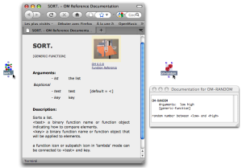
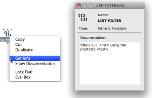
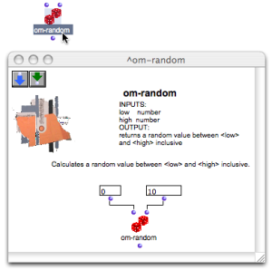

Navigation : [Previous](Evaluation "page
précédente\(Evaluation\)") | [Next](Comments "page
suivante\(Comments\)")

# Documentation and Info

There exist several way to get information about a box in an OM patch,
principally :

  * The reference documentation
  * The "Info" window
  * The tutorial patches

## Reference Documentation

The reference documentation gives access to full information about a function
or class.

To access the reference of an item select the box and :

  * press `d`
  * choose `Help / Documentation` in the main menu.

The documentation, when available, will pop up in a new window as an HTML or
simple text window.

|

[zoom](../res/onlinedoc_scr_1.png "Zoom \(nouvelle fenêtre\)")  
  
---|---  
  
## Info Window

The `Info` window provides various information, depending on the type of the
selected item, and possible short documentation.

To open the `Info` window :

  * press `Cmd` \+ `i`
  * `Ctrl` / right click on an item and select `Get Info` in the contextual menu.

|

  
  
---|---  
  
## Tutorial Patches

Tutorials are commented example patches. They are OM internal patches which
cannot be modified and saved. Nevertheless, their content can be copied in
another patch.

To open the related tutorial patch of an item, select it and

  * choose `Help / Tutorial Patch` in the menu
  * press `t` . 

The tutorial will open as a new patch.

|

  
  
---|---  
  
References :

Contents :

  * [OpenMusic Documentation](OM-Documentation)
  * [OM User Manual](OM-User-Manual)
    * [Introduction](00-Contents)
    * [System Configuration and Installation](Installation)
    * [Going Through an OM Session](Goingthrough)
    * [The OM Environment](Environment)
    * [Visual Programming I](BasicVisualProgramming)
      * [Patch Introduction](ProgrammingIntro)
      * [Adding Boxes Into a Patch](AddingBoxes)
      * [Elementary Manipulations](ElementaryManips)
      * [Boxes](Boxes)
      * [Box Inputs](BoxInputs)
      * [Connections](Connections)
      * [Evaluation](Evaluation)
      * Documentation and Info
      * [Comments](Comments)
      * [Pictures](Pictures)
      * [Saving / Reloading a Patch](SavingPatch)
      * [Dead Boxes](DeadBox)
    * [Visual Programming II](AdvancedVisualProgramming)
    * [Basic Tools](BasicObjects)
    * [Score Objects](ScoreObjects)
    * [Maquettes](Maquettes)
    * [Sheet](Sheet)
    * [MIDI](MIDI)
    * [Audio](Audio)
    * [SDIF](SDIF)
    * [Lisp Programming](Lisp)
    * [Errors and Problems](errors)
  * [OpenMusic QuickStart](QuickStart-Chapters)

Navigation : [Previous](Evaluation "page
précédente\(Evaluation\)") | [Next](Comments "page
suivante\(Comments\)")

