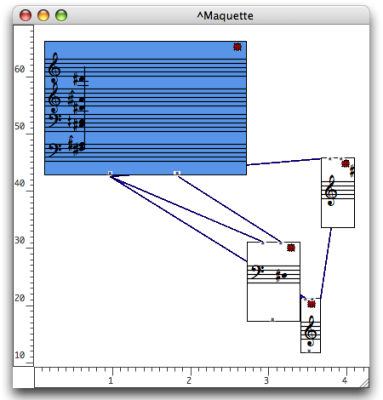
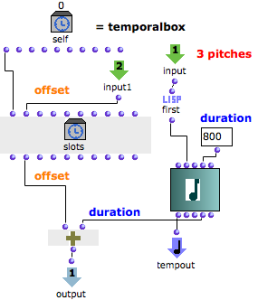
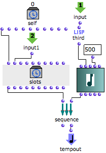

précédente\(Programming with the Tempin\)") | [page
suivante](Maquettes%20in%20Patches "Next\(Maquettes in
Patches\)")

 **Attention** , votre navigateur ne supporte pas le **javascript** ou celui-
ci a ete desactive. Certaines fonctionnalites de ce guide sont restreintes.

# Example 2 : Defining Temporal Relations Between TemporalBoxes

## Applying the Values of a TemporalBox to Other TemporalBoxes

The values of the Self Input Box can be used for defining  **temporal
relations** with other TemporalBoxes, via connections between functional
inputs and outputs.

Building a Sequence of TemporalBoxes

The chord of TemporalBox #1 is a reservoir for isolated notes that will occur
successively in the maquette.

  1. We have programmed the TemporalBoxes so that the initial chord provides one random note to each of TemporalBoxes #2; 3; and 4. 

  2. The  **offset** of each TemporalBox is determined by the  **offset and **duration** ** of the  **preceding box** , so that boxes follow each other.

Inside TemporalBox #1

The internal program of the first TemporalBox determines some characteristics
of the other TemporalBox.

Inside TemporalBox #1 : using the "pattern-chord"'s data.

  * The initial chord lasts 3 seconds. It is connected to the Tempout of TemporalBox #1, and represents its musical value. 
  * Permut-random performs a random permutation of the chord's pitches. The  **three first pitches** of this permutation are returned by nth-first to the  **first output** of TemporalBox #1.
  * On the other hand, the  **offset** of the TemporalBox returned by the Self Input Box, is added with the chord's  **duration** . 
  * The result is returned to the  **second output** of the TemporalBox.

## TemporalBoxes Interaction

The random pitches - output #1 - are returned to all the other TemporalBoxes.
The ending time of the box - output #2 - is returned to the next TemporalBox.

Inside TemporalBox #2

  1. The three random pitches are returned by the first input of TemporalBox #2 to the first function. 

First picks the first note and returns it to the note box. This note is also
given a duration.

  2. The note is connected to the Tempout and becomes the musical value of the TemporalBox.

  3. The temporal position of TemporalBox #1, is returned to the "offset" input of slots, which defines the offset of TemporalBox #2. 

  4. The offset of TemporalBox #2 is added to the duration of the note, and the result is returned to the output of TemporalBox #2.

  5. The value of the output ending of the box - is returned to the next TemporalBox, which contains the same program. 

|

  
  
---|---  
  
About Last TemporalBox

|

Note that the last TemporalBox has nor output, neither om+ function, but a
sequence function. The box has nothing to return to another box. The sequence
function allows to evaluate slots before evaluating the TemporalBox, so that
its offset is correct.  
  
---|---  
  
References :

Contents :

  * [OpenMusic Documentation](OM-Documentation)
  * [OM User Manual](OM-User-Manual)
    * [Introduction](00-Contents)
    * [System Configuration and Installation](Installation)
    * [Going Through an OM Session](Goingthrough)
    * [The OM Environment](Environment)
    * [Visual Programming I](BasicVisualProgramming)
    * [Visual Programming II](AdvancedVisualProgramming)
    * [Basic Tools](BasicObjects)
    * [Score Objects](ScoreObjects)
    * [Maquettes](Maquettes)
      * [Creating a Maquette](Maquette)
      * [TemporalBoxes](TemporalBoxes)
      * [The Maquette Editor](Editor)
      * [Maquette Programming](Programming%20Maquette)
        * [Functional Components](InputsOutputs)
        * [Evaluation](MaquetteEvaluation)
        * [The Synthesis Patch](Synthpatchprog)
        * [TempBoxes Programming](TempProgramming)
          * [The Self Input Box - Tempin](SelfInputBox)
          * [Programming with the Tempin](Examplestempbox)
          * Temporal Relations
      * [Maquettes in Patches](Maquettes%20in%20Patches)
    * [Sheet](Sheet)
    * [MIDI](MIDI)
    * [Audio](Audio)
    * [SDIF](SDIF)
    * [Lisp Programming](Lisp)
    * [Errors and Problems](errors)
  * [OpenMusic QuickStart](QuickStart-Chapters)

Navigation : [Previous](Examplestempbox "page
précédente\(Programming with the Tempin\)") | [page
suivante](Maquettes%20in%20Patches "Next\(Maquettes in
Patches\)")

