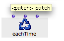
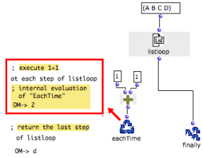
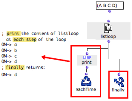
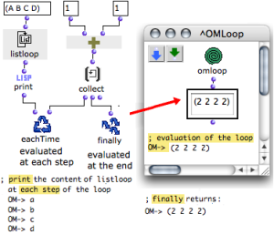

Navigation : [Previous](Finally "page précédente\(Finally\)") |
[Next](Initdo "Next\(Initdo\)")

# Executing Operations : EachTime

 **EachTime** **triggers successive evaluations**
inside the OMLoop. It is not visible from the outside.

EachTime can apply to any type of operation, but the results won't be returned
to other boxes or displayed, unless the user adds relevant connections.

## Inputs

|

EachTime has one default input, and can be added a number of optional inputs.
Each input **calls upstream boxes** , so that several tasks can be performed
at each step of the iteration.  
  
---|---  
  
## Uses

Producing, Displaying and Returning Results

Even if an EachTime evaluator is used, **the result of Finally alone** is
displayed by the Listener. Yet, EachTime plays a very important part in an
iteration, since it is the only means to evaluate and keep track of the
results yielded at each step of the program. This is one of the main
specificities and interests of OMLoop.

The results of the operations called by EachTime can actually be displayed and
returned to other boxes, inside and outside the OMLoop module . For instance,
these results can be collected and returned to Finally with accumulators, or
displayed by the Listener with a  print box.

|

EachTime has evaluated each step of the loop.  
  
---|---  
  
Example 1 : Checking an Iteration Process

To check what happens during the iteraion, a print box is evaluated at each
step.

  1. When listloop returns an item in the (A B C D) list, EachTime evaluates print.

  2. The current value of listloop is printed.

  3. At the end of the list, finally returns the last value of listloop.

|

  
  
---|---  
  
Example 2 : Collecting the Results of EachTime

|

The results of each loop of the iteration can be gathered in a list and
returned to other boxes outside the module with ** collect **, an accumulator.

Collect stores the results of each loop in a list.

  1. At each step, EachTime calls :

    * print, which print the item returned by listloop
    * collect, which stores a new value. 
  2. At the end, Finally gets all the collected values and returns them as the result of the OMLoop.

Note  : the editable-text-box displays the value of the OMLoop output.  
  
---|---  
  
Loop Accumulators

  * [Accumulators](LoopAccumulators)

References :

Contents :

  * [OpenMusic Documentation](OM-Documentation)
  * [OM User Manual](OM-User-Manual)
    * [Introduction](00-Contents)
    * [System Configuration and Installation](Installation)
    * [Going Through an OM Session](Goingthrough)
    * [The OM Environment](Environment)
    * [Visual Programming I](BasicVisualProgramming)
    * [Visual Programming II](AdvancedVisualProgramming)
      * [Abstraction](Abstraction)
      * [Evaluation Modes](EvalModes)
      * [Higher-Order Functions](HighOrder)
      * [Control Structures](Control)
      * [Iterations: OMLoop](OMLoop)
        * [Iteration](LoopIntro)
        * [General Features](LoopGeneral)
        * [Evaluators](LoopEvaluators)
          * [Finally](Finally)
          * EachTime
          * [Initdo](Initdo)
        * [Iterators](LoopIterators)
        * [Accumulators](LoopAccumulators)
        * [Example : A Random Series](LoopExample)
      * [Instances](Instances)
      * [Interface Boxes](InterfaceBoxes)
      * [Files](Files)
    * [Basic Tools](BasicObjects)
    * [Score Objects](ScoreObjects)
    * [Maquettes](Maquettes)
    * [Sheet](Sheet)
    * [MIDI](MIDI)
    * [Audio](Audio)
    * [SDIF](SDIF)
    * [Lisp Programming](Lisp)
    * [Reactive mode](Reactive)
    * [Errors and Problems](errors)
  * [OpenMusic QuickStart](QuickStart-Chapters)

Navigation : [Previous](Finally "page précédente\(Finally\)") |
[Next](Initdo "Next\(Initdo\)")

