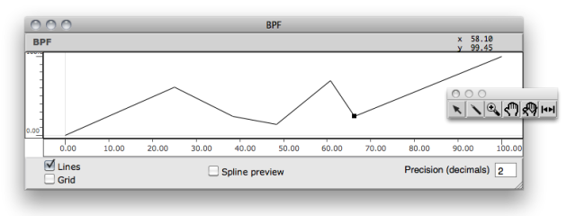
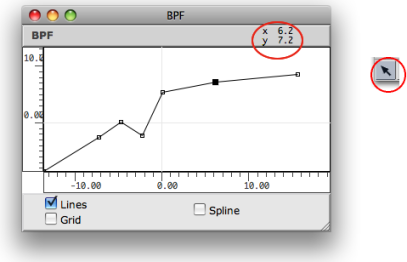
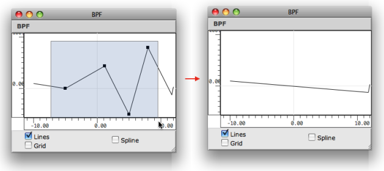
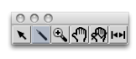
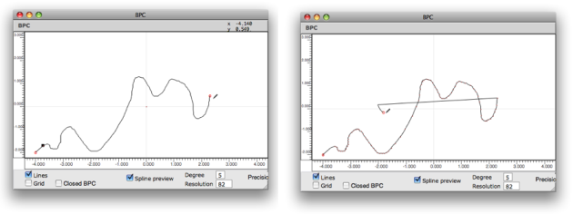
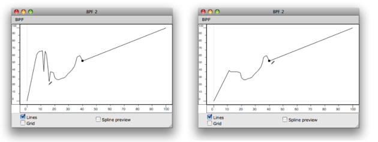
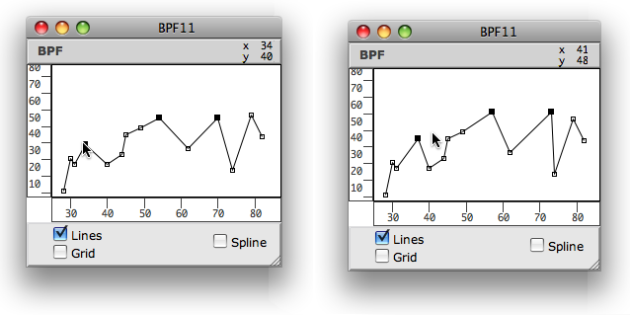
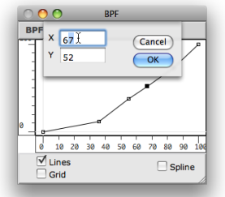
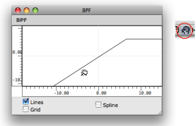
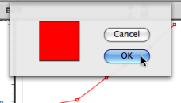

Navigation : [Previous](BPFEditors "page précédente\(Editors\)") |
[Next](Display "Next\(Display\)")

# Edition Basics

Sommaire

  1. Adding / Deleting Points
  2. Drawing in BPFs vs. BPCs
  3. Moving Points
  4. Extra Edition

Double click on a BPF or BPC to open the **editor window** . The editor opens
along with a **palette** . This palette has a number of edition tools, which
allow to add, delete and manipulate points within the editor.

The BPF editor and the edition palette.

## Adding / Deleting Points

The following operations are performed with the pointer
 .

Adding Points in a BPF

 To add points on the object, `Cmd` click in the editor window at the desired
point position.  Note that the coordinates of the pointer are displayed in the
upper part of the editor window.

Adding points in a BPC

In a BPC, points can be added anywhere in the x / y plane, so that the new
points are automatically inserted at **the end** of the points list . To add a
point between two existing points, click precisely on the curve segment.

Delete

To delete points :

  1. select a region of the object 

  2. press `Backspace`.

## Drawing in BPFs vs. BPCs

The Pen Tool

|

The "pen" tool allows to draw on the BPF or BPC Editor. To draw a curve,
select it press the mouse button while moving on the editorin the editor.  
  
---|---  
  

[Zoom](../res/drawcurve_scr_1.png "Zoom \(nouvelle fenêtre\)")

With a  BPC , points are added **at the end** of the current curve.

[Zoom](../res/BPFDraw_scr_1.png "Zoom \(nouvelle fenêtre\)")

With a  BPF , points are only added or moved **to the closest x -coordinate**
from the cursor.

Use `CMD` \+ click in order to activate the selection mode while  pen mode
tool is selected.

## Moving Points

Moving Points Manually

The location of one or several points can be modified manually :

  * with a click and drag
  * with a selection and the `->` keys.

Editing Coordinates

To access and edit the coordinates of a point :

  1. double click on it,

  2. enter values in the dialogue window.

Note : floats are truncated depending on the object "decimals" parameter. If
"decimals" = 0, coordinate values are rounded to the closest integer.

|

  
  
---|---  
  
Moving the Whole Object

To change the position of a curve within the editor's surface :

  1. select the curve tool 

  2. click and drag the object in the editor.

## Extra Edition

Colour

|

To change the colour of a curve :

  1. select the item and press `c` ,

  2. select a colour in the Colour Chooser.

Assigning specific colours to curves may be especially useful in BPF and BPC-
libs, which can have several BPFs and BPCs.  
  
---|---  
  
Multiple Curves

  * [BPF-Lib / BPC-Lib Editors](BPFLibEditors)

References :

Plan :

  * [OpenMusic Documentation](OM-Documentation)
  * [OM User Manual](OM-User-Manual)
    * [Introduction](00-Sommaire)
    * [System Configuration and Installation](Installation)
    * [Going Through an OM Session](Goingthrough)
    * [The OM Environment](Environment)
    * [Visual Programming I](BasicVisualProgramming)
    * [Visual Programming II](AdvancedVisualProgramming)
    * [Basic Tools](BasicObjects)
      * [Curves and Functions](CurvesAndFunctions)
        * [BPF / BPC](BPF-BPC)
        * [BPF/BPC-Libs](MultiBPF)
        * [Editors](BPFEditors)
          * Edition Basics
          * [Display](Display)
          * [BPF-Lib / BPC-Lib Editors](BPFLibEditors)
        * [BPF / BPC Tools](Tools)
        * [3D Objects](3D)
      * [Array](ClassArray)
      * [TextFile](textfile)
      * [Picture](Picture)
    * [Score Objects](ScoreObjects)
    * [Maquettes](Maquettes)
    * [Sheet](Sheet)
    * [MIDI](MIDI)
    * [Audio](Audio)
    * [SDIF](SDIF)
    * [Lisp Programming](Lisp)
    * [Errors and Problems](errors)
  * [OpenMusic QuickStart](QuickStart-Chapters)

Navigation : [Previous](BPFEditors "page précédente\(Editors\)") |
[Next](Display "Next\(Display\)")

