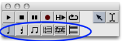
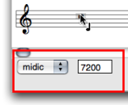
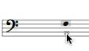
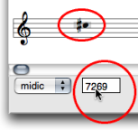
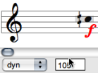
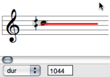
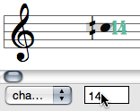
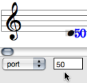

Navigation : [Previous](Editor-Display "page précédente\(Score
Display\)") | [Next](Harmonic-Obj-Editor "page
suivante\(Harmonic Objects\)")

# Basic Editing

Edition applies to all score objects.  The  **Palette** offers a set of
edition tools, adapted to each of these objects. The  **Editor Control** is
the main edition interface of the editor window. The  **Score Inspector
window** also allows a number of editing operations.

## Accessing Parameters

Selecting the Right Item : the Palette

The palette displays a player in its upper part, and edition tools in its
lower part.

To edit an item, select the relevant edition tool.

|

  
  
---|---  
  
Inspector Window

A non exhaustive set of parameters can be accessed via the  **Inspector
window** .

The Inspector window appears once an item is selected, and displays related
parametric values.

To modify a parameter :

  * Select a frame and scroll the mouse up or down to increase or decrease the values. 
  * Add `Cmd` to change the value by 10 steps, or `SHIFT` to change the value by 100 steps.

|

Editing the pitch of a note.  
  
---|---  
  
Editor Control Menu and Frame

|

The  **editor control** allows a thorough edition of each slot, as shown
below. It shows one or two menus and an adjacent numeric frame.  
  
---|---  
  
## Editor Control : Selecting and Editing Slots

Pitch

There are three ways to change the pitch of a note. In any case, the `midic`
menu item must be previously selected.

  * "Manually" : 

Select an item and move it with the mouse.

|

  
  
---|---  
  
To raise or lower the pitch from the staff, use the `↑` or `↓` keys .

  * Add `Cmd` to transpose the note from a perfect fifth.
  * Add `SHIFT` to transpose the note from an octave.

|

To change a pitch from the Editor Control Frame, click on the value displayed
in the numeric frame and scroll the mouse upwards or downwards.

  * Add `Cmd` to change the value by 100 midicents steps.
  * Add `SHIFT` to change the value by 1000 midicents steps.

Double click in the frame and type a value.  
  
---|---  
  
Velocity - Dynamics

|

  1. Choose `Dyn` in the editor control. The dynamic is displayed under the note.

  2. Click on the note and scroll the mouse to increase or decrease the velocity value.

    * Add `SHIFT` to change the value by steps of 10.
    * Add `Cmd` to switch from 0 to 127.

  
  
---|---  
  
Duration

Choose `Dur` in the pop up menu. The duration is expressed by a plain line.

There are two ways to change the duration of a note :

  * To Click in the numeric frame and scroll the mouse to increase or decrease the duration value

  * Use the `<-` and `->` keys.

    * Add `Cmd` to change the value by steps of 100 milliseconds.
    * Add `SHIFT` to change the value by steps of 1000 milliseconds.

|

  
  
---|---  
  
MidiChannel

|

The OM midi interface has 16 midi channel.

  1. Choose `Channel` in the pop up menu.

  2. Click in the adjacent frame and scroll the mouse to increase or decrease the duration value.

Add `Cmd` or ` SHIFT` to switch from 1 to 16.

  
  
---|---  
  
Port

You can access 255 audio ports.

  1. Choose `Port` in the pop up menu.

  2. Click in the adjacent frame and scroll the mouse to increase or decrease the duration value.

    * Add `Cmd` to change the value by steps of 100
    * Add `SHIFT` to change the value by steps of 10.

|

  
  
---|---  
  
References :

Plan :

  * [OpenMusic Documentation](OM-Documentation)
  * [OM 6.6 User Manual](OM-User-Manual)
    * [Introduction](00-Sommaire)
    * [System Configuration and Installation](Installation)
    * [Going Through an OM Session](Goingthrough)
    * [The OM Environment](Environment)
    * [Visual Programming I](BasicVisualProgramming)
    * [Visual Programming II](AdvancedVisualProgramming)
    * [Basic Tools](BasicObjects)
    * [Score Objects](ScoreObjects)
      * [Presentation](Score-Objects-Intro)
      * [Rhythm Trees](RT)
      * [Score Players](ScorePlayer)
      * [Score Editors](ScoreEditors)
        * [Overview](Editor-Overview)
        * [Preferences](Editors-Prefs)
        * [Score Display](Editor-Display)
        * Basic Editing
        * [Harmonic Objects](Harmonic-Obj-Editor)
        * [Rhythmic Objects](Editor-Rhythm)
        * [Polyphonic Objects](Poly-Multi-Editor)
        * [Page Mode](Editor-PageMode)
        * [Tonal Display](Editor-Tonality)
        * [Microintervals Notation](Editor-Microintervals)
        * [Play Controls](Editor-Play)
      * [Quantification](Quantification)
      * [Export / Import](ImportExport)
    * [Maquettes](Maquettes)
    * [Sheet](Sheet)
    * [MIDI](MIDI)
    * [Audio](Audio)
    * [SDIF](SDIF)
    * [Lisp Programming](Lisp)
    * [Errors and Problems](errors)
  * [OpenMusic QuickStart](QuickStart-Chapters)

Navigation : [Previous](Editor-Display "page précédente\(Score
Display\)") | [Next](Harmonic-Obj-Editor "page
suivante\(Harmonic Objects\)")

