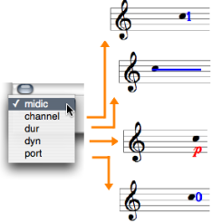

Navigation : [Previous](Editors-Prefs "page
précédente\(Preferences\)") | [Next](Editor-Basics "page
suivante\(Basic Editing\)")

# Score Display

## Displaying Information

Pop Up Menus

The note editor menus and controls.[Zoom](../res/changegrade_scr_1.png "Zoom
\(nouvelle fenêtre\)")

Pop up menus are mainly used for modifying the score displaying and player
options :

  * `Font size` - adjust the font size to your convenience. 

Use the Zoom to adjust the horizontal spacing of notes.

  * `Staff`  - number of staves and G or F clefs.

  * `Approx`  - division of the octave, from the tone to the 1/16th tone.

Each scale has an adapted accidentals notation system.

|

The 1/6 tone notation system.  
  
---|---  
  
Microintervals Notation

  * [Microintervals Notation](Editor-Microintervals)

Editor Control Menu

The Editor Control `pop up menu` allows to select and visualize each of the
parametric values attached to an object.

  * To display the corresponding value of an object, pick one option. 

The midic parameter is selected by default, and the note is displayed
permanently. This value can now be modified.

|

  
  
---|---  
  
## Staves Configuration

Non Polyphonic Objects

The staves configuration of notes ,  chords ,  chord-seqs and  voices can be
modified via a simple selection in the `Staff` pop up menu.

Polyphonic Objects

|

The staves configuration of  polys and  multi-seqs can be modified to the
whole object's scale, or to selected items scale.

  * To apply a configuration to a specific item

    1. click on the clef of a staff 

    2. select a configuration in the` Staff` pop up menu.

  * To apply a configuration to each element

    1. don't select any staff 

    2. choose a configuration in the menu.

  
  
---|---  
  
Editors Displaying Parameters

  * [Preferences](Editors-Prefs)

Multipe Staves Configurations in Polyphonic Objects

|

All score objects, but  note objects, offer multiple staves configurations -
`GG`, `FF`, `GGFF` etc. -.

These configurations do no allow single staff manipulation : staves form
groups which cannot be splitted for edition purposes .  
  
---|---  
  
## Colour

Midi Channel

To change the note colour according to its midi channel, Press `c`

|

  
  
---|---  
  
Note Colour

To change the colour of a note :

  1. press `SHIFT` \+ `c`

  2. select a colour in the Colour Chooser.

|

  
  
---|---  
  
References :

Contents :

  * [OpenMusic Documentation](OM-Documentation)
  * [OM User Manual](OM-User-Manual)
    * [Introduction](00-Contents)
    * [System Configuration and Installation](Installation)
    * [Going Through an OM Session](Goingthrough)
    * [The OM Environment](Environment)
    * [Visual Programming I](BasicVisualProgramming)
    * [Visual Programming II](AdvancedVisualProgramming)
    * [Basic Tools](BasicObjects)
    * [Score Objects](ScoreObjects)
      * [Presentation](Score-Objects-Intro)
      * [Rhythm Trees](RT)
      * [Score Players](ScorePlayer)
      * [Score Editors](ScoreEditors)
        * [Overview](Editor-Overview)
        * [Preferences](Editors-Prefs)
        * Score Display
        * [Basic Editing](Editor-Basics)
        * [Harmonic Objects](Harmonic-Obj-Editor)
        * [Rhythmic Objects](Editor-Rhythm)
        * [Polyphonic Objects](Poly-Multi-Editor)
        * [Page Mode](Editor-PageMode)
        * [Tonal Display](Editor-Tonality)
        * [Microintervals Notation](Editor-Microintervals)
        * [Play Controls](Editor-Play)
      * [Quantification](Quantification)
      * [Export / Import](ImportExport)
    * [Maquettes](Maquettes)
    * [Sheet](Sheet)
    * [MIDI](MIDI)
    * [Audio](Audio)
    * [SDIF](SDIF)
    * [Lisp Programming](Lisp)
    * [Errors and Problems](errors)
  * [OpenMusic QuickStart](QuickStart-Chapters)

Navigation : [Previous](Editors-Prefs "page
précédente\(Preferences\)") | [Next](Editor-Basics "page
suivante\(Basic Editing\)")

