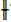
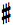
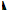
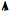
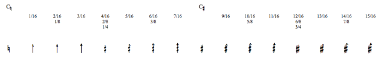
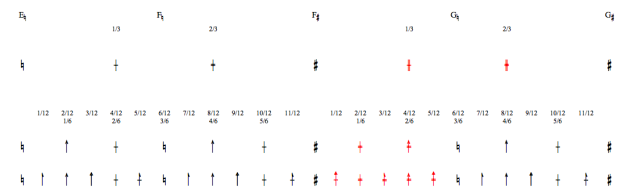
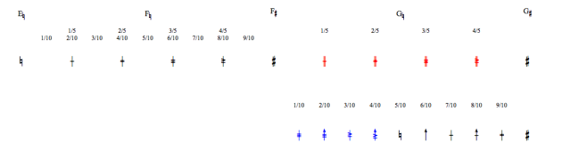
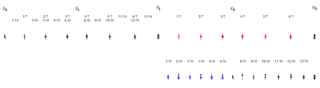

Navigation : [Previous](Editor-Tonality "page précédente\(Tonal
Display\)") | [Next](Editor-Play "Next\(Play
Controls\)")

# Microintervals Notation

## Conventions

Scales

OM offers all scales approximations from 1/2 to 1/8 tone, as well as 1/10,
1/12, 1/14 and 1/16 tone approximations.

Accidental Types

All accidentals are ascending, that is, based on  **naturals** and  **sharps**
.

Microintervals and Tonality

Microtonal scales are not available in a tonal context.

To cancel the choice of a tonality, press `Shift` \+ `t`. The original
"atonal" configuration is be restored.

## Accidentals Charts

Note

Scales that don't comprise semitones - 1/3, 1/5, 1/7 and their derived scales
can be tricky, for they sometimes have different types of accidentals.

Notation Principles

**Naturals** are replaced by plain vertical lines - for instance
: .

Incrementations of  **sharps** are indicated by two vertical lines - for
instance :.

  * ** 1/4 tone ** scale : 

the number of vertical lines indicates incrementations of 1, 2 or 3 quarter
tones - for instance .

  * **1/8   and 1/16 tone** scales : 

three different arrowheads indicate incrementations of a 1/16th
, 1/8th and 3/16th
tones of naturals and sharps.

  * **1/3 tone** scale : 

incrementations of 1 or 2 thirds of tone are shown by the number of additional
horizontal lines - for instance  .

  * **1/6 and 1/12 tone** scales :

they combine  
arrowheads with horizontal lines.

  * **1/5, 1/7 tone** scale and their multiples :

they use additional combination of horizontal lines.

1/2 Tone and Elementary Multiples

Accidentals of the half tone scale and its multiples.[Zoom](../res/1_scr_1.png
"Zoom \(nouvelle fenêtre\)")

1/3 Tone and Elementary Multiples

Accidentals of the third tone scale and its
multiples.[Zoom](../res/3RD_scr_1.png "Zoom \(nouvelle fenêtre\)")

1/5 and 1/10 Tone

Accidentals of the fifth and tenth tone scales.[Zoom](../res/5th_scr_1.png
"Zoom \(nouvelle fenêtre\)")

1/7 and 1/14 Tone

Accidentals of the seventh and fourteenth tone
scales.[Zoom](../res/7th_scr_1.png "Zoom \(nouvelle fenêtre\)")

References :

Plan :

  * [OpenMusic Documentation](OM-Documentation)
  * [OM 6.6 User Manual](OM-User-Manual)
    * [Introduction](00-Sommaire)
    * [System Configuration and Installation](Installation)
    * [Going Through an OM Session](Goingthrough)
    * [The OM Environment](Environment)
    * [Visual Programming I](BasicVisualProgramming)
    * [Visual Programming II](AdvancedVisualProgramming)
    * [Basic Tools](BasicObjects)
    * [Score Objects](ScoreObjects)
      * [Presentation](Score-Objects-Intro)
      * [Rhythm Trees](RT)
      * [Score Players](ScorePlayer)
      * [Score Editors](ScoreEditors)
        * [Overview](Editor-Overview)
        * [Preferences](Editors-Prefs)
        * [Score Display](Editor-Display)
        * [Basic Editing](Editor-Basics)
        * [Harmonic Objects](Harmonic-Obj-Editor)
        * [Rhythmic Objects](Editor-Rhythm)
        * [Polyphonic Objects](Poly-Multi-Editor)
        * [Page Mode](Editor-PageMode)
        * [Tonal Display](Editor-Tonality)
        * Microintervals Notation
        * [Play Controls](Editor-Play)
      * [Quantification](Quantification)
      * [Export / Import](ImportExport)
    * [Maquettes](Maquettes)
    * [Sheet](Sheet)
    * [MIDI](MIDI)
    * [Audio](Audio)
    * [SDIF](SDIF)
    * [Lisp Programming](Lisp)
    * [Errors and Problems](errors)
  * [OpenMusic QuickStart](QuickStart-Chapters)

Navigation : [Previous](Editor-Tonality "page précédente\(Tonal
Display\)") | [Next](Editor-Play "Next\(Play
Controls\)")

