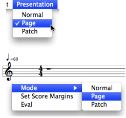
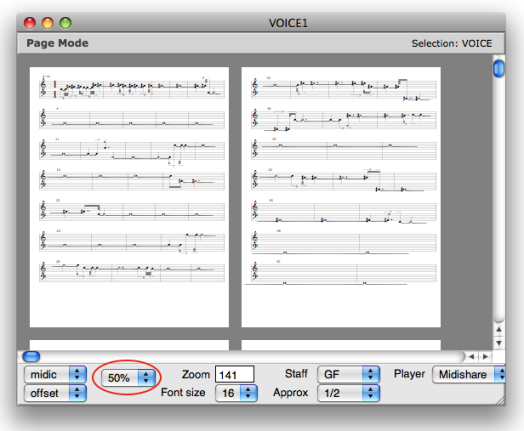
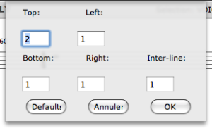
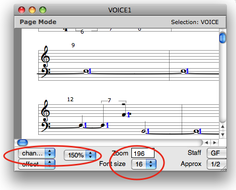

# Page Mode

The content of objects can be displayed and edited - to a certain extent - on
**page mode** . This is especially convenient as far as long sequences are
concerned. The page mode is also very convenient to get a preview of an object
and modify its page layout before printing.

## Displaying Pages

Accessing Page Mode

|

To display a content on page mode

  * select `Presentation / Page` in the main menu
  * `Ctrl` / right click in the editor to access the contextual menu.

  
  
---|---  
  
Page Size

The number of displayed pages can be modified via the `page size` menu.

Margins

|

To modify the page margins :

  1. `Ctrl` / right click in the editor 

  2. select the `Page layout` menu item in the contextual menu.

    * Select `Default` to restore the default page margins.
    * Select `Cancel` to cancel values.
    * Press `OK` to validate.

Margins values are also effective on `Normal` presentation mode.  
  
---|---  
  
## Parameters Displaying and Edition

Legibility : Slots and Score

Parametric values can also be displayed via the usual upper and lower Editor
Control menus.

Font size and zoom can be adjusted via the usual menus.

Parametric Values Edition

Slots cannot be edited.

Notes and chord can be moved or deleted, but new pitches cannot be entered in
the score.

## Print

To print the score :

  * select `File / Print` in the main menu 
  * press `Cmd` \+ `p` .

References :

Plan :

  * [OpenMusic Documentation](OM-Documentation)
  * [OM 6.6 User Manual](OM-User-Manual)
    * [Introduction](00-Sommaire)
    * [System Configuration and Installation](Installation)
    * [Going Through an OM Session](Goingthrough)
    * [The OM Environment](Environment)
    * [Visual Programming I](BasicVisualProgramming)
    * [Visual Programming II](AdvancedVisualProgramming)
    * [Basic Tools](BasicObjects)
    * [Score Objects](ScoreObjects)
      * [Presentation](Score-Objects-Intro)
      * [Rhythm Trees](RT)
      * [Score Players](ScorePlayer)
      * [Score Editors](ScoreEditors)
        * [Overview](Editor-Overview)
        * [Preferences](Editors-Prefs)
        * [Score Display](Editor-Display)
        * [Basic Editing](Editor-Basics)
        * [Harmonic Objects](Harmonic-Obj-Editor)
        * [Rhythmic Objects](Editor-Rhythm)
        * [Polyphonic Objects](Poly-Multi-Editor)
        * Page Mode
        * [Tonal Display](Editor-Tonality)
        * [Microintervals Notation](Editor-Microintervals)
        * [Play Controls](Editor-Play)
      * [Quantification](Quantification)
      * [Export / Import](ImportExport)
    * [Maquettes](Maquettes)
    * [Sheet](Sheet)
    * [MIDI](MIDI)
    * [Audio](Audio)
    * [SDIF](SDIF)
    * [Lisp Programming](Lisp)
    * [Errors and Problems](errors)
  * [OpenMusic QuickStart](QuickStart-Chapters)

Navigation : [page precedente](Poly-Multi-Editor "page
précédente\(Polyphonic Objects\)") | [page suivante](Editor-Tonality
"page suivante\(Tonal Display\)")

