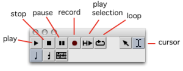
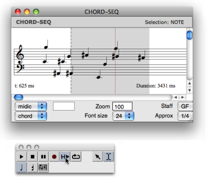
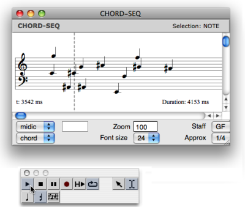

Navigation : [Previous](Editor-Microintervals "page
précédente\(Microintervals Notation\)") | [Next](Quantification
"Next\(Quantification\)")

# Play Controls

|

The player of the editor palette includes several standard commands.  
  
---|---  
  
About Ports Settings for MIDI Playback

  * [Managing MIDI Ports](MIDI-Ports)

## Playing Modes

Play Selection

This command allows to play a selection within an object.

  1. Select the cursor  .

  2. Add a marker or select a region in the score editor.

  3. Click on the play selection command  : the player will either play the object from the marker to the end, or the selected region.

Play Loop

This command allows to play a selected region repeatedly.

  1. Select a region with the cursor.

  2. Click on the loop  and play commands.

Record

 This command allows to record any sound from a
midi device.

References :

Contents :

  * [OpenMusic Documentation](OM-Documentation)
  * [OM User Manual](OM-User-Manual)
    * [Introduction](00-Contents)
    * [System Configuration and Installation](Installation)
    * [Going Through an OM Session](Goingthrough)
    * [The OM Environment](Environment)
    * [Visual Programming I](BasicVisualProgramming)
    * [Visual Programming II](AdvancedVisualProgramming)
    * [Basic Tools](BasicObjects)
    * [Score Objects](ScoreObjects)
      * [Presentation](Score-Objects-Intro)
      * [Rhythm Trees](RT)
      * [Score Players](ScorePlayer)
      * [Score Editors](ScoreEditors)
        * [Overview](Editor-Overview)
        * [Preferences](Editors-Prefs)
        * [Score Display](Editor-Display)
        * [Basic Editing](Editor-Basics)
        * [Harmonic Objects](Harmonic-Obj-Editor)
        * [Rhythmic Objects](Editor-Rhythm)
        * [Polyphonic Objects](Poly-Multi-Editor)
        * [Page Mode](Editor-PageMode)
        * [Tonal Display](Editor-Tonality)
        * [Microintervals Notation](Editor-Microintervals)
        * Play Controls
      * [Quantification](Quantification)
      * [Export / Import](ImportExport)
    * [Maquettes](Maquettes)
    * [Sheet](Sheet)
    * [MIDI](MIDI)
    * [Audio](Audio)
    * [SDIF](SDIF)
    * [Lisp Programming](Lisp)
    * [Errors and Problems](errors)
  * [OpenMusic QuickStart](QuickStart-Chapters)

Navigation : [Previous](Editor-Microintervals "page
précédente\(Microintervals Notation\)") | [Next](Quantification
"Next\(Quantification\)")

