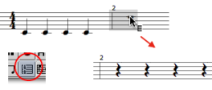
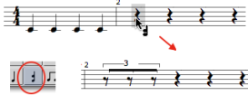
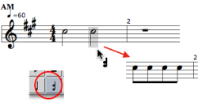
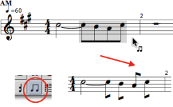
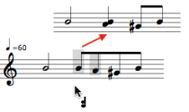
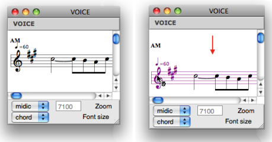
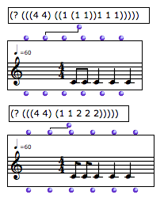

Navigation : [Previous](Editor-Other-Slots "page précédente\(Other
Slots\)") | [Next](Poly-Multi-Editor "Next\(Polyphonic
Objects\)")

# Rhythmic Objects : Voice Editor

The voice editor palettes shows a number of additional tools, which define
hierarchic edition level.

  *  **Group tool** \- rhythmic groups within measures of the sequence. 

  *  **Measure tool** \- entire measures within the sequence.

  *  **Voice tool** \- seen before, more specifically dedicated to the voice object whole voice at once.

**Consecutive pitches** are considered as **chords** .  This must be taken
into account for choosing the appropriate tool in the palette.

## Entering Chords and Notes

Adding and Deleting Measures

  * To add measures in a poly :

    1. select the measure tool  in the palette,

    2. `Cmd` click on the left or on the right of the pre existent measure. in the palette

  * To delete one or several selected measures, press `Backspace`.

Converting Silences into Notes

|

Once created, a measure displays a whole pause. You can either :

  * turn this pause into a whole note, and then split it into other values,

  * split this pause into shorter values first, and split it into other values.

To convert a whole pause into a whole note and back, select the measure tool
 , select the measure and press `esc` .  
  
---|---  
  
To split a silence or a note  into a group of equal values :

  1. select the chord tool  ,

  2. select the item,

  3. enter a number.

|

  
  
---|---  
  
Adding Notes to Chords

Select the note or the chord tool and `Cmd` click on a chord.

If you didn't click right on the chord, the note is framed in red.

Use the `<-` and `->` keys to reach the desired chord and press `ENTER` .

|

  
  
---|---  
  
## Manipulating

Chords

To tie successive chords, press `=` .

To untie them, press `/` .

Groups

To get a group :

  1. select a chord

  2. enter a number to split it into smaller equal values.

Individual chords cannot be grouped from the voice editor.

|

  
  
---|---  
  

|

To break an existing group :

  1. select a group with the group tool

  2. press `-`.

  
  
---|---  
  
Durations

To merge successive chords into one longer chord :

  1. delete all existing ties,

  2. select several chords with the chord tool, and press `+` .

The duration of the resulting chord is equal to the sum of the merged chords.

|

  
  
---|---  
  
Move Staff

To move a staff up or down :

  1. select it by clicking on the clef

  2. use the `↓` `↑` keys.

Staff, Voices and Measures

To apply modifications to a whole voice or measure, select the voice tool
 or the measure tool 

Some modifications may not be relevant. Groups cannot be broken over a whole
voice, for instance.

Transposing an entire voice.

Note that if a voice consists of several staves,  a selection with the voice
tool applies to the whole group of staves.

Groups

The second mesure of the first voice shows three groups levels nested within
each other.

Groups are represented by beams or by small vertical lines.

To break a group :

  1. select the group tool, 

  2. select the group to break,

  3. press `-`. 

If several groups are nested into each other, they are broken from the main
level to the secondary levels.

Groups and Rhythm Trees Syntax :

  * [Rhythm Trees](RT)

Reminder : Groups and Rhythm Trees

Groups are written as  **sub lists.**

Here, the first sequence has one eighth notes group, the second sequence has
no group.

|

  
  
---|---  
  
Modifying Groups From the Rhythm Tree Input

Groups cannot be created from the editor. If you modify a rhythm tree after
editing the other parameters of a voice, all parameters are reset to their
default value when evaluating the object.

References :

Contents :

  * [OpenMusic Documentation](OM-Documentation)
  * [OM User Manual](OM-User-Manual)
    * [Introduction](00-Contents)
    * [System Configuration and Installation](Installation)
    * [Going Through an OM Session](Goingthrough)
    * [The OM Environment](Environment)
    * [Visual Programming I](BasicVisualProgramming)
    * [Visual Programming II](AdvancedVisualProgramming)
    * [Basic Tools](BasicObjects)
    * [Score Objects](ScoreObjects)
      * [Presentation](Score-Objects-Intro)
      * [Rhythm Trees](RT)
      * [Score Players](ScorePlayer)
      * [Score Editors](ScoreEditors)
        * [Overview](Editor-Overview)
        * [Preferences](Editors-Prefs)
        * [Score Display](Editor-Display)
        * [Basic Editing](Editor-Basics)
        * [Harmonic Objects](Harmonic-Obj-Editor)
        * Rhythmic Objects
        * [Polyphonic Objects](Poly-Multi-Editor)
        * [Page Mode](Editor-PageMode)
        * [Tonal Display](Editor-Tonality)
        * [Microintervals Notation](Editor-Microintervals)
        * [Play Controls](Editor-Play)
      * [Quantification](Quantification)
      * [Export / Import](ImportExport)
    * [Maquettes](Maquettes)
    * [Sheet](Sheet)
    * [MIDI](MIDI)
    * [Audio](Audio)
    * [SDIF](SDIF)
    * [Lisp Programming](Lisp)
    * [Reactive mode](Reactive)
    * [Errors and Problems](errors)
  * [OpenMusic QuickStart](QuickStart-Chapters)

Navigation : [Previous](Editor-Other-Slots "page précédente\(Other
Slots\)") | [Next](Poly-Multi-Editor "Next\(Polyphonic
Objects\)")

