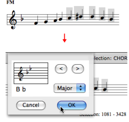

# Tonal Display

Sommaire

  1. Tonality
  2. Editor Scale
  3. Cadences, Degrees and Figuring
  4. Modulation

Tonal display options concern all musical objects with possible tonal harmonic
or melodic progressions :  chord-seqs,  multi-seqs,  voices and  polys .

## Tonality

Editor Preferences

The `Editor preferences` tab provides a number of options and tools, which
relate to tonality expression and analysis.

|

  
  
---|---  
  
Tonality Dialogue Window

To choose a tonality

  1. select the editor and press `t`. 

  2. A tonality dialogue window pops up. 

  3. Select the `Minor` or `Major` mode in the pop up menu, and a key signature via the `<` and `>` buttons. 

  4. The tonality is indicated on the upper left corner of the editor, as well as a conventional key signature. 

To restore the original "atonal" configuration, press `SHIFT` \+ `t` .

Enharmony

OM automatically assigns the expected accidentals, depending on the chosen
tonality. Accidentals can though be modified enharmonically.

To modify an accidental :

  1. select the note tool, 

  2. `Ctrl` click on a note and select an item.

|

  
  
---|---  
  
## Editor Scale

The default accidental notation system in score editors uses sharps. This
system can be modified, to a certain extent.

|

The `Editor Scale` dialogue window offers a limited number of enharmonic
accidentals, based on the standard twelve semitones notation.

This especially makes sense when using a tonal or modal semitones scale
pattern.

To specify a scale

  1. select an editor and press `s`. 

  2. The `Editor Scale` dialogue window opens. 

  3. Choose `Edit`.

  
  
---|---  
  
To assign an enharmonic accidental to a note, `Ctrl` / right click on it and
select a menu item.

Modifications of the default scale are displayed by the dialogue window.

Click on `Default` to reset the default scale.

|

  
  
---|---  
  
## Cadences, Degrees and Figuring

|

An elementary tonal analysis tool is implemented in musical editors. It is
based on the options provided in the `Editor preferences` :

  * `Degrees`
  * `Cadences`
  * `Figuring`

The analysis takes place as chords are being edited, provided OM can recognize
a listed chord and chord progression.  
  
---|---  
  
## Modulation

Specifying Modulations

Modulations can be specified textually in the score editor.

  1. Select a section in a score and press `t`.

  2. Choose a tonality.

|

  
  
---|---  
  
Boundaries

|

OM displays the modulation but it doesn't automatically adapt the key
signature or accidentals to the new tonality.  
  
---|---  
  
References :

Plan :

  * [OpenMusic Documentation](OM-Documentation)
  * [OM 6.6 User Manual](OM-User-Manual)
    * [Introduction](00-Sommaire)
    * [System Configuration and Installation](Installation)
    * [Going Through an OM Session](Goingthrough)
    * [The OM Environment](Environment)
    * [Visual Programming I](BasicVisualProgramming)
    * [Visual Programming II](AdvancedVisualProgramming)
    * [Basic Tools](BasicObjects)
    * [Score Objects](ScoreObjects)
      * [Presentation](Score-Objects-Intro)
      * [Rhythm Trees](RT)
      * [Score Players](ScorePlayer)
      * [Score Editors](ScoreEditors)
        * [Overview](Editor-Overview)
        * [Preferences](Editors-Prefs)
        * [Score Display](Editor-Display)
        * [Basic Editing](Editor-Basics)
        * [Harmonic Objects](Harmonic-Obj-Editor)
        * [Rhythmic Objects](Editor-Rhythm)
        * [Polyphonic Objects](Poly-Multi-Editor)
        * [Page Mode](Editor-PageMode)
        * Tonal Display
        * [Microintervals Notation](Editor-Microintervals)
        * [Play Controls](Editor-Play)
      * [Quantification](Quantification)
      * [Export / Import](ImportExport)
    * [Maquettes](Maquettes)
    * [Sheet](Sheet)
    * [MIDI](MIDI)
    * [Audio](Audio)
    * [SDIF](SDIF)
    * [Lisp Programming](Lisp)
    * [Errors and Problems](errors)
  * [OpenMusic QuickStart](QuickStart-Chapters)

Navigation : [page precedente](Editor-PageMode "page précédente\(Page
Mode\)") | [page suivante](Editor-Microintervals "page
suivante\(Microintervals Notation\)")

