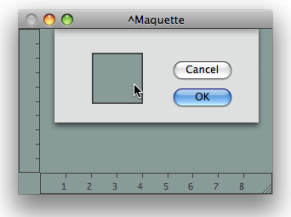
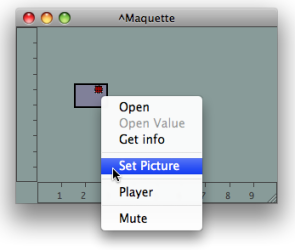
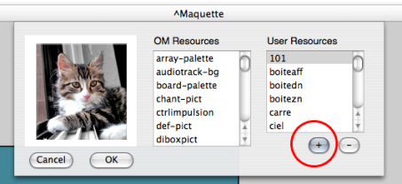
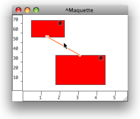

Navigation : [Previous](Editor "page précédente\(The Maquette
Editor\)") | [Next](Grid%20and%20Rulers "Next\(Rulers
and Grid\)")

# Maquette Editor Appearance

## Default Appearance of Maquettes

To modify the default appearance of maquettes :

  1. go to the `Prefences` menu

  2. select the `Maquette`  tab in the `Preferences` pane.

These modification only apply to items created afterward.

|

  
  
---|---  
  

|

  1. Click on the **" Default Colour"** frame of the maquette.

  2. Pick a colour in the Colour Chooser, and select `OK`. 

  3. Select `Apply` or `Cancel`, 

  4. choose `OK` to validate your choice. 

Select `Restore` to reset the default preferences of the maquette.  
  
---|---  
  
## Contextual Modifications

Colour

To modify the colour of a specific maquette editor, press `SHIFT` \+ `c` and
follow the previous procedure.

Maquettes and TemporalBoxes Pictures

To assign a maquette editor or a TemporalBox a background picture :

  1. `Ctrl` / right click in the editor

  2. choose `Load Picture`, or `Set Picture` depending whether you have selected the maquette itself or a Temporalbox,

  3. choose a picture in the Picture Chooser. 

|

  
  
---|---  
  
You can possibly import a resource to the **User Resources**.

Choosing Pictures : Detailed Procedure

  * [Resources](resources)

Modifying the Temporalboxes Appearance

  * [Temporalboxes Appearance](Appearance)

## Connections

Showing / Hiding Connections

Connections can be hidden or shown, depending whether the semantic structure
of the program has to be revealed or not.

To show or hide connections, `Ctrl` / right click on a box and choose `Show /
Hide Connections`.

Colour

|

To modify the colour of the connections between Temporalboxes :

  1. select a connection

  2. press `c`.

  
  
---|---  
  
References :

Contents :

  * [OpenMusic Documentation](OM-Documentation)
  * [OM User Manual](OM-User-Manual)
    * [Introduction](00-Contents)
    * [System Configuration and Installation](Installation)
    * [Going Through an OM Session](Goingthrough)
    * [The OM Environment](Environment)
    * [Visual Programming I](BasicVisualProgramming)
    * [Visual Programming II](AdvancedVisualProgramming)
    * [Basic Tools](BasicObjects)
    * [Score Objects](ScoreObjects)
    * [Maquettes](Maquettes)
      * [Creating a Maquette](Maquette)
      * [TemporalBoxes](TemporalBoxes)
      * [The Maquette Editor](Editor)
        * Editor Appearance
        * [Rulers and Grid](Grid%20and%20Rulers)
        * [The Palette](player)
        * [Markers / Anchors](Markers)
      * [Maquette Programming](Programming%20Maquette)
      * [Maquettes in Patches](Maquettes%20in%20Patches)
    * [Sheet](Sheet)
    * [MIDI](MIDI)
    * [Audio](Audio)
    * [SDIF](SDIF)
    * [Lisp Programming](Lisp)
    * [Reactive mode](Reactive)
    * [Errors and Problems](errors)
  * [OpenMusic QuickStart](QuickStart-Chapters)

Navigation : [Previous](Editor "page précédente\(The Maquette
Editor\)") | [Next](Grid%20and%20Rulers "Next\(Rulers
and Grid\)")

