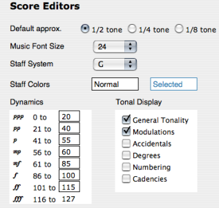
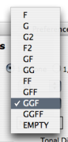
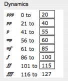

# Preferences

The basic settings of the score editors can be modified via the` Score
Editors` tab of the `Preferences` pane. To access the `Score Editors`
preferences, select the `OM.6.X.X / Preferences` menu, and click on the
 score icon. These default parameters can be
modified subsequently if needed, via the score editors themselves.

## Displaying Options

The score editors preferences give access to a set of musical displaying
parameters.

Default Scale Approximation

Three default scales are offered by OM :

  * semitones
  * quarter tones
  * eighth tones. 

Other scales, from the tone to the sixteenth tone are available via the
editors menus.

Choosing a Scale :

  * [Score Display](Editor-Display)

Music Font Size

The music font size affects the size of the whole score, like a vertical zoom.

Staff Configuration and Colour

A great number of staff configurations, based on F and G clefs combinations,
is offered in the preferences.

A specific staff colour can be be selected via the Colour Chooser.

|

  
  
---|---  
  
Dynamics

|

The standard midi dynamics scale can also be adapted to the user's specific
needs, via the **" Dynamics"** frame.  
  
---|---  
  
Tonal Display

The **" Tonal Display"** frame offers a number of options, which are dedicated
to tonal music notation.

|

  
  
---|---  
  
About Tonality :

  * [Tonal Display](Editor-Tonality)

References :

Plan :

  * [OpenMusic Documentation](OM-Documentation)
  * [OM 6.6 User Manual](OM-User-Manual)
    * [Introduction](00-Sommaire)
    * [System Configuration and Installation](Installation)
    * [Going Through an OM Session](Goingthrough)
    * [The OM Environment](Environment)
    * [Visual Programming I](BasicVisualProgramming)
    * [Visual Programming II](AdvancedVisualProgramming)
    * [Basic Tools](BasicObjects)
    * [Score Objects](ScoreObjects)
      * [Presentation](Score-Objects-Intro)
      * [Rhythm Trees](RT)
      * [Score Players](ScorePlayer)
      * [Score Editors](ScoreEditors)
        * [Overview](Editor-Overview)
        * Preferences
        * [Score Display](Editor-Display)
        * [Basic Editing](Editor-Basics)
        * [Harmonic Objects](Harmonic-Obj-Editor)
        * [Rhythmic Objects](Editor-Rhythm)
        * [Polyphonic Objects](Poly-Multi-Editor)
        * [Page Mode](Editor-PageMode)
        * [Tonal Display](Editor-Tonality)
        * [Microintervals Notation](Editor-Microintervals)
        * [Play Controls](Editor-Play)
      * [Quantification](Quantification)
      * [Export / Import](ImportExport)
    * [Maquettes](Maquettes)
    * [Sheet](Sheet)
    * [MIDI](MIDI)
    * [Audio](Audio)
    * [SDIF](SDIF)
    * [Lisp Programming](Lisp)
    * [Errors and Problems](errors)
  * [OpenMusic QuickStart](QuickStart-Chapters)

Navigation : [page precedente](Editor-Overview "page
précédente\(Overview\)") | [page suivante](Editor-Display "page
suivante\(Score Display\)")

