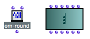
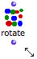
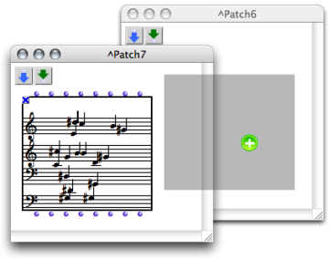
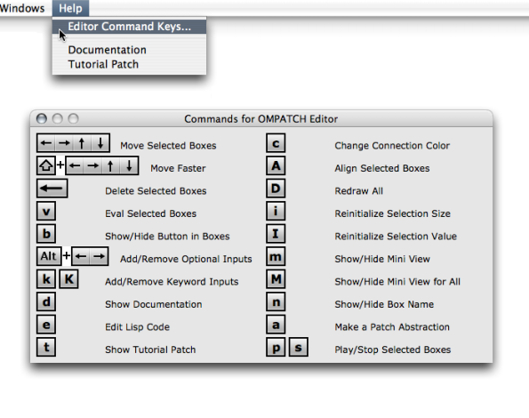

Navigation : [Previous](AddingBoxes "page précédente\(Adding Boxes
Into a Patch\)") | [Next](Boxes "Next\(Boxes\)")

# Elementary Manipulations

This section provides information about specific commands regarding the
manipulation of items within patches. Specific details are given for each box
type in [Boxes and Patch Components](Boxes).

## Selection and Resizing

Selection

Boxes are selected using standard mouse selection. A selected box shows a bold
border.

  * To enable multiple selection, click on boxes keeping pressing `SHIFT` or click and drag the mouse over several boxes.
  * To select all the boxes of a window, choose `Edit / Select All`, or press `Cmd`\+ `a` .

|

Selected boxes.  
  
---|---  
  
Most patch editor commands apply to every selected boxes in the current
window.

Resizing

|

  * To resize a box, hover the mouse over the lower right corner of the box, then drag it with the cursor.
  * To restore the default size of the selected box(es), press `i` .

  
---|---  
  
## Move / Copy / Align

Move

To move an item around in a patch editor :

  * drag and drop it with the mouse
  * select it and use the four  `->` keys. Add `SHIFT` to move items faster.

Drag and Drop / Copy

Boxes can also be moved or copied from a patch editor to another.

  * Drag and drop the item to move it. 
  * Add the `Alt` key to copy it. 
  * Use the usual commands and shortcuts -  `Edit / Copy`, `Paste`, `Duplicate` ...

Copying a chord-seq box to another patch editor.

Align

To align all selected boxes automatically, press `SHIFT` \+ `a` .

## Delete

To delete selected boxes :

  * press `Backspace` ,
  * select `Edit / Clear - Cut `or press `Cmd` \+ `x` .

Undo

The Undo command can be used for restoring deleted boxes - not their
connections. It can only apply to the last action that was executed.

To cancel an action :

  * select ` Edit / Undo`
  * press `Cmd` \+ `z` .

Tip : Patch Editor Commands

To display an overview of the main patch editor commands :

  * choose `Help / Editor Command Keys`

  * type `h` in an open patch editor. 

References :

Contents :

  * [OpenMusic Documentation](OM-Documentation)
  * [OM User Manual](OM-User-Manual)
    * [Introduction](00-Contents)
    * [System Configuration and Installation](Installation)
    * [Going Through an OM Session](Goingthrough)
    * [The OM Environment](Environment)
    * [Visual Programming I](BasicVisualProgramming)
      * [Patch Introduction](ProgrammingIntro)
      * [Adding Boxes Into a Patch](AddingBoxes)
      * Elementary Manipulations
      * [Boxes](Boxes)
      * [Box Inputs](BoxInputs)
      * [Connections](Connections)
      * [Evaluation](Evaluation)
      * [Documentation and Info](DocAndInfo)
      * [Comments](Comments)
      * [Pictures](Pictures)
      * [Saving / Reloading a Patch](SavingPatch)
      * [Dead Boxes](DeadBox)
    * [Visual Programming II](AdvancedVisualProgramming)
    * [Basic Tools](BasicObjects)
    * [Score Objects](ScoreObjects)
    * [Maquettes](Maquettes)
    * [Sheet](Sheet)
    * [MIDI](MIDI)
    * [Audio](Audio)
    * [SDIF](SDIF)
    * [Reactive mode](Reactive)
    * [Lisp Programming](Lisp)
    * [Errors and Problems](errors)
  * [OpenMusic QuickStart](QuickStart-Chapters)

Navigation : [Previous](AddingBoxes "page précédente\(Adding Boxes
Into a Patch\)") | [Next](Boxes "Next\(Boxes\)")

