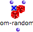
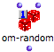
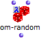
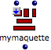

Navigation : [Previous](RecursiveTree "page précédente\(Recursive
Trees\)") | [Next](LockMode "Next\(Lock Mode\)")

## Evaluation Modes

"Evaluation" refers to two different concepts :

  * The **user-evaluation** , which is triggered **by the user via the interface**  :

`Cmd` click on an outlet, or with a selection + `v` .

  * The **internal evaluation** , which refers to an evaluation or to a series of evaluations **resulting** from a user-evaluation. 

This section deals with the **control of internal evaluations**.

Boxes can be set on four different evaluation modes, in addition to the
default mode, to control the transmission of resulting data in a program, or
to perform specific tasks. These modes are :

  * **[ **lock** mode](LockMode) ** : 

|

  * **[ **evaluate-once** mode](EvOnceMode) ** : 

  
---|---  
  
  * **[ **lambda** mode](LambdaMode) ** : 

|

  * **[ **reference** mode](RefMode) ** : 

  
  
To select an evaluation mode :

  1. press `b` to set the box on "lock" mode

  2. click successively on the upper left label of the box to select other modes. 

To reset the box to its initial state, press `b` again.

Duplication doesn't affect the state of a box that was set on a specific
evaluation mode : the copy will have the same parameters and will be on the
same mode as the master.

References :

Plan :

  * [OpenMusic Documentation](OM-Documentation)
  * [OM 6.6 User Manual](OM-User-Manual)
    * [Introduction](00-Sommaire)
    * [System Configuration and Installation](Installation)
    * [Going Through an OM Session](Goingthrough)
    * [The OM Environment](Environment)
    * [Visual Programming I](BasicVisualProgramming)
    * [Visual Programming II](AdvancedVisualProgramming)
      * [Abstraction](Abstraction)
      * Evaluation Modes
        * [Lock Mode](LockMode)
        * [Evaluate-Once Mode](EvOnceMode)
        * [Lambda Mode](LambdaMode)
        * [Reference Mode](RefMode)
      * [Higher-Order Functions](HighOrder)
      * [Control Structures](Control)
      * [Iterations: OMLoop](OMLoop)
      * [Instances](Instances)
      * [Interface Boxes](InterfaceBoxes)
      * [Files](Files)
    * [Basic Tools](BasicObjects)
    * [Score Objects](ScoreObjects)
    * [Maquettes](Maquettes)
    * [Sheet](Sheet)
    * [MIDI](MIDI)
    * [Audio](Audio)
    * [SDIF](SDIF)
    * [Lisp Programming](Lisp)
    * [Errors and Problems](errors)
  * [OpenMusic QuickStart](QuickStart-Chapters)

Navigation : [Previous](RecursiveTree "page précédente\(Recursive
Trees\)") | [Next](LockMode "Next\(Lock Mode\)")

