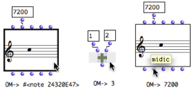
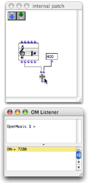
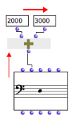
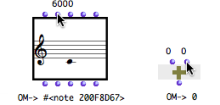
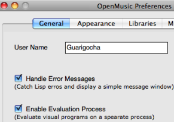

Navigation : [Previous](Connections "page
précédente\(Connections\)") | [Next](DocAndInfo "page
suivante\(Documentation and Info\)")

# Evaluation

Evaluating a box means calling its inner function and parameters. If this box
is connected to others, all the upstream boxes will be evaluated one by one.
Thus, evaluating one box can trigger a more or less lengthy evaluation chain.
This chain refers to the calculus of a function tree, or, in other words, of
the visual program.

## Evaluating Boxes and Outlets

Shortcuts

|

  * To evaluate a box, select it and press `v`. 

The result of the leftmost output is displayed in the Listener.

  * To evaluate a specific output of a box, `Cmd` click on the outlet. 

The corresponding value is displayed in the Listener.

In any case, the whole box, that is all of its outputs, are computed during
the evaluation.  
  
---|---  
  
Reminder : Listener Window

The Listener window displays the different messages and the results of
evaluations.

|

  
  
---|---  
  
Computation Flow : Left-Right, Bottom-Up

In a program, a box evaluates all boxes connected to its inputs, and evaluates
its inputs ** from left to right **.

Therefore, the evaluation of a patch always goes ** bottom-top and left right
**, graphically speaking.

|

  
  
---|---  
  

|

Box inlets generally have a default value. This is why a box can often be
evaluated even if part or the totality of its inlets are not connected to
other boxes. Default values can be visualized by hovering the mouse over an
inlet.  
  
---|---  
  
Box Inputs

  * [Box Inputs](BoxInputs)

Reinitializing box contents

To reset the content of a box to its default value, press `SHIFT` \+ `i`.

|

The same chord, before and after it was reinitialized.  
  
---|---  
  
Listener Window

  * [Windows of the OM Environment](MainWindows)

## Locking / Unlocking a Box

Locked boxes : the values of the locked boxes are fixed and do not depend on
the box inputs anymore.

|

To lock a box, select it and press `b` . A small 
icon appears on the upper left corner of the box icon.

  * The last computed value will kept as a definitive value for this box. 
  * The input values of this box, as well as the possible elements connected to these inputs will be ignored at a subsequent evaluation.

To unlock the box, press `b` again.  
  
---|---  
  
Evaluation Modes

Several other evaluation modes can be used for controlling the transmission of
resulting data in a program, or to perform specific tasks.

Evaluation Modes :

  * [Evaluation Modes](EvalModes)

## Evaluation Control

Evaluation process

The `enable evaluation process` option in the OM preferences allows to trigger
evaluations on a specific process separated from the user interface. The user
can therefore keep on using the interface during evaluations. During an
evaluation, the other evaluations are queued and performed successively after
the current one terminates.

This option also enables  **to stop ongoing computations** can via the "Abort"
command (see below).

|

  
  
---|---  
  
Aborting Evaluations

When the `enable evaluation process` option is selected, it is possible to
abort evaluations :

  1. Select the Listener window

  2. Abort using the `Lisp / Abort` menu or the shortcut `Cmd` \+ `a`.

Error handling

The `handle error messages` option in the OM preferenxes allows, to some
extent, to limit the consequences of possible programming errors and prevent
OM from crashing. If an error occurs, a message is displayed in a pop up
window.

Errors in OM

  * [Errors and Problems](errors)

References :

Plan :

  * [OpenMusic Documentation](OM-Documentation)
  * [OM User Manual](OM-User-Manual)
    * [Introduction](00-Sommaire)
    * [System Configuration and Installation](Installation)
    * [Going Through an OM Session](Goingthrough)
    * [The OM Environment](Environment)
    * [Visual Programming I](BasicVisualProgramming)
      * [Patch Introduction](ProgrammingIntro)
      * [Adding Boxes Into a Patch](AddingBoxes)
      * [Elementary Manipulations](ElementaryManips)
      * [Boxes](Boxes)
      * [Box Inputs](BoxInputs)
      * [Connections](Connections)
      * Evaluation
      * [Documentation and Info](DocAndInfo)
      * [Comments](Comments)
      * [Pictures](Pictures)
      * [Saving / Reloading a Patch](SavingPatch)
      * [Dead Boxes](DeadBox)
    * [Visual Programming II](AdvancedVisualProgramming)
    * [Basic Tools](BasicObjects)
    * [Score Objects](ScoreObjects)
    * [Maquettes](Maquettes)
    * [Sheet](Sheet)
    * [MIDI](MIDI)
    * [Audio](Audio)
    * [SDIF](SDIF)
    * [Lisp Programming](Lisp)
    * [Errors and Problems](errors)
  * [OpenMusic QuickStart](QuickStart-Chapters)

Navigation : [Previous](Connections "page
précédente\(Connections\)") | [Next](DocAndInfo "page
suivante\(Documentation and Info\)")

