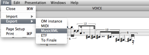
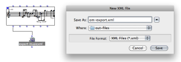
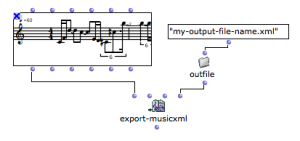
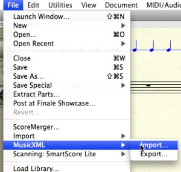
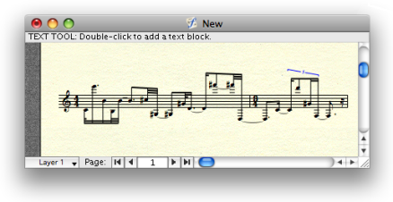

Navigation : [Previous](ImportExport "page précédente\(Export /
Import\)") | [Next](Import "Next\(Import\)")

# Export

Exporting OM score objects as external files can be done from the boxes'
contextual menu, from the score editors (menu `File / Export`) or using the
dedicated boxes in a patch from the `Functions / Score / Import/Export` menu.

In this page we show an example of score export using the MusicXML format.

Import/Export Formats and Generalities

  * [Export / Import](ImportExport)

Exporting a Voice in MusicXML

 **Option 1  **: The editor `Export` menu

|

  
  
---|---  
  
 **Option 2  **: The editor **export-musicxml** box.

The export procedure is triggered at evaluating the box connected to a
compatible type of object (here, voice or poly).

|

  
  
---|---  
  
Using the Export Box Options

The export boxes generally present a set of options for storage in a given
format.

In particular, the "output file" option allows to connect the file name
directly and avoids the file chooser dialog each time a file has to be saved.

|

  
  
---|---  
  
Importing the File in Finale

|

To import an XML file in Finale, you can choose `MusicXML` in the `Import
File` menu of the opening dialogue window, or use the `File / MusicXML /
Import` menu in any Finale window.  
  
---|---  
  

References :

Plan :

  * [OpenMusic Documentation](OM-Documentation)
  * [OM 6.6 User Manual](OM-User-Manual)
    * [Introduction](00-Sommaire)
    * [System Configuration and Installation](Installation)
    * [Going Through an OM Session](Goingthrough)
    * [The OM Environment](Environment)
    * [Visual Programming I](BasicVisualProgramming)
    * [Visual Programming II](AdvancedVisualProgramming)
    * [Basic Tools](BasicObjects)
    * [Score Objects](ScoreObjects)
      * [Presentation](Score-Objects-Intro)
      * [Rhythm Trees](RT)
      * [Score Players](ScorePlayer)
      * [Score Editors](ScoreEditors)
      * [Quantification](Quantification)
      * [Export / Import](ImportExport)
        * Export
        * [Import](Import)
    * [Maquettes](Maquettes)
    * [Sheet](Sheet)
    * [MIDI](MIDI)
    * [Audio](Audio)
    * [SDIF](SDIF)
    * [Lisp Programming](Lisp)
    * [Errors and Problems](errors)
  * [OpenMusic QuickStart](QuickStart-Chapters)

Navigation : [Previous](ImportExport "page précédente\(Export /
Import\)") | [Next](Import "Next\(Import\)")

