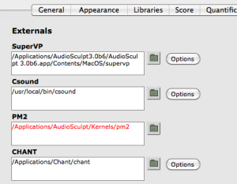

Navigation : [Previous](SoundRecording "page
précédente\(Recording\)") | [Next](SoundPreferences "page
suivante\(Audio Preferences\)")

# External Libraries

Advanced sound analysis, porcessing and synthesis tools are available in
External libraries.

As no signal processing is done in OM, these library mostly rely on external
tools and software and allow to set or automate processing, and integrate
these process in OM visual programs.

Here is a list of available sond processing libraries :

Library

|

Description  
  
---|---  
  
**OM2Csound**

|

Control of Csound synthesis process : design and formatting of Csound score
and orchestra files. Call Csound kernel in OM.  
  
**OM-SuperVP**

|

Control of SuperVP sound analysis/processing in OM.  
  
**OM_ASX**

|

Formats parameter files for AudioSculp, SuperVP and OM-SuperVP (by Hans
Tutschku)  
  
**OM-pm2**

|

Control of pm2 additive sound analysis andsynthesis in OM.  
  
**OM-Diph**

|

Control of Diphone synthesis processes.  
  
**OM-Chant**

|

Control of CHANT synthesis in OM.  
  
**OM-Spat**

|

Control of sound spatialisation (Spat 4) in OM.  
  
**OMChroma**

|

High-level control of sound synthesis processes (Csound, Chant)  
  
**OMPrisma**

|

Spatialisation of sound synthesis composents in OMChroma  
  
External Libraries Documentation

The reference documentation of the external libraies boxes is accessible in OM
(when available) using the `d` key.

Some libraries also have specific user manual or documentations.

## Setting Externals in the OM Preferences

Most libraries using external software will require preliminary installation
and setup of this software. In particular, the  path to the executable
application or program has to be specified in order to allow OM to find and
call it. In this case, items may appear in the `Externals` tab of the OM
Preferences windows once the corresponding libraries are loaded.

These items allow to set the path to the external software (use the
 button or double click on the pathname
text), and sometimes to access some specific options for this particular tool
(`options` button).

|

  
  
---|---  
  
Red pathname in the Externals preferences mean the pathname is wrong or the
external software could not be found at this location.

## Other Preference Options

Most of the options in the `Audio` preference tabs also apply to the external
sound processing functions (when these options are available and relevant).

General Audio Preferences

  * [Audio Preferences](SoundPreferences)

References :

Plan :

  * [OpenMusic Documentation](OM-Documentation)
  * [OM 6.6 User Manual](OM-User-Manual)
    * [Introduction](00-Sommaire)
    * [System Configuration and Installation](Installation)
    * [Going Through an OM Session](Goingthrough)
    * [The OM Environment](Environment)
    * [Visual Programming I](BasicVisualProgramming)
    * [Visual Programming II](AdvancedVisualProgramming)
    * [Basic Tools](BasicObjects)
    * [Score Objects](ScoreObjects)
    * [Maquettes](Maquettes)
    * [Sheet](Sheet)
    * [MIDI](MIDI)
    * [Audio](Audio)
      * [Sound Object](Sound)
      * [Sound Editor](SoundEditor)
      * [Audio Player](AudioPlayer)
      * [Sound Tools](SoundTools)
      * [Sound Processing](SoundProcessing)
      * [Recording](SoundRecording)
      * External Libraries
      * [Audio Preferences](SoundPreferences)
    * [SDIF](SDIF)
    * [Lisp Programming](Lisp)
    * [Errors and Problems](errors)
  * [OpenMusic QuickStart](QuickStart-Chapters)

Navigation : [Previous](SoundRecording "page
précédente\(Recording\)") | [Next](SoundPreferences "page
suivante\(Audio Preferences\)")

