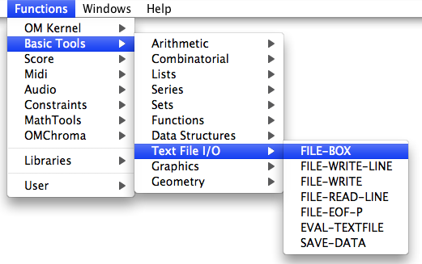

Navigation : [Previous](DefDirectories "page précédente\(Default
Directories\)") | [Next](FileBoxIntro "page
suivante\(Introduction\)")

# File-Box : Iterative File Input/Output Processes

The  **File-Box** is an extension of **[ **OMLoop** ](OMLoop) ** used for
programming iterative processes while controlling file reading and/or writing
operations. These operations can be executed with several functions from the
Files package .

To access the  File-Box , `Cmd` click and type a name or select a menu item in
the `Basic Tools / Text File I/O / File-Box` menu.

References :

Contents :

  * [OpenMusic Documentation](OM-Documentation)
  * [OM User Manual](OM-User-Manual)
    * [Introduction](00-Contents)
    * [System Configuration and Installation](Installation)
    * [Going Through an OM Session](Goingthrough)
    * [The OM Environment](Environment)
    * [Visual Programming I](BasicVisualProgramming)
    * [Visual Programming II](AdvancedVisualProgramming)
      * [Abstraction](Abstraction)
      * [Evaluation Modes](EvalModes)
      * [Higher-Order Functions](HighOrder)
      * [Control Structures](Control)
      * [Iterations: OMLoop](OMLoop)
      * [Instances](Instances)
      * [Interface Boxes](InterfaceBoxes)
      * [Files](Files)
        * [Pathnames](Pathnames)
        * [Default Directories](DefDirectories)
        * File-Box
          * [Introduction](FileBoxIntro)
          * [Reading / Writing](ReadingWriting)
          * [Designing Iterations](FileBoxIterations)
    * [Basic Tools](BasicObjects)
    * [Score Objects](ScoreObjects)
    * [Maquettes](Maquettes)
    * [Sheet](Sheet)
    * [MIDI](MIDI)
    * [Audio](Audio)
    * [SDIF](SDIF)
    * [Lisp Programming](Lisp)
    * [Errors and Problems](errors)
  * [OpenMusic QuickStart](QuickStart-Chapters)

Navigation : [Previous](DefDirectories "page précédente\(Default
Directories\)") | [Next](FileBoxIntro "page
suivante\(Introduction\)")

