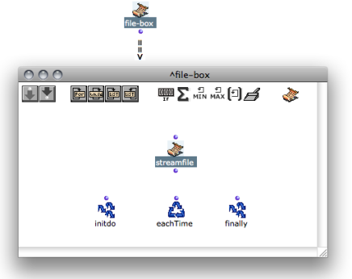
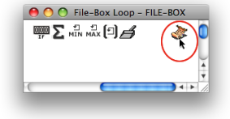
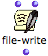
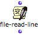
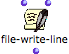
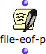

Navigation : [Previous](File-Box "page précédente\(File-Box\)") |
[Next](ReadingWriting "Next\(Reading / Writing\)")

# Introduction to the File-Box

Programming with the File-Box takes place in an internal editor, which
resembles the OMLoop editor. Like OMLoop, File-Box can only be evaluated from
outside the editor, in its container patch.

Iterations : OMLoop

  * [Iterations: OMLoop](OMLoop)

## StreamFile : a Pointer to Read and Write Files in File-Box

This editor has one main additional feature : the  ** StreamFile ** **** box.

Features

StreamFile is an indispensable element for the File-Box : it is required to
read from a file, or write to a file.

|

The **StreamFile** box represents a file pointer , that is :

  * an **access to a file** on the computer drive
  * a **position in the file** . 

  
---|---  
  
Use

  * Several StreamFile boxes can be used in a File-Box, if several files must be read or written at the same time. 

  * A StreamFile box is added by default in the File-Box editor. 

To add another StreamFile box, click on the icon in the upper right corner of
the window.

|

  
  
---|---  
  
## Reading and Writing Files in File-Box : Functions of the "Files" Package

A number of functions of the package are used for writing or reading files in
the Text-Box.

Access

To access these functions, go to `Functions / Kernel / Files`.

Features

  * 

|

The  **file-write** function writes something (its input) in a file.

|

  * 

|

The  **file-read-line** function reads one line in a file.  
  
---|---|---|---  
  
  * 

|

The  **file-write-line** function writes a line (that is, its input and a line
break) a file.

|

  * 

|

The **file-eof-p** function tells if the end of file has been reached.  
  
Using Connate Functions

  * [Reading and Writing Files](ReadingWriting)

## Inito

|

The [Initdo module](LoopEvaluators) performs an action before the
iteration starts. It is a useful tool to read or write file headers.  
  
---|---  
  
Using Initdo in Iterative Processes

  * [Designing an Iterative Process with the File-Box](FileBoxIterations)

References :

Contents :

  * [OpenMusic Documentation](OM-Documentation)
  * [OM User Manual](OM-User-Manual)
    * [Introduction](00-Contents)
    * [System Configuration and Installation](Installation)
    * [Going Through an OM Session](Goingthrough)
    * [The OM Environment](Environment)
    * [Visual Programming I](BasicVisualProgramming)
    * [Visual Programming II](AdvancedVisualProgramming)
      * [Abstraction](Abstraction)
      * [Evaluation Modes](EvalModes)
      * [Higher-Order Functions](HighOrder)
      * [Control Structures](Control)
      * [Iterations: OMLoop](OMLoop)
      * [Instances](Instances)
      * [Interface Boxes](InterfaceBoxes)
      * [Files](Files)
        * [Pathnames](Pathnames)
        * [Default Directories](DefDirectories)
        * [File-Box](File-Box)
          * Introduction
          * [Reading / Writing](ReadingWriting)
          * [Designing Iterations](FileBoxIterations)
    * [Basic Tools](BasicObjects)
    * [Score Objects](ScoreObjects)
    * [Maquettes](Maquettes)
    * [Sheet](Sheet)
    * [MIDI](MIDI)
    * [Audio](Audio)
    * [SDIF](SDIF)
    * [Reactive mode](Reactive)
    * [Lisp Programming](Lisp)
    * [Errors and Problems](errors)
  * [OpenMusic QuickStart](QuickStart-Chapters)

Navigation : [Previous](File-Box "page précédente\(File-Box\)") |
[Next](ReadingWriting "Next\(Reading / Writing\)")

