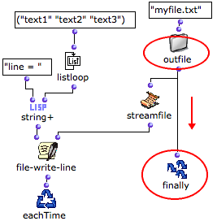
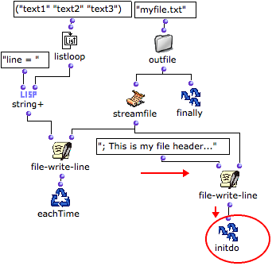
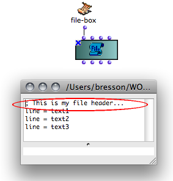
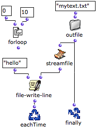
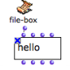
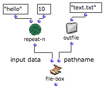
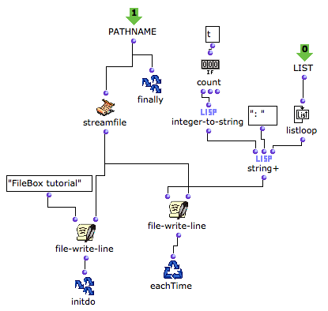
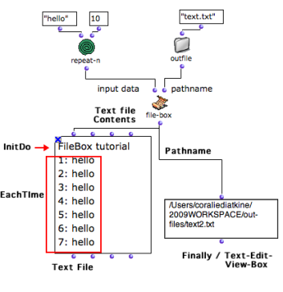

Navigation : [Previous](ReadingWriting "page précédente\(Reading /
Writing\)") | [Next](BasicObjects "Next\(Basic
Tools\)")

# Designing an Iterative Process with the File-Box

Contents

  1. Getting Results : Finally
  2. InitDo : Performing Initial Operations
  3. Eachtime : Repeating an Operation
  4. File-Box inputs

All the [common OMloop tools](OMLoop) - iterators, accumulators - can be
used in the File-Box to design iterative file read/write processes.

## Getting Results : Finally

[Just like in an OMLoop](LoopEvaluators), the Finally box allows to
return something as a result of the iteration.

Example : Returning a Pathname

|

Pathnames can be returned at the end of a process, which is quite convenient
when writing a file.

  * On the left,  **Eachtime** calls file-write-line three times to write three lines of string. 
  * On the right,  **Finally** returns the written file pathname.

  
  
---|---  
  
The file can be accessed and used in a program.

Here, the file pathname allows to load and visualize the written file in a
[TextFile](textfile) object.

|

Visualizing the resulting text in a textfile box - above - and in the textfile
editor - below.  
  
---|---  
  
## InitDo : Performing Initial Operations

The **InitDo** box is called internally, just after the filestream has been
initialized, and before the iteration starts.

It allows to perform initial operations, such as writing a "file header", as
in this example.

Example : Writing a Header

Here, an Initdo module has been added to the program, so that a text header is
added before the strings.

|

The data printed by InitDo is visible in the text file.  
  
---|---  
  
## Eachtime : Repeating an Operation

**Eachtime** allows to execute an operation at each step of the loop. can be
used for writing data in the file at each step of the loop.

Example : Writing Several Lines of Strings

  * At each step, file-write-line writes a line containing "hello" in the file. The path to the file is given by streamfile and outfile. 
  * The operation is iterated ten times, as defined by forloop. 
  * On the other hand, Finally returns the pathname.

|

  
  
---|---  
  
The text file can be visualized in a [ textfile ](textfile) box.

|

  
  
---|---  
  
## File-Box inputs

The content of the file and other parameters - the file pathname for instance
- can be set in higher-level programs and abstracted as inputs of the File-
Box.

Inputs are added or removed like in [OMLoop boxes](LoopGeneral) : press
`alt` \+ `->` or `<-`.

Here, File-Box writes a text file that contains ten lines with "hello". The
internal program of FileBox allows to add a header to the text, and a number
to each line.

|

  
  
---|---  
  

  * On the left, the " **pathname " input** box returns a pathname to Finally and streamfile. 

    1. The pathname is returned to file-write-line functions. 

    2. The first file-write-line returns a header to Initdo, which executes the operation before the iteration starts.

  * The second file-write-line writes the content of the text file with the boxes located on the right.

    1. The " **list " input** returns a list with ten "hellos". 

    2. Listloop enumerates each item of the list. At each step, count gets "true" and returns the number of the step. 

    3. String+ concatenates this number, ":" and "hello". 

    4. Eachtime writes a line containing the resulting string in the text at each step of the loop.

The **pathname** returned by Finally can possibly be displayed in a  [text-
view](TextBoxes) .

The **content of the text** displayed in the textfile box shows :

  * the header printed by Initdo
  * the lines printed by Eachtime.

References :

Contents :

  * [OpenMusic Documentation](OM-Documentation)
  * [OM User Manual](OM-User-Manual)
    * [Introduction](00-Contents)
    * [System Configuration and Installation](Installation)
    * [Going Through an OM Session](Goingthrough)
    * [The OM Environment](Environment)
    * [Visual Programming I](BasicVisualProgramming)
    * [Visual Programming II](AdvancedVisualProgramming)
      * [Abstraction](Abstraction)
      * [Evaluation Modes](EvalModes)
      * [Higher-Order Functions](HighOrder)
      * [Control Structures](Control)
      * [Iterations: OMLoop](OMLoop)
      * [Instances](Instances)
      * [Interface Boxes](InterfaceBoxes)
      * [Files](Files)
        * [Pathnames](Pathnames)
        * [Default Directories](DefDirectories)
        * [File-Box](File-Box)
          * [Introduction](FileBoxIntro)
          * [Reading / Writing](ReadingWriting)
          * Designing Iterations
    * [Basic Tools](BasicObjects)
    * [Score Objects](ScoreObjects)
    * [Maquettes](Maquettes)
    * [Sheet](Sheet)
    * [MIDI](MIDI)
    * [Audio](Audio)
    * [SDIF](SDIF)
    * [Lisp Programming](Lisp)
    * [Reactive mode](Reactive)
    * [Errors and Problems](errors)
  * [OpenMusic QuickStart](QuickStart-Chapters)

Navigation : [Previous](ReadingWriting "page précédente\(Reading /
Writing\)") | [Next](BasicObjects "Next\(Basic
Tools\)")

