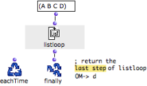
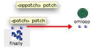
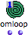

Navigation : [Previous](LoopEvaluators "page
précédente\(Evaluators\)") | [Next](Eachtime "page
suivante\(EachTime\)")

# Getting Results : Finally

 **Finally** **represents the OMLoop output**. It
is evaluated when the iterative process is over and **returns its final
result(s)** .

If nothing is connected to it, the evaluation of OMLoop returns "nil".

## Example : Enumeration of a List

The following example uses an [iterator](LoopIterators) : listloop. at
each step of a loop, listloop enumerates an element of a list, then the
following element, and so on, until the list is exhausted.

  1. Here, there are four iterations during which listloop takes the successive values from the list. 

  2. At the end of this process, Finally returns the current value listloop, that is, the last value of the list. 

  3. This value is the result of OMLoop. 

|

  
  
---|---  
  
## Finally Inputs : OMLoop Outputs

|

Finally has one default input : "patch". It can be added as many optional
inputs as necessary : "oppatch".

The **optional inputs** of  finally can be used as **additional outputs** for
OMLoop to return data to external elements in a higher-level program.  
  
---|---  
  
Multiple Outputs and "Once" Mode

|

When an OMLoop has several outputs, it is advised to set it on ["evaluate-
once" mode](EvOnceMode) to avoid useless multiple evaluations. When the
OMLoop is evaluated, the result displayed by the Listener is that of the first
output.  
  
---|---  
  
References :

Contents :

  * [OpenMusic Documentation](OM-Documentation)
  * [OM User Manual](OM-User-Manual)
    * [Introduction](00-Contents)
    * [System Configuration and Installation](Installation)
    * [Going Through an OM Session](Goingthrough)
    * [The OM Environment](Environment)
    * [Visual Programming I](BasicVisualProgramming)
    * [Visual Programming II](AdvancedVisualProgramming)
      * [Abstraction](Abstraction)
      * [Evaluation Modes](EvalModes)
      * [Higher-Order Functions](HighOrder)
      * [Control Structures](Control)
      * [Iterations: OMLoop](OMLoop)
        * [Iteration](LoopIntro)
        * [General Features](LoopGeneral)
        * [Evaluators](LoopEvaluators)
          * Finally
          * [EachTime](Eachtime)
          * [Initdo](Initdo)
        * [Iterators](LoopIterators)
        * [Accumulators](LoopAccumulators)
        * [Example : A Random Series](LoopExample)
      * [Instances](Instances)
      * [Interface Boxes](InterfaceBoxes)
      * [Files](Files)
    * [Basic Tools](BasicObjects)
    * [Score Objects](ScoreObjects)
    * [Maquettes](Maquettes)
    * [Sheet](Sheet)
    * [MIDI](MIDI)
    * [Audio](Audio)
    * [SDIF](SDIF)
    * [Reactive mode](Reactive)
    * [Lisp Programming](Lisp)
    * [Errors and Problems](errors)
  * [OpenMusic QuickStart](QuickStart-Chapters)

Navigation : [Previous](LoopEvaluators "page
précédente\(Evaluators\)") | [Next](Eachtime "page
suivante\(EachTime\)")

