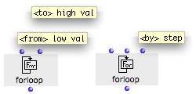
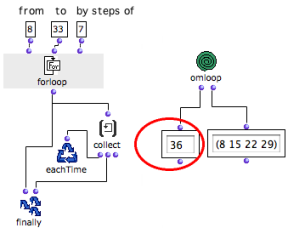

Navigation : [Previous](OnListLoop "page précédente\(OnList
Loop\)") | [Next](WhileLoop "Next\(While Loop\)")

# ForLoop : Enumeration Between Two Values

## General Properties

** ForLoop ** enumerates each element of a list ** from ** ** a minimum**
value - starting point - ** to **** a maximum ** value - ending point - ** by
** **a default step** of 1, and stops once the maximum value is exceeded.

Forloop has two default inputs and one optional input :

  * "from" and "to" : a starting and and ending vlaue
  * "by" : the value of the enumeration step.

|

  
  
---|---  
  
Constraints

  * Forloop can only handle and return **numbers**  :it cannot enumerate **an existing list** \- see [ListLoop](ListLoop)).
  * The value of "from" **must always be inferior** to the value of "to".
  * The default value of "by" is 1. It can be replaced by another **positive value** . If this value is negative, forloop doesn't stop, because "to" would never be reached.

## Example : a List with a 7 step

ForLoop stops the iteration when the value defined by "to" is **exceeded**.
Here, the first value returned by finally is the first value which exceeds the
maximum value.

References :

Contents :

  * [OpenMusic Documentation](OM-Documentation)
  * [OM User Manual](OM-User-Manual)
    * [Introduction](00-Contents)
    * [System Configuration and Installation](Installation)
    * [Going Through an OM Session](Goingthrough)
    * [The OM Environment](Environment)
    * [Visual Programming I](BasicVisualProgramming)
    * [Visual Programming II](AdvancedVisualProgramming)
      * [Abstraction](Abstraction)
      * [Evaluation Modes](EvalModes)
      * [Higher-Order Functions](HighOrder)
      * [Control Structures](Control)
      * [Iterations: OMLoop](OMLoop)
        * [Iteration](LoopIntro)
        * [General Features](LoopGeneral)
        * [Evaluators](LoopEvaluators)
        * [Iterators](LoopIterators)
          * [List Loop](ListLoop)
          * [OnList Loop](OnListLoop)
          * For Loop
          * [While Loop](WhileLoop)
          * [Infinite Loops](InfiniteLoops)
        * [Accumulators](LoopAccumulators)
        * [Example : A Random Series](LoopExample)
      * [Instances](Instances)
      * [Interface Boxes](InterfaceBoxes)
      * [Files](Files)
    * [Basic Tools](BasicObjects)
    * [Score Objects](ScoreObjects)
    * [Maquettes](Maquettes)
    * [Sheet](Sheet)
    * [MIDI](MIDI)
    * [Audio](Audio)
    * [SDIF](SDIF)
    * [Lisp Programming](Lisp)
    * [Reactive mode](Reactive)
    * [Errors and Problems](errors)
  * [OpenMusic QuickStart](QuickStart-Chapters)

Navigation : [Previous](OnListLoop "page précédente\(OnList
Loop\)") | [Next](WhileLoop "Next\(While Loop\)")

