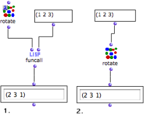
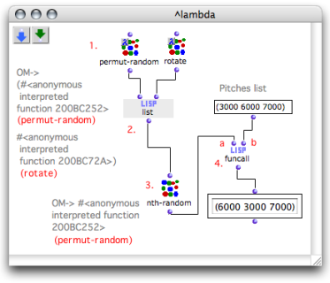
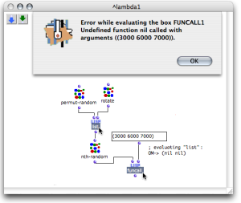

Navigation : [Previous](HighOrder "page précédente\(Higher-Order
Functions\)") | [Next](Mapcar "Next\(Mapcar -
Iterations\)")

# Lambda Mode Examples: Funcall - Using Functions as Data

Functional arguments are **variables** of higher-order functions and programs.
Here is a way of applying higher-order programs and lambda mode in OM.

Applying a function via Funcall

It can sometimes be necessary to leave the choice of a function in a program.
The call of the function, which is passed as data in the program is then
delayed.

Funcall has two types of arguments :

  * its first argument is a function

  * its other arguments are additional - "[rest](AdditionalInputs)" \- arguments).

Funcall calls the function taking these additional arguments as parameters.

|

Rotate performs circular permutations upon a list : items are enumerated
starting from the second element. In this example, rotate is applied to a
simple list of numbers : (1 2 3).

  1. Funcall is called with the rotate function,  and a list. 

The  rotate box is on ["lambda"](LambdaMode) mode. Its free input is
assigned the (1 2 3) list by  funcall.

  2. Rotate is not on "lambda" mode. Its input is assigned the same list as argument.

The result of the computation is similar in both cases. We will however extend
it to show how using a function as an actual variable .  
  
---|---  
  
Random Selection of a Functions to Apply

Using lambda functions allows to choose between several functions, as if they
were plain data.

We will modify a list of numbers with one of these two functions : permut-
random or rotate.

  * Permut-random makes a random permutation of the elements of a list. 

  * Rotate makes a circular permutation of the elements in the list (see previous example). 

The function will be selected randomly, so that is becomes **a random
variable**.

"Permut-random" is applied randomly to the list.

  1. To use permut-random and rotate as variables, we have set them on "lambda" mode. 

  2. List makes a list **with these two functions**. 

  3. Nth-random picks one of the two functions in this list randomly.

  4. Funcall applies the selected function to its second argument, the list of numbers. 

Note

Setting the functions on "lambda" mode **precisely** allows to :

  * make a list with these two functions

  * choose one of them in this list like a "lambda item".

|

If the functions were not on "lambda" mode, the list function would return a
list that contains the result of these functions call.  
  
---|---  
  
References :

Plan :

  * [OpenMusic Documentation](OM-Documentation)
  * [OM 6.6 User Manual](OM-User-Manual)
    * [Introduction](00-Sommaire)
    * [System Configuration and Installation](Installation)
    * [Going Through an OM Session](Goingthrough)
    * [The OM Environment](Environment)
    * [Visual Programming I](BasicVisualProgramming)
    * [Visual Programming II](AdvancedVisualProgramming)
      * [Abstraction](Abstraction)
      * [Evaluation Modes](EvalModes)
      * [Higher-Order Functions](HighOrder)
        * Using Functions as Data
        * [Mapcar \- Iterations](Mapcar)
        * [Lambda Patches](LambdaPatch)
        * [Test Functions](LambdaTest)
      * [Control Structures](Control)
      * [Iterations: OMLoop](OMLoop)
      * [Instances](Instances)
      * [Interface Boxes](InterfaceBoxes)
      * [Files](Files)
    * [Basic Tools](BasicObjects)
    * [Score Objects](ScoreObjects)
    * [Maquettes](Maquettes)
    * [Sheet](Sheet)
    * [MIDI](MIDI)
    * [Audio](Audio)
    * [SDIF](SDIF)
    * [Lisp Programming](Lisp)
    * [Errors and Problems](errors)
  * [OpenMusic QuickStart](QuickStart-Chapters)

Navigation : [Previous](HighOrder "page précédente\(Higher-Order
Functions\)") | [Next](Mapcar "Next\(Mapcar -
Iterations\)")

