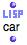
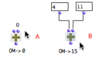
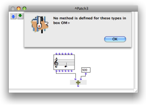

Navigation : [Previous](DataBox "page précédente\(Data Boxes\)") |
[Next](FactoryBoxes "Next\(Objects – Factory Boxes\)")

# Function Boxes

Sommaire

  1. Adding Functions in a Patch
  2. The Two Types of Functions : OM Functions and Lisp Functions
  3. Box Inputs
  4. Box Outputs
  5. Methods

Functions are fundamental components of programs, and are some of the most
important OM tools. A function box refers to an underlying function that
allows to execute a given operation. It has a number of arguments[1], or
parameters, which generally represent data to be transformed.

There are two main types of function boxes :  **OM functions** and ** Lisp
functions **. Both function types are used in patches following the same
modalities.

## Adding Functions in a Patch

Functions can be added

  * via the `Functions` menu

  * the [Library window](Library)

  * typing a name in a patch editor.

How to Add a Function Into a Patch Editor

  * [Adding Boxes Into a Patch](AddingBoxes)

## The Two Types of Functions : OM Functions and Lisp Functions

OM Functions

|

OM functions are specifically declared and assigned particular graphical
properties : an icon, default inputs, etc. In other words, they have been
designed for OM.  
  
---|---  
  
Lisp Functions

|

Lisp functions are defined in the Lisp standard programming language. Their
differ from OM functions by their "LISP" icon.  
  
---|---  
  
Most of the time, it is necessary to type the name of such a function to add
it in a patch, for Lisp functions are not provided in the OM menus.

However, a set of useful Lisp functions is accessible

  * through the `Function / OM Kernel / Lisp` menu
  * in the OM Kernel / Lisp package of the Library.

## Box Inputs

A function box has a number - 0 or more - of inputs, which represent the
arguments[1] of the function.

The inputs of a box initially come with default values. Nevertheless, they do
not necessary enable correct computations : their values must be set by the
user or be connected to other boxes' outputs.

|

An addition with and without the default values of OM+  
  
---|---  
  
Input Tooltips and Function Documentation

  * [Box Inputs](BoxInputs)
  * [Documentation and Info](DocAndInfo)

Tip : Editing Default Values

Simple input values can be set directly when typing the name of the function
box.

|

  
  
---|---  
  
## Box Outputs

Reminder

Box outputs can be evaluated and used for connections with other boxes.

  * To evaluate a function box, select it and press `v`.
  * To evaluate a specific output, `Cmd` click on it.

The result of the computation is given instantly in the Listener[2] window.

Multiple outputs

Om// performs an euclidean division : its first output returns a quotient, its
second output returns a rest. The evaluation of the "rest" output necessarily
triggers the evaluation of the whole function.

|

A function box may have several outputs, which means that it can return
multiple values.

  * If the box is evaluated, all the outputs are evaluated, but the Listener prints the result of the first output only. 
  * If a specific output is evaluated, all the outputs are evaluated, but the Listener prints the results of the chosen output. 

  
  
---|---  
  
About Evaluation Specificites

  * [Evaluation](Evaluation)

Multiple Outputs : Evaluate-Once Mode

Om-random returns a random number between a minimum and a maximum value.

|

The " **evaluate-once** " mode is generally useful for multiple outputs
function boxes : the result of a same evaluation is sent to all connected
boxes. Otherwise, each of them will evaluate the function box separately :

  * the function can sometimes return a different result each time,
  * useless additional computations run.

Here, in the first case, om-random is on the standard evaluation mode and
returns two different results to each input of list, as shown in the text box
below. In the second case, it returns the same result.  
  
---|---  
  
More Information about EvalOnce and Other Evaluation Modes

  * [Evaluation Modes](EvalModes)

## Methods

In theory, standard Lisp functions are not typed explicitly : their arguments
are not predefined, and they are supposed to accept any type of argument.
However, internal errors may still occur if the input data is not of the
expected type.

On the contrary, most OM functions actually refer to what is known as generic
functions[3]. In CLOS[4], a generic function is a kind of "meta" function that
applies to several distinct types of arguments[1] via several methods[5]. Each
method is specialized to adapt the behaviour of the function - the way it
operates - to the type of argument it is assigned. Hence, the input data is
"filtered" before computation starts and the relevant method is applied to it.

For instance, a generic function "OM+" has set 4 different methods, and is
able to receive 1) two numbers, 2) a number + a list, 3) a list + a number, or
4) two lists.

There exist several ways to check which type of argument can be connected to a
function :

  * In the Generic Function editor (by double-clicking the function box - for OM Generic Functions only)

The Generic Function Editor

  * [Methods](Method)

  * In the source code finder of the function (typing `e`) 

Editing the OM sources

  * [Lisp Programming](Lisp)

  * (Sometimes) in the reference documentation of the function (typing `d`)

Box Documentation

  * [Documentation and Info](DocAndInfo)

Calling Methods with Wrong Input Types

In a patch, "calling" - using - a generic function with the wrong types of
arguments, triggers an error message of the type : "No method is defined for
this type of box ...". For instance, this can occur if a function is connected
to a data type it cannot accept.

Here is a widespread error when using object boxes :

In this example, we want to transpose a chord using OM+. To execute an
operation, a function must apply to the right argument : the relevant output
must be connected to the function. No method is defined in OM+ for arguments
of type chord, so the "self" (1st) ouput of the chord box can not be connected
to this function box. The "pitch" output (which returns a list of numbers)
should be connected instead.

|

  
  
---|---  
  
Object Box Inputs and Outputs

  * [Instantiating Objects](2-Instanciation)

References :

  1. Argument

An argument represents a parameter upon which a function operates. For
instance, the (om+ x y) function has two arguments : x and y.

  2. Lisp Listener

A Lisp communication interface displaying results of computations, warnings or
error messages, and where Lisp expressions - programs - can be evaluated.

  3. Generic Function

In object oriented programming, a generic function is a collection of methods
- elementary specialized functions - with the same name and argument
structure, but with arguments typed differently.

See also : Method

  4. CLOS - Common Lisp Object System -

CLOS is an object-oriented programming protocol defined in the Common Lisp
language specification. It is based on classes, instances of classes, generic
functions and methods to be used in Lisp programs.

See also : Class, Function, Generic Function, Method, Instance.

  5. Method

An elementary function or part of a generic function defining rules for its
behaviour depending on a type of argument. Defining a generic function amounts
to defining at least one method.

For instance, the OM+ function is made of four methods : 1. number + list / 2.
list + number / 3. number + number / 4. list + list

Plan :

  * [OpenMusic Documentation](OM-Documentation)
  * [OM 6.6 User Manual](OM-User-Manual)
    * [Introduction](00-Sommaire)
    * [System Configuration and Installation](Installation)
    * [Going Through an OM Session](Goingthrough)
    * [The OM Environment](Environment)
    * [Visual Programming I](BasicVisualProgramming)
      * [Patch Introduction](ProgrammingIntro)
      * [Adding Boxes Into a Patch](AddingBoxes)
      * [Elementary Manipulations](ElementaryManips)
      * [Boxes](Boxes)
        * [Boxes Features](GraphicFeatures)
        * [Data Boxes](DataBox)
        * Function Boxes
        * [Objects - Factory Boxes](FactoryBoxes)
        * [Abstraction Boxes](AbsBoxesIntro)
        * [Other Boxes](OtherBoxes)
      * [Box Inputs](BoxInputs)
      * [Connections](Connections)
      * [Evaluation](Evaluation)
      * [Documentation and Info](DocAndInfo)
      * [Comments](Comments)
      * [Pictures](Pictures)
      * [Saving / Reloading a Patch](SavingPatch)
      * [Dead Boxes](DeadBox)
    * [Visual Programming II](AdvancedVisualProgramming)
    * [Basic Tools](BasicObjects)
    * [Score Objects](ScoreObjects)
    * [Maquettes](Maquettes)
    * [Sheet](Sheet)
    * [MIDI](MIDI)
    * [Audio](Audio)
    * [SDIF](SDIF)
    * [Lisp Programming](Lisp)
    * [Errors and Problems](errors)
  * [OpenMusic QuickStart](QuickStart-Chapters)

Navigation : [Previous](DataBox "page précédente\(Data Boxes\)") |
[Next](FactoryBoxes "Next\(Objects – Factory Boxes\)")

