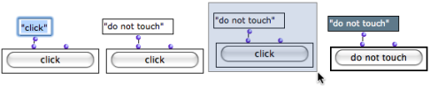
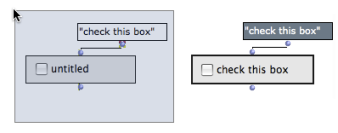
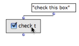
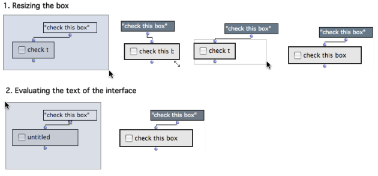
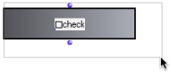

Navigation : [Previous](InterfaceBoxes "page précédente\(Interface
Boxes\)") | [Next](TextBoxes "Next\(Text Boxes\)")

# General Features

To access dialog Items, go to `Classes / Kernel / Interface Boxes /` in the OM
menus.

## Displaying the Dialog Items

Miniview

The actual interface of a dialog box is displayed via the miniview.

To display a miniview, select a box and press `m`.

|

Diplaying the interface for the classes TEXT-BOX and BUTTON  
  
---|---  
  
Appellation : Displaying and Editing the "Text" Argument

A button-box before and after the evaluation : "click" is a default text
argument.

|

Most interface boxes have a display text, generally as a first input. The text
connected to the input is displayed on the interface when the box is evaluated
(if not in [locked mode](LockMode)).  
  
---|---  
  
To change the value of the "text" argument  :

  1. click or `SHIFT` click on the first input to edit it - don't forget to validate

  2. select and evaluate the box : press `v`. 

## Selecting Boxes

Selection, Move, Resize...

|

Once their miniview is displayed, interface boxes cannot be selected with a
mouse click, due to the nature of the interface.  
  
---|---  
  
To select a box, click on the border of the box, or drag the mouse over the
whole box. The box can then be resized or evaluated as usual.

Items can be also moved and resized without the mouse, to a certain extent :

  * use the `->` arrows keys - use `SHIFT` to go faster

  * press `i` to restore the initial size.

Hiding the Box Contents

An easy way to select and move/resize the interface box is to temporarily hide
their contenst with `m`.

References :

Plan :

  * [OpenMusic Documentation](OM-Documentation)
  * [OM User Manual](OM-User-Manual)
    * [Introduction](00-Sommaire)
    * [System Configuration and Installation](Installation)
    * [Going Through an OM Session](Goingthrough)
    * [The OM Environment](Environment)
    * [Visual Programming I](BasicVisualProgramming)
    * [Visual Programming II](AdvancedVisualProgramming)
      * [Abstraction](Abstraction)
      * [Evaluation Modes](EvalModes)
      * [Higher-Order Functions](HighOrder)
      * [Control Structures](Control)
      * [Iterations: OMLoop](OMLoop)
      * [Instances](Instances)
      * [Interface Boxes](InterfaceBoxes)
        * General Features
        * [Text Boxes](TextBoxes)
        * [Check Box](CheckBox)
        * [List Boxes](ListBoxes)
        * [Button](Button)
        * [Slider Box](Slider)
        * [Pop-Up Menu Box](MenuBoxes)
        * [Examples of Use](InterfaceExample)
      * [Files](Files)
    * [Basic Tools](BasicObjects)
    * [Score Objects](ScoreObjects)
    * [Maquettes](Maquettes)
    * [Sheet](Sheet)
    * [MIDI](MIDI)
    * [Audio](Audio)
    * [SDIF](SDIF)
    * [Lisp Programming](Lisp)
    * [Errors and Problems](errors)
  * [OpenMusic QuickStart](QuickStart-Chapters)

Navigation : [Previous](InterfaceBoxes "page précédente\(Interface
Boxes\)") | [Next](TextBoxes "Next\(Text Boxes\)")

