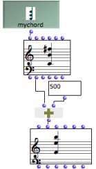
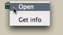
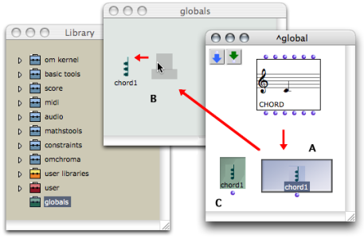
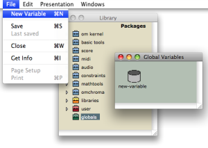
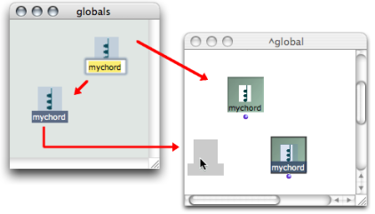

Navigation : [Previous](InstanceBoxes "page précédente\(Instance
Boxes\)") | [Next](SlotsBox "Next\(Slots\)")

# Global Variables

Sommaire

  1. General Properties
  2. Using a Global Variable
  3. Creating a Global Variable From an Instance
  4. Modifying a Global Variable

**Global variables** are "globalized" instances.

## General Properties

Advantages

A global variable is an instance[1] associated with the workspace where it was
created. It can be used in **several programs of the same workspace**. It is
designed so that **any modification of the instance** **is incorporated into**
**all its representations** .

Instances and Global Variables

When defining a chord, a metric sequence, manipulating an audio file, the user
creates a specific instance[1] from a class[2].

|

This instance can be materialized in the current patch editor by instance
boxes . Instance boxes are grey.  
  
---|---  
  

|

It can also be exported as a  **global variable** to a workspace where it will
be stored in the  [ Globals package](Packages) of the Library
. Global variable boxes are green.  
  
## Using a Global Variable

Reference of a Global Variable

A global variable can be used in **several different places** , but all boxes
created from it correspond to the same instance.

  * When evaluated, the box always returns the same instance.

  * **A same global variable can be present **in several different places** **: it refers to several boxes. 

Modifications : Effects

Any modification of a global variable will affect all of its representations,
as well as the master item.

  * Modifying a global variable affects each of its references.

  * Modifying **one of its references** equally affects the **variable itself and all its references** . 

Connections to Other Boxes

A global variable box can be connected to other boxes, just as an instance
box.

## Creating a Global Variable From an Instance

Adding a Global Variable in the Library

Open the Globals package in the Library window :

  * double click on its lower part to open it as a side frame,
  * double click on its upper part, or `Ctrl` / right click and choose `Open` in the contextual menu to open it as a window. 

|

  
  
---|---  
  
Select an instance and drop it in the Globals package window. The instance box
in the patch is converted into a global variable box automatically.

Adding a Store Object in the Globals Package

|

The  ** store ** object is a **general-purpose object** , which is designed to
store any type of data. A global variable created in the Globals package is an
instance of the Store class, where any type of object can be stored.

To add a global variable in the Globals package, open the  Globals package and
select `File / New Variable`.  
  
---|---  
  
More About the Store Object

  * [The Store Object](Store)

## Modifying a Global Variable

Name

The variable can be renamed in the Globals window. All related elements in the
patch will be affected by this change immediately. They will have the same
name and reference.

Parametric Values : Using the Slots Box

Like an instance box, the global variable box appears without inputs.
Parametric values of global variables can be accessed and modified via a
specific type of box : the  **slots** box.

How to Modify Instance Boxes

  * [Reading and Modifying Instances : Slots](SlotsBox)

Modifying a Global Variable from its Editor

A global variable can also be modified using its editor, like any instance or
factory box.

Modifying an Instance

  * [Editors](3-Editors)

References :

  1. Instance

An actual object created at runtime, out of a given class. In OM, more
specifically, an object created when evaluating a factory box. An instance can
be saved as a global variable.

⤷ `SHIFT` click on an outlet - especially the first outlet representing the
self, the whole object - of a factory box to materialize an instance.

  2. Class

A category of objects sharing common properties - characteristics and
behaviour. A class specifies the internal structure and behaviour of an
object. In OM, it is represented in a patch by a factory box that can produce
an instance of a class.

See also : Object, Instance

Plan :

  * [OpenMusic Documentation](OM-Documentation)
  * [OM User Manual](OM-User-Manual)
    * [Introduction](00-Sommaire)
    * [System Configuration and Installation](Installation)
    * [Going Through an OM Session](Goingthrough)
    * [The OM Environment](Environment)
    * [Visual Programming I](BasicVisualProgramming)
    * [Visual Programming II](AdvancedVisualProgramming)
      * [Abstraction](Abstraction)
      * [Evaluation Modes](EvalModes)
      * [Higher-Order Functions](HighOrder)
      * [Control Structures](Control)
      * [Iterations: OMLoop](OMLoop)
      * [Instances](Instances)
        * [Instance Boxes](InstanceBoxes)
        * Global Variables
        * [Slots](SlotsBox)
        * [The Store Object](Store)
      * [Interface Boxes](InterfaceBoxes)
      * [Files](Files)
    * [Basic Tools](BasicObjects)
    * [Score Objects](ScoreObjects)
    * [Maquettes](Maquettes)
    * [Sheet](Sheet)
    * [MIDI](MIDI)
    * [Audio](Audio)
    * [SDIF](SDIF)
    * [Lisp Programming](Lisp)
    * [Errors and Problems](errors)
  * [OpenMusic QuickStart](QuickStart-Chapters)

Navigation : [Previous](InstanceBoxes "page précédente\(Instance
Boxes\)") | [Next](SlotsBox "Next\(Slots\)")

