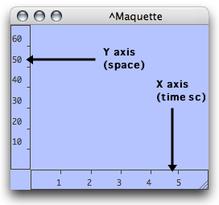
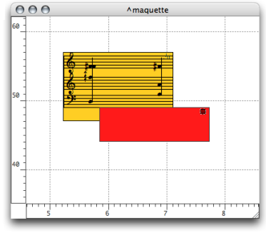
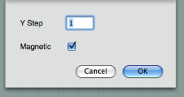
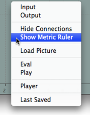
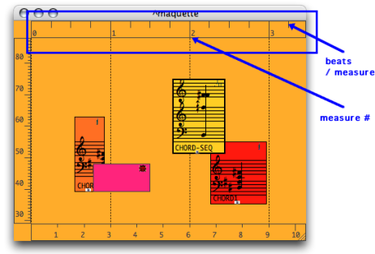
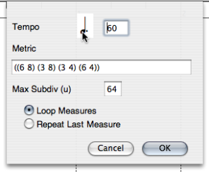
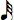
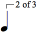

Navigation : [Previous](EditorAppearance "page précédente\(Editor
Appearance\)") | [Next](player "Next\(The Palette\)")

# Rulers and Grid

## Rulers

Function

|

The maquette editor has two rulers :

  * the horizontal ruler, or abscissas axis, measures time in milliseconds
  * the vertical ruler, or ordinates axis, measures space with an arbitrary unit.

  
  
---|---  
  
Zoom

The scale of each ruler can be increased or decreased manually to zoom in or
out, vertically and/or horizontally in the maquette.

To modify the scale of a ruler :

  1. click on a ruler to view the double-arrow cursor 

  2. keep pressing while scroling the mouse.

To zoom in scroll the mouse upwards or rightwards. To zoom out, scroll it
downwards or leftwards.

## Grid

Displaying and Resolution

To display the grid of the maquette editor, press `g` .The grid's resolution
is calculated automatically, according to the zoom scale.

Quantization and Snap to Grid Option

|

The quantization allows to snap boxes to the grid when they are moved
manually. The quantization of the  **ordinates axis** can be defined with
positive integers.

  * To specify a quantization : 

    1. double click on the vertical ruler. 

    2. enter a number of steps in the **" Y Step"** frame.

  * To activate the quantization, select the `Magnetic` option. Boxes will snap to the closest vertical step. 

  
  
---|---  
  
## The Metric Ruler : Rhythmic Parameters of the Maquette

The  **metric ruler** displays measures and beats. It can be shown at the top
of the maquette editor.

To display the metric ruler :

  1. `Ctrl` / right click in the maquette 

  2. choose `Show / Hide Metric Ruler`. 

|

  
  
---|---  
  
The metric ruler has three parameters :

  * tempo
  * meter
  * a metric quantization applying to objects.

To define the musical parameters of the maquette, double click on the metric
ruler.

  * To define a tempo :

    1. click successively on the quarter note  icon to choose a unit.

    2. enter a tempo in the **" Tempo"** frame.

  * To define a metric pattern, enter a list of one or more measures in the **Metric** frame according to the usual conventions. 

  * To specify pattern repetitions, use the ` Loop Measure / Last Measure` option : 

    * The `Loop Measure` option allows to repeat the meter pattern defined above. 
    * The `Repeat Last Measure` option allows to apply the last metric value of the pattern to the following measures

Note that complex or irregular meter changes, which cannot be expressed by a
single pattern, require a thorough expression, measure by measure...

|

  
  
---|---  
  
Snap to Metrics

The **" Maximum Subdivision"** frame takes a metric quantization unit.

  * The reference unit of this subdivision[1] ** is always **equal to the whole note**  **, no matter which time signature has been chosen.

For instance, "64" represents a 64th note subdivision, that is :
.

  * Values must be integers. 

  * Any subdivision of the whole note, - other values than powers of 2 - are accepted by OM.

For instance, "12" represents a triplet's fourth note subdivision, that is :
.

Here, we defined the following pattern : ((6 8) (3 8) (3 4) (6 4)) and chose
the "Repeat Last Measure" option.

Grid and Metric Ruler

The grid fits the measure unit of the metric ruler.

Memento : Subdivisions

= 1;  = 2; =
4; = 8; = 16;
= 32; = 64...

References :

  1. Subdivisions of the Whole Note

Memento :

= 1,  = 2, =
4, = 8, = 16,
= 32, = 64

Contents :

  * [OpenMusic Documentation](OM-Documentation)
  * [OM User Manual](OM-User-Manual)
    * [Introduction](00-Contents)
    * [System Configuration and Installation](Installation)
    * [Going Through an OM Session](Goingthrough)
    * [The OM Environment](Environment)
    * [Visual Programming I](BasicVisualProgramming)
    * [Visual Programming II](AdvancedVisualProgramming)
    * [Basic Tools](BasicObjects)
    * [Score Objects](ScoreObjects)
    * [Maquettes](Maquettes)
      * [Creating a Maquette](Maquette)
      * [TemporalBoxes](TemporalBoxes)
      * [The Maquette Editor](Editor)
        * [Editor Appearance](EditorAppearance)
        * Rulers and Grid
        * [The Palette](player)
        * [Markers / Anchors](Markers)
      * [Maquette Programming](Programming%20Maquette)
      * [Maquettes in Patches](Maquettes%20in%20Patches)
    * [Sheet](Sheet)
    * [MIDI](MIDI)
    * [Audio](Audio)
    * [SDIF](SDIF)
    * [Lisp Programming](Lisp)
    * [Errors and Problems](errors)
  * [OpenMusic QuickStart](QuickStart-Chapters)

Navigation : [Previous](EditorAppearance "page précédente\(Editor
Appearance\)") | [Next](player "Next\(The Palette\)")

