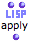
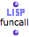
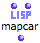
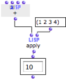
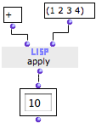
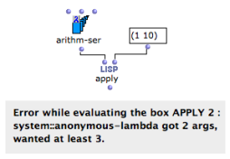
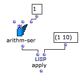

Navigation : [Previous](RefMode "page précédente\(Reference
Mode\)") | [Next](Funcall "Next\(Using Functions as
Data\)")

# Higher-Order Programs and Functions

In functional languages such as Lisp, programs and data are generally
considered as " **first-class'' objects** [1]. A Lisp function can thus be
considered as data and used or constructed in the calculus.

Functions that accept other functions as arguments, or that produce functions
as output values are called **higher-order functions**.

In OM, higher-order programming is mainly possible with boxes in "lambda"
evaluation mode.

Lambda Mode

  * [Lambda Mode](LambdaMode)

Some functions are more specifically designed to be called with functional
arguments :

|

 
 ...  
  
---|---  
  
## Using a Lambda Function in OM

Example

In Lisp,  apply is one of the simplest example of higher-order function. Apply
takes two arguments :

  1. a function

  2. a list of parameters 

The function on "lambda" mode is applied to each item of the list.

In this example, the  + is on "lambda" mode : it can return the  ** +
function** .

|

  
  
---|---  
  
Using the function name

When a simple function is involved, its **name** can be used instead of the
function box on "lambda" mode.

|

  
  
---|---  
  
In Practice

In practice, functional arguments are used in two main configurations :

  1. as an argument applied to one or more other arguments by the higher-order function ****

  2. as a test function to determine the behaviour of a higher-order function. 

The following sections detail several typical cases regarding the use of
higher-order functions and "lambda" mode.

Higher-Order Functions in OM

  * [Lambda Mode Examples: Funcall - Using Functions as Data](Funcall)
  * [Lambda Mode Examples: Mapcar \- Iterations](Mapcar)
  * [Lambda Mode Examples: Lambda Patches](LambdaPatch)
  * [Lambda Mode Examples: Test Functions](LambdaTest)

## Inputs of a Lambda Function and Currying

In a higher-order function call, a function may be applied to a number of
items. These items are then matched to the different arguments of the
function. Hence, one must make sure that this function

  * has the **right number of arguments**

an / or

  * is applied to the right number of items.

Example #1

Arithm-ser requires **3 arguments** : "from", "to" and "step".

It is applied to a list of **two values only**. OM returns an error message.

|

  
  
---|---  
  
Currying : Controling the Arguments of a Lambda Function

In some situations, we may want to ignore some of the arguments required by a
"lambda" function. In this case we only want to define the bounds of the
series : "from", and "to", and ignore "step".

To do so, we need to **set** one of the variables of the lambda form. This
procedure is known as currying[2].

In OM, the arguments of a function box on "lambda" mode are represented by
free inputs, and only free inputs. Free inputs are not connected to anything.

The values connected to the other inputs are comprised in the lambda function
.

|

  
  
---|---  
  
References :

  1. First Class Object

A first-class object is an entity which can be passed as a parameter to a
function, returned from a function, or assigned into the variable of a
program.

  2. Currying

Reducing the number of arguments of a lambda function by assigning values to
some of them.

Plan :

  * [OpenMusic Documentation](OM-Documentation)
  * [OM 6.6 User Manual](OM-User-Manual)
    * [Introduction](00-Sommaire)
    * [System Configuration and Installation](Installation)
    * [Going Through an OM Session](Goingthrough)
    * [The OM Environment](Environment)
    * [Visual Programming I](BasicVisualProgramming)
    * [Visual Programming II](AdvancedVisualProgramming)
      * [Abstraction](Abstraction)
      * [Evaluation Modes](EvalModes)
      * Higher-Order Functions
        * [Using Functions as Data](Funcall)
        * [Mapcar \- Iterations](Mapcar)
        * [Lambda Patches](LambdaPatch)
        * [Test Functions](LambdaTest)
      * [Control Structures](Control)
      * [Iterations: OMLoop](OMLoop)
      * [Instances](Instances)
      * [Interface Boxes](InterfaceBoxes)
      * [Files](Files)
    * [Basic Tools](BasicObjects)
    * [Score Objects](ScoreObjects)
    * [Maquettes](Maquettes)
    * [Sheet](Sheet)
    * [MIDI](MIDI)
    * [Audio](Audio)
    * [SDIF](SDIF)
    * [Lisp Programming](Lisp)
    * [Errors and Problems](errors)
  * [OpenMusic QuickStart](QuickStart-Chapters)

Navigation : [Previous](RefMode "page précédente\(Reference
Mode\)") | [Next](Funcall "Next\(Using Functions as
Data\)")

