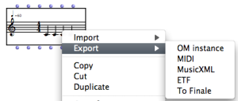

Navigation : [Previous](Quantification "page
précédente\(Quantification\)") | [Next](Export "page
suivante\(Export\)")

# Export / Import

Score objects can be saved as external files under MIDI or other musical
notation formats. Exporting files allows to store and exchange data, and to
use/edit this data in other software.

Reciprocally, files created by other software can be imported in OM.

The Import/Export commands are available on the score object boxes' contextual
menus or in the `File` menu of the score editor windows.

Boxes are also available in the Score / Import/Export packages and menus in
order to perform these operation as part of your visual programs.

Different formats are proposed, depending on the type of the objects.

|

  
  
---|---  
  
OM Instances

OM instances are textfiles representing any kind of OpenMusic object. This
format allows to save and restore the exact object contents, but is not
compatible with any other application.

MIDI

MIDI is a standard format for storing MIDI messages with temporal information.
This is the simplest and more common format for storage and interchange of
symbolic musical data, although it does not allow to store much rhythmic or
other type of high-level information.

More about MIDI in OM

  * [Introduction to MIDI in OpenMusic](Intro)

MIDI Files roughly correspond to **chord-seq** objects in OM.

**Voice** or **poly** objects can also be stored as MIDI, but most rhythmic
information will be lost. Conversely, importing a MIDI file in a **voice** or
**poly** is equivalent to importing in a **chord-seq** then quantifying the
**chord-seq** using the metric information (possibly) contained in the MIDI
file.

Quantification

  * [Quantification](Quantification)

MusicXML

MusicXML is a new standard for storing musical objects including rhythmic and
other high-level musical information.

Is is the priviledged and recommeded format in OM to import/export **voice**
and **poly** objects and interchange with software such as Finale or Sibelius.

External Software Links

 **Finale** by MakeMusic :
[http://www.finalemusic.com/](http://www.finalemusic.com/
"http://www.finalemusic.com/ \(nouvelle fenêtre\)")

 **Sibelius  **: [http://www.sibelius.com/](http://www.sibelius.com/
"http://www.sibelius.com/ \(nouvelle fenêtre\)")

ETF (Deprecated)

ETF (Enigma Transportable Format) is a specific format used by Finale for
cross-platform storage.

OM can export **voice** or **poly** objects in this format (but not import
them). However, **compatibility is not supported anymore** with recent Finale
versions, for which MusicXML should be preferred.

"From/To Finale" (Deprecated)

This specific option was designed to import/export from/to Finale using the
Finale Import from/Export to OpenMusic menus.

They are not compatible either with recent versions, but have been kept as
they were used also for communication with NoteAbility.

The data is transferred via the system "clipboard" (copy/paste buffer) so no
file needs to be written.

NoteAbility

By Opus 1 Music :
[http://debussy.music.ubc.ca/NoteAbility/](http://debussy.music.ubc.ca/NoteAbility/
"http://debussy.music.ubc.ca/NoteAbility/ \(nouvelle fenêtre\)")

References :

Contents :

  * [OpenMusic Documentation](OM-Documentation)
  * [OM User Manual](OM-User-Manual)
    * [Introduction](00-Contents)
    * [System Configuration and Installation](Installation)
    * [Going Through an OM Session](Goingthrough)
    * [The OM Environment](Environment)
    * [Visual Programming I](BasicVisualProgramming)
    * [Visual Programming II](AdvancedVisualProgramming)
    * [Basic Tools](BasicObjects)
    * [Score Objects](ScoreObjects)
      * [Presentation](Score-Objects-Intro)
      * [Rhythm Trees](RT)
      * [Score Players](ScorePlayer)
      * [Score Editors](ScoreEditors)
      * [Quantification](Quantification)
      * Export / Import
        * [Export](Export)
        * [Import](Import)
    * [Maquettes](Maquettes)
    * [Sheet](Sheet)
    * [MIDI](MIDI)
    * [Audio](Audio)
    * [SDIF](SDIF)
    * [Lisp Programming](Lisp)
    * [Errors and Problems](errors)
  * [OpenMusic QuickStart](QuickStart-Chapters)

Navigation : [Previous](Quantification "page
précédente\(Quantification\)") | [Next](Export "page
suivante\(Export\)")

