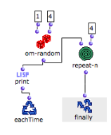
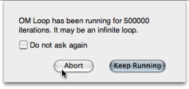

# Iterators and Infinite Loops

If no iterator is used, or if an iterator is used the wrong way, OMLoop gets
stuck and potentially goes on forever.

## Example : Generating Numbers

We want to generate four random numbers between 1 and 4.

Instead of using forloop to define the number of steps of the iteration, we
have used repeat-n : OMLoop will never end and generate **four random
numbers** an infinite number of times...

|

  
  
---|---  
  
## Abort Procedures

Abort Dialogue Window

|

An abort dialogue window pops up after a while (by default, 500 000 loops). To
stop the iteration, choose `Abort`, unless you have planned a very long
iteration...  
  
---|---  
  
Abort Command

Type `Cmd` \+ `SHIFT` \+ `a` to abort the ongoing calculation.

References :

Plan :

  * [OpenMusic Documentation](OM-Documentation)
  * [OM 6.6 User Manual](OM-User-Manual)
    * [Introduction](00-Sommaire)
    * [System Configuration and Installation](Installation)
    * [Going Through an OM Session](Goingthrough)
    * [The OM Environment](Environment)
    * [Visual Programming I](BasicVisualProgramming)
    * [Visual Programming II](AdvancedVisualProgramming)
      * [Abstraction](Abstraction)
      * [Evaluation Modes](EvalModes)
      * [Higher-Order Functions](HighOrder)
      * [Control Structures](Control)
      * [Iterations: OMLoop](OMLoop)
        * [Iteration](LoopIntro)
        * [General Features](LoopGeneral)
        * [Evaluators](LoopEvaluators)
        * [Iterators](LoopIterators)
          * [List Loop](ListLoop)
          * [OnList Loop](OnListLoop)
          * [For Loop](ForLoop)
          * [While Loop](WhileLoop)
          * Infinite Loops
        * [Accumulators](LoopAccumulators)
        * [Example : A Random Series](LoopExample)
      * [Instances](Instances)
      * [Interface Boxes](InterfaceBoxes)
      * [Files](Files)
    * [Basic Tools](BasicObjects)
    * [Score Objects](ScoreObjects)
    * [Maquettes](Maquettes)
    * [Sheet](Sheet)
    * [MIDI](MIDI)
    * [Audio](Audio)
    * [SDIF](SDIF)
    * [Lisp Programming](Lisp)
    * [Errors and Problems](errors)
  * [OpenMusic QuickStart](QuickStart-Chapters)

Navigation : [page precedente](WhileLoop "page précédente\(While Loop\)")
| [page suivante](LoopAccumulators "page suivante\(Accumulators\)")

