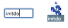
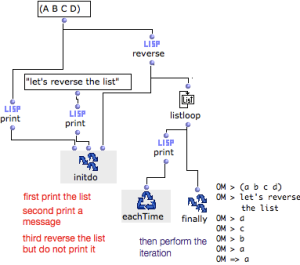

Navigation : [Previous](Eachtime "page précédente\(EachTime\)") |
[Next](LoopIterators "Next\(Iterators\)")

# Prior Evaluation(s) : Initdo

 This evaluator can execute one or several
operations **prior to the iteration**. It can be added as many optional inputs
as necessary.

Optional Intputs

  * [Additional Inputs : Optional, Keyword and Rest Arguments](AdditionalInputs)

## Adding the Box in the Editor

Contrary to EachTime and Finally, Initdo must be added in the editor by the
user. To do so, `Cmd` click, type its name and validate, as for any other box.

Note that there can be only one Initdo box in the editor : the box can be
added multiple optional inputs.

Press `Alt` +` ->` or `<-` to add or delete an input.

|

  
  
---|---  
  
## Example : Modifying a List Before an Enumeration

We'll send a message and reverse our list before the iteration begins.

|

On the left, Initdo is called internally before the iteration starts. It
performs three evaluations :

  1. Input #1 evaluates a  print box, which prints the original list

  2. Input #2 evaluates another print box, which prints the following message : "let's revers the list".

  3. Input #3 evaluates the  reverse function, which reverses the original list.

Then, the iteration starts : Listloop enumerates the items of the reversed
list returned by  reverse . EachTime and Finally return the results of the
iteration.

  1. At each step, EachTime evaluates a  print box that prints a an item of the list

  2. At the end of the iteration, Finally returns the resulting list.

  
  
---|---  
  
References :

Plan :

  * [OpenMusic Documentation](OM-Documentation)
  * [OM User Manual](OM-User-Manual)
    * [Introduction](00-Sommaire)
    * [System Configuration and Installation](Installation)
    * [Going Through an OM Session](Goingthrough)
    * [The OM Environment](Environment)
    * [Visual Programming I](BasicVisualProgramming)
    * [Visual Programming II](AdvancedVisualProgramming)
      * [Abstraction](Abstraction)
      * [Evaluation Modes](EvalModes)
      * [Higher-Order Functions](HighOrder)
      * [Control Structures](Control)
      * [Iterations: OMLoop](OMLoop)
        * [Iteration](LoopIntro)
        * [General Features](LoopGeneral)
        * [Evaluators](LoopEvaluators)
          * [Finally](Finally)
          * [EachTime](Eachtime)
          * Initdo
        * [Iterators](LoopIterators)
        * [Accumulators](LoopAccumulators)
        * [Example : A Random Series](LoopExample)
      * [Instances](Instances)
      * [Interface Boxes](InterfaceBoxes)
      * [Files](Files)
    * [Basic Tools](BasicObjects)
    * [Score Objects](ScoreObjects)
    * [Maquettes](Maquettes)
    * [Sheet](Sheet)
    * [MIDI](MIDI)
    * [Audio](Audio)
    * [SDIF](SDIF)
    * [Lisp Programming](Lisp)
    * [Errors and Problems](errors)
  * [OpenMusic QuickStart](QuickStart-Chapters)

Navigation : [Previous](Eachtime "page précédente\(EachTime\)") |
[Next](LoopIterators "Next\(Iterators\)")

