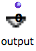

Navigation : [Previous](Programming%20Maquette "page
précédente\(Maquette Programming\)") | [Next](MaquetteEvaluation
"Next\(Evaluation\)")

# Using TemporalBoxes as Functional Components : Inputs and Outputs

Data can be sent from and to TemporalBoxes via standard functional inputs and
outputs. These allow to assign input values to TemporalBoxes and create
connections between objects in the maquette. They are represented on the
outside of TemporalBoxes by  small  /
chips.

To display or hide connections :

  * `Ctrl` / right click in the maquette
  * choose `Show / Hide Connections`. 

## Patches Inputs and Outputs

To add inputs and outputs to a TemporalBox, follow the usual procedure.

  1. Double click on the TemporalBox to open it.

  2. Click on the blue and green arrow icons to add inputs and outputs from the inside of patch. 

  3. Inputs and outputs appear on the outside of the TemporalBox.

Note that, as in any patch, inputs and outputs are represented by the same
arrow icons, and are connected exactly the same way to the boxes of the patch
editor.

## Maquette Inputs and Outputs

Adding Inputs and Outputs

|

|

Maquettes are also  **programs** : they can be added a number of inputs and
outputs.  
  
---|---|---  
  

|

In particular, this makes it possible to organize data transfers between
temporal boxes into a hierarchy of maquettes.

To add an input or output in a maquette :

  1. `Ctrl` click in the maquette editor

  2. select `Input` or `Output` in the contextual menu.

  
  
---|---  
  
Edition

Maquette inputs and outputs can be edited like patch inputs, via their editor.

|

  
  
---|---  
  
Editing Input Boxes

  * [Input Boxes](AbsInputBoxes)

## Instances and Global Variables

Default Output

When an  **instance** , ** factory box ** or  **global variable** is dropped
into a maquette, a default output is automatically added in the corresponding
Temporalbox.

|

  
  
---|---  
  
No Inputs

|

Instances are programs that always produce the same object.
Consequently,TemporalBoxes refering to instances don't have any inputs, but a
single output that returns the value of the object they produce.  
  
---|---  
  
References :

Contents :

  * [OpenMusic Documentation](OM-Documentation)
  * [OM User Manual](OM-User-Manual)
    * [Introduction](00-Contents)
    * [System Configuration and Installation](Installation)
    * [Going Through an OM Session](Goingthrough)
    * [The OM Environment](Environment)
    * [Visual Programming I](BasicVisualProgramming)
    * [Visual Programming II](AdvancedVisualProgramming)
    * [Basic Tools](BasicObjects)
    * [Score Objects](ScoreObjects)
    * [Maquettes](Maquettes)
      * [Creating a Maquette](Maquette)
      * [TemporalBoxes](TemporalBoxes)
      * [The Maquette Editor](Editor)
      * [Maquette Programming](Programming%20Maquette)
        * Functional Components
        * [Evaluation](MaquetteEvaluation)
        * [The Synthesis Patch](Synthpatchprog)
        * [TempBoxes Programming](TempProgramming)
      * [Maquettes in Patches](Maquettes%20in%20Patches)
    * [Sheet](Sheet)
    * [MIDI](MIDI)
    * [Audio](Audio)
    * [SDIF](SDIF)
    * [Lisp Programming](Lisp)
    * [Errors and Problems](errors)
  * [OpenMusic QuickStart](QuickStart-Chapters)

Navigation : [Previous](Programming%20Maquette "page
précédente\(Maquette Programming\)") | [Next](MaquetteEvaluation
"Next\(Evaluation\)")

